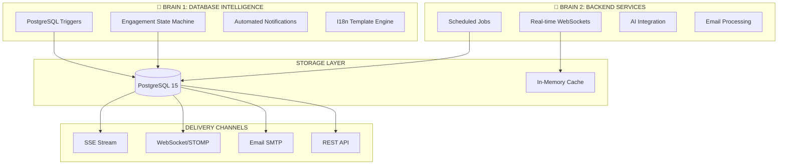
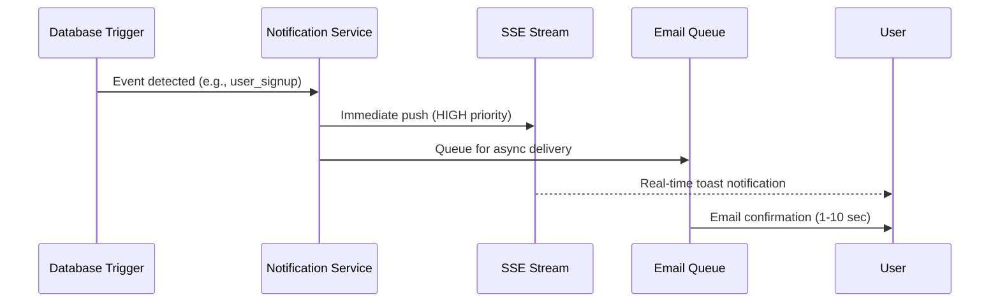
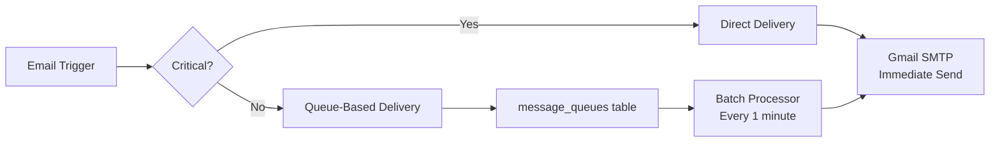

# NeuralHealer Backend

**Version:** 2.0.0 | **Tier:** Production-Ready | **Last Updated:** February 2026

## 📋 Overview

NeuralHealer is a comprehensive, secure healthcare platform that bridges AI-powered mental health support with regulated doctor-patient engagements. Built with **Spring Boot 3.2.5** and **PostgreSQL 15**, it delivers enterprise-grade security, real-time communication, and intelligent healthcare workflows.

### ✨ Core Capabilities
- 🔐 **Advanced Security**: HTTPOnly Cookie-based JWT, 2FA engagements, encrypted communications
- 🤖 **AI-Powered Support**: Persistent chat history, smart session management, doctor-accessible insights
- 📬 **Unified Notifications**: Real-time SSE delivery with email fallback, dual-brain architecture
- 🏛️ **Regulated Healthcare Workflows**: State-machine driven engagements with audit trails
- 📧 **Robust Email System**: Direct & queue-based delivery with template management
- 🧪 **Clinical Assessments**: IPIP-120/IPIP-50 personality quizzes with session management

---

## 🏗️ Architecture Philosophy

NeuralHealer employs a **Hybridized Dual-Brain Architecture** combining database intelligence with backend services for maximum reliability and flexibility.

### 🧠 Dual-Brain Architecture



### 📊 Three-Plane Performance Model

| Plane | Purpose | Components | Characteristics |
|-------|---------|------------|-----------------|
| **Control Plane** | Business logic & compliance | Engagement state machine, Auth, Permissions | Synchronous, ACID, high consistency |
| **Data Plane** | Persistent storage & history | Message storage, Audit logs, Chat history | Optimized read/write, audit-ready |
| **Real-Time Plane** | Live interactions | WebSocket/STOMP, SSE, Typing indicators | Asynchronous, <50ms delivery, eventual consistency |

---

## 🔄 Core Systems & Workflows

### 1. Engagement System (Regulated Doctor-Patient Interactions)
**Complete Specification:** [ENGAGEMENT_LOGIC.md](./docs/api/ENGAGEMENT_LOGIC.md)

#### State Machine
```
[NO RELATIONSHIP] → PENDING → ACTIVE → ENDED/ARCHIVED
        ↑              ↓         ↓
        └────── CANCELLED ←─────┘
```

#### Key Features
- **2FA Verification**: Token-based engagement activation (24h expiry with refresh)
- **Mutual Termination**: Dual-verification end process with configurable retention
- **Unilateral Cancellation**: Either party can cancel with access rule selection
- **Permanent Relationship Records**: `doctor_patients` table preserves lifetime history
- **WebSocket Broadcasts**: Real-time status updates to all participants

#### Critical Business Rules
- `relationship_started_at` set on **first ever activation** and never changes
- Patient chooses access level (`FULL_ACCESS`, `READ_ONLY`, `NO_ACCESS`) when cancelling
- Doctor cancellation always results in `NO_ACCESS` for security
- Multiple engagements can exist between same doctor-patient pair

### 2. AI Chat System (Intelligent Health Assistant)
**Complete Documentation:** [all AI.md](./docs/api/all%20AI.md)

#### Architecture
- **STOMP over WebSocket**: `/app/ai/ask` for sending, `/user/queue/ai` for receiving
- **Automatic Persistence**: All conversations saved with smart session titles
- **Doctor Access Control**: Permission-based viewing of patient AI chats
- **Heartbeat Support**: 10-second intervals for robust connections

#### Smart Session Management
```yaml
Sessions:
  Auto-creation: On first user message
  Smart Titles: First 50 chars of initial message
  Organization: Browse, search, rename capabilities
  Retention: Permanent storage with audit trail
```

#### Privacy Model
```sql
-- Simple permission check for doctor access
SELECT EXISTS (
    SELECT 1 FROM doctor_patient_engagements 
    WHERE doctor_id = ? AND patient_id = ? 
    AND end_date IS NULL
)
```

### 3. Notification System (Real-Time Alerts)
**Complete Specification:** [notification.md](./docs/api/notification.md)

#### Dual-Brain Delivery


#### Notification Types & Priorities
| Type | Priority | SSE | Email | Created By |
|------|----------|-----|-------|------------|
| `USER_WELCOME` | HIGH | ✅ | ✅ | Database Trigger |
| `ENGAGEMENT_*` | HIGH | ✅ | ✅ | Database Trigger |
| `SECURITY_ALERT` | HIGH | ✅ | ✅ | Backend Service |
| `MESSAGE_RECEIVED` | NORMAL | ✅ | ❌ | Backend Service |
| `USER_REENGAGE` | NORMAL | ✅ | ✅ | Scheduled Job |

#### I18n Template System
- **Centralized Templates**: Stored in `notification_templates` table
- **Bilingual Support**: English & Arabic with variable substitution
- **Delivery Tracking**: Real-time status of SSE/email delivery

### 4. Email System (Reliable Communication)
**Documentation:** [EMAIL_SYSTEM.md](./docs/api/EMAIL_SYSTEM.md)

#### Two-Tier Delivery Strategy


#### Supported Email Types
- **Direct Delivery**: Verification codes, password resets (time-sensitive)
- **Queue-Based**: Welcome emails, engagement notifications, reminders
- **Templates**: HTML templates with dynamic placeholder replacement

#### Configuration
```bash
GMAIL_USERNAME=your-email@gmail.com
GMAIL_APP_PASSWORD=16-char-app-password
```

### 5. Personality Assessment System (Clinical Insights)
**Documentation:** [quizzes.md](./docs/api/quizzes.md)

#### Available Assessments
| Quiz | Questions | Session Duration | Endpoint |
|------|-----------|------------------|----------|
| **IPIP-120** | 120 | 2 hours | `/api/quizzes/ipip120` |
| **IPIP-50** | 50 | 1 hour | `/api/quizzes/ipip50` |
| **PHQ-9** | 9 | 30 minutes | `/api/quizzes/phq9` |

#### Features
- **Session Management**: Cookie-based progress tracking
- **Partial Submission**: Save responses question-by-question
- **Progress Tracking**: Real-time completion percentage
- **Comprehensive Scoring**: Trait-based analysis with interpretations

---

## 🛠️ Technology Stack

### Backend Framework
- **Java 21** with modern language features
- **Spring Boot 3.2.5** with auto-configuration
- **Spring Security 6** with JWT cookie authentication
- **Spring Data JPA** with PostgreSQL
- **Spring WebSocket** with STOMP protocol

### Database & Storage
- **PostgreSQL 15** with advanced indexing
- **PL/pgSQL Triggers** for business logic enforcement
- **Connection Pooling** with HikariCP
- **JSONB Support** for flexible data structures

### Real-Time Communication
- **STOMP over WebSocket** for bi-directional messaging
- **Server-Sent Events (SSE)** for notification streaming
- **SockJS Fallback** for browser compatibility
- **In-Memory Broker** with Redis readiness

### External Integrations
- **Gmail SMTP** for email delivery
- **AI Service** (External) for health assistant
- **JWT** with HTTPOnly cookies for security

### Development & Operations
- **Docker & Docker Compose** for containerization
- **Maven** for dependency management
- **Liquibase** for database migrations (optional)
- **Actuator** for health monitoring

---

## ⚙️ Environment Configuration

### Required Variables
Create `.env` file or set environment variables:

```bash
# Database
DB_URL=jdbc:postgresql://localhost:5432/neuralhealer
DB_USERNAME=postgres
DB_PASSWORD=your_password

# Security
JWT_SECRET=your-base64-encoded-secret-min-32-chars
JWT_EXPIRATION=86400000  # 24 hours in milliseconds

# Email
GMAIL_USERNAME=your-email@gmail.com
GMAIL_APP_PASSWORD=your-16-char-app-password

# AI Integration
AI_SERVICE_URL=https://your-ai-service.com
AI_API_KEY=your-ai-api-key
AI_SERVICE_TIMEOUT_SECONDS=90

# Frontend
FRONTEND_URL=http://localhost:3000

# Application
SERVER_PORT=8080
LOG_LEVEL=INFO
```

### Optional Configuration
```bash
# Redis (for production WebSocket scaling)
REDIS_HOST=localhost
REDIS_PORT=6379

# CORS (for frontend development)
ALLOWED_ORIGINS=http://localhost:3000,https://app.neuralhealer.com

# File Storage
FILE_STORAGE_BASE_PATH=/app/storage
PROFILE_PICTURES_PATH=doctors/profiles
MAX_FILE_SIZE_MB=10
ALLOWED_IMAGE_FORMATS=jpg,jpeg,png,webp
PROFILE_IMAGE_MIN_DIMENSION=512
PROFILE_IMAGE_MAX_DIMENSION=2048
IMAGE_COMPRESSION_QUALITY=85
THUMBNAIL_SIZE=256

# Monitoring
METRICS_ENABLED=true
TRACING_ENABLED=false
```

---

## 🚀 Quick Start

### Prerequisites
- Java 21 SDK
- Docker & Docker Compose
- Maven 3.9+
- PostgreSQL 15 (optional, Docker provided)

### Local Development Setup

```bash
# 1. Clone repository
git clone https://github.com/dolamasa1/neuralhealer-backend.git
cd neuralhealer-backend

# 2. Configure environment
cp .env.example .env
# Edit .env with your values

# 3. Start database
docker-compose up -d neuralhealer-db

# 4. Build and run application
./mvnw clean spring-boot:run

# 5. Verify health
curl http://localhost:8080/api/actuator/health
```

### Database Initialization
First run automatically executes `schema.sql` to:
- Create tables, indexes, and constraints
- Set up PL/pgSQL functions and triggers
- Insert initial data (notification templates, etc.)

### Testing the System
```bash
# Test email system
curl -X POST http://localhost:8080/api/test/email/verification \
  -H "Content-Type: application/json" \
  -d '{"email":"test@example.com","code":"123456"}'

# Test WebSocket connection
# Use WebSocket client to connect to ws://localhost:8080/ws

# Test AI integration
curl -X POST http://localhost:8080/api/ai/ask \
  -H "Authorization: Bearer YOUR_TOKEN" \
  -d '{"question":"What are symptoms of anxiety?"}'
```

---

## 🔌 API Reference

**Base URL:** `http://localhost:8080/api`  
**WebSocket:** `ws://localhost:8080/ws`  
**SSE Stream:** `GET /api/notifications/stream`

### Authentication & Users
| Method | Endpoint | Description | Auth |
|--------|----------|-------------|------|
| `POST` | `/auth/register` | Register new user | No |
| `POST` | `/auth/login` | Login (sets HTTPOnly cookie) | No |
| `POST` | `/auth/logout` | Logout (clears cookie) | Yes |
| `POST` | `/auth/verify-email` | Verify email with OTP code | No |
| `POST` | `/auth/resend-otp` | Resend email OTP | No |
| `GET` | `/auth/verification-status/{email}` | Check email verification status | No |
| `GET` | `/users/me` | Current user profile | Yes |
| `GET` | `/users/by-email` | Look up user by email | Yes |

### Engagements (Doctor-Patient)
| Method | Endpoint | Description | Role |
|--------|----------|-------------|------|
| `POST` | `/engagements/initiate` | Start new engagement | Doctor |
| `POST` | `/engagements/verify-start` | Activate with token | Patient |
| `GET` | `/engagements/my-engagements` | List user's engagements | Any |
| `GET` | `/engagements/{id}` | Get engagement details | Both |
| `DELETE` | `/engagements/{id}` | Delete engagement record | Both |
| `POST` | `/engagements/{id}/cancel` | Cancel engagement | Both |
| `POST` | `/engagements/{id}/end-request` | Request termination | Both |
| `POST` | `/engagements/{id}/verify-end` | Confirm termination | Both |
| `POST` | `/engagements/{id}/refresh-token` | Regenerate token | Doctor |
| `GET` | `/engagements/{id}/token` | View current token | Doctor |
| `POST` | `/engagements/{id}/messages` | Send engagement message | Both |
| `GET` | `/engagements/{id}/messages` | Get engagement messages | Both |

### AI Chat System
| Method | Endpoint | Description | Auth |
|--------|----------|-------------|------|
| `GET` | `/chats` | List chat sessions | Patient |
| `GET` | `/chats/with-doctors` | Sessions with doctor access | Patient |
| `GET` | `/chats/search?q={query}` | Search chat history | Patient |
| `GET` | `/chats/{id}/messages` | Get session messages | Patient |
| `PUT` | `/chats/{id}/title` | Rename session | Patient |
| `GET` | `/doctors/patients/{id}/chats` | View patient chats | Doctor |

### Notifications
| Method | Endpoint | Description | Auth |
|--------|----------|-------------|------|
| `GET` | `/notifications/stream` | SSE event stream | Yes |
| `GET` | `/notifications` | Notification history | Yes |
| `PUT` | `/notifications/{id}/read` | Mark as read | Yes |
| `POST` | `/notifications/mark-all-read` | Mark all as read | Yes |
| `DELETE` | `/notifications/{id}` | Delete a notification | Yes |
| `GET` | `/notifications/unread-count` | Unread counts | Yes |
| `GET` | `/notifications/stats` | Delivery statistics | Yes |

### Personality & Clinical Assessments
| Method | Endpoint | Description | Headers |
|--------|----------|-------------|--------|
| `POST` | `/quizzes/ipip120/start` | Start IPIP-120 | None |
| `GET` | `/quizzes/ipip120/questions` | Get questions | `X-Quiz-Session-120` |
| `GET` | `/quizzes/ipip120/responses` | Get saved responses | `X-Quiz-Session-120` |
| `POST` | `/quizzes/ipip120/submit-question` | Save single answer | `X-Quiz-Session-120` |
| `POST` | `/quizzes/ipip120/submit-quiz` | Final submission | `X-Quiz-Session-120` |
| `POST` | `/quizzes/ipip50/start` | Start IPIP-50 | None |
| `GET` | `/quizzes/ipip50/questions` | Get questions | `X-Quiz-Session` |
| `POST` | `/quizzes/ipip50/submit-question` | Save single answer | `X-Quiz-Session` |
| `GET` | `/quizzes/ipip50/progress` | Get progress | `X-Quiz-Session` |
| `GET` | `/quizzes/ipip50/responses` | Get saved responses | `X-Quiz-Session` |
| `POST` | `/quizzes/ipip50/submit-quiz` | Final submission | `X-Quiz-Session` |
| `DELETE` | `/quizzes/ipip50/reset` | Reset session | `X-Quiz-Session` |
| `POST` | `/quizzes/phq9/start` | Start PHQ-9 assessment | None |
| `GET` | `/quizzes/phq9/questions` | Get PHQ-9 questions | `X-Quiz-Session` |
| `POST` | `/quizzes/phq9/submit-question` | Save single answer | `X-Quiz-Session` |
| `GET` | `/quizzes/phq9/responses` | Get saved responses | `X-Quiz-Session` |
| `POST` | `/quizzes/phq9/submit-quiz` | Final submission | `X-Quiz-Session` |

### Doctor Profile & Lobby
| Method | Endpoint | Description | Role |
|--------|----------|-------------|------|
| `GET` | `/doctors/lobby` | Browse available doctors | Patient |
| `GET` | `/doctors/search` | Search doctors by criteria | Patient |
| `GET` | `/doctors/nearby` | Find doctors by location | Patient |
| `GET` | `/doctors/{doctorId}/profile` | View a doctor's public profile | Any |
| `GET` | `/doctors/me/profile` | View own profile | Doctor |
| `PUT` | `/doctors/me/profile` | Update own profile | Doctor |
| `POST` | `/doctors/me/profile-picture` | Upload profile picture | Doctor |
| `DELETE` | `/doctors/me/profile-picture` | Remove profile picture | Doctor |
| `PATCH` | `/doctors/me/availability` | Toggle availability status | Doctor |
| `PUT` | `/doctors/me/social-media` | Update social media links | Doctor |

### Doctor Verification
| Method | Endpoint | Description | Role |
|--------|----------|-------------|------|
| `GET` | `/doctors/verification/questions` | Get verification questions | Doctor |
| `POST` | `/doctors/verification/me/submit` | Submit verification answers | Doctor |
| `GET` | `/doctors/verification/me/answers` | View submitted answers | Doctor |

### Testing & Utilities
| Method | Endpoint | Description |
|--------|----------|-------------|
| `POST` | `/test/email/verification` | Test verification email |
| `POST` | `/test/email/password-reset` | Test password reset email |
| `POST` | `/test/email/special-thanks` | Test special thanks email |
| `GET` | `/actuator/health` | System health check |
| `GET` | `/actuator/metrics` | Application metrics |

---

## 🌐 WebSocket/STOMP Protocol

### Connection Details
```javascript
const client = new StompJs.Client({
    brokerURL: "ws://localhost:8080/ws",
    connectHeaders: { 
        Authorization: "Bearer YOUR_JWT_TOKEN" 
    },
    heartbeatIncoming: 10000,
    heartbeatOutgoing: 10000,
    reconnectDelay: 5000
});
```

### Topics & Destinations
| Type | Path | Purpose |
|------|------|---------|
| **Subscribe** | `/topic/engagement/{id}` | Engagement chat & updates |
| **Subscribe** | `/topic/user/{userId}` | Personal notifications |
| **Subscribe** | `/user/queue/ai` | AI responses & events |
| **Send** | `/app/engagement/{id}/message` | Send chat message |
| **Send** | `/app/ai/ask` | Ask AI question |
| **Send** | `/app/engagement/{id}/typing` | Typing indicators |

### Message Formats
**AI Question:**
```json
{
  "question": "What are common stress symptoms?"
}
```

**AI Response:**
```json
{
  "type": "AI_RESPONSE",
  "senderName": "AI Assistant",
  "content": "Common symptoms include...",
  "sentAt": "2026-02-07T10:30:00Z"
}
```

---

## 📈 Performance & Scalability

### Current Capacity
- **WebSocket Connections**: 5,000+ concurrent sessions
- **Database Throughput**: 2,000+ transactions/second
- **Response Times**: <100ms for 95% of API calls
- **Memory Usage**: ~500MB for typical deployment

### Scaling Strategy
1. **Vertical Scaling**: Increase instance size (current approach)
2. **Read Replicas**: PostgreSQL read replicas for reporting
3. **Redis Integration**: For WebSocket session clustering
4. **Microservices**: Planned decomposition (see roadmap)

### Monitoring & Metrics
```bash
# Health endpoint
GET /actuator/health

# Metrics endpoint  
GET /actuator/metrics

# Custom metrics
- engagement.active.count
- messages.sent.rate
- websocket.connections.active
- notification.delivery.latency
```

---

## 🐳 Docker Deployment

### Full Stack with Docker Compose
```yaml
# docker-compose.yml
version: '3.8'

services:
  neuralhealer-db:
    image: postgres:15
    environment:
      POSTGRES_DB: neuralhealer
      POSTGRES_USER: ${DB_USERNAME}
      POSTGRES_PASSWORD: ${DB_PASSWORD}
    volumes:
      - postgres_data:/var/lib/postgresql/data
    ports:
      - "5432:5432"
    healthcheck:
      test: ["CMD-SHELL", "pg_isready -U ${DB_USERNAME}"]
      interval: 10s
      timeout: 5s
      retries: 5

  neuralhealer-app:
    build: .
    depends_on:
      neuralhealer-db:
        condition: service_healthy
    environment:
      DB_URL: jdbc:postgresql://neuralhealer-db:5432/neuralhealer
      DB_USERNAME: ${DB_USERNAME}
      DB_PASSWORD: ${DB_PASSWORD}
      JWT_SECRET: ${JWT_SECRET}
      GMAIL_USERNAME: ${GMAIL_USERNAME}
      GMAIL_APP_PASSWORD: ${GMAIL_APP_PASSWORD}
    ports:
      - "8080:8080"
    restart: unless-stopped

volumes:
  postgres_data:
```

### Running with Docker
```bash
# Build and start
docker-compose up --build -d

# View logs
docker-compose logs -f neuralhealer-app

# Stop services
docker-compose down

# Stop and remove volumes
docker-compose down -v
```

### Production Considerations
- Use managed PostgreSQL (RDS, Cloud SQL)
- Implement Redis for session clustering
- Configure proper SSL/TLS termination
- Set up monitoring with Prometheus/Grafana
- Implement backup strategies

---

## 🔮 Roadmap & Future Development

### Q2 2026 - Enhanced Analytics
- Patient health trend analysis
- Engagement effectiveness metrics
- AI conversation insights dashboard
- Export functionality for clinical use

### Q3 2026 - Advanced Features
- Video consultation integration
- Document sharing with e-signatures
- Medication tracking & reminders
- Family/caregiver access portals

### Q4 2026 - Platform Expansion
- Mobile applications (iOS/Android)
- Wearable device integration
- Multi-language expansion
- API marketplace for partners

### Technical Evolution
- Migration to microservices architecture
- Event-driven architecture with Kafka
- GraphQL API layer
- Blockchain for audit trail immutability

---

## 🤝 Contributing

We welcome contributions! Please follow these guidelines:

### Development Workflow
1. Fork the repository
2. Create a feature branch: `git checkout -b feature/amazing-feature`
3. Commit changes: `git commit -m 'Add amazing feature'`
4. Push to branch: `git push origin feature/amazing-feature`
5. Open a Pull Request

### Code Standards
- Follow Google Java Style Guide
- Write comprehensive tests for new features
- Update documentation for API changes
- Use meaningful commit messages
- Ensure backward compatibility

### Testing Requirements
```bash
# Run all tests
./mvnw test

# Run specific test suite
./mvnw test -Dtest=EngagementServiceTest

# Integration tests
./mvnw verify
```

### Security Guidelines
- Never commit credentials or secrets
- Validate all user inputs
- Use prepared statements for SQL
- Implement proper error handling
- Follow principle of least privilege

---

## 🐛 Troubleshooting

### Common Issues

| Issue | Solution |
|-------|----------|
| **Database connection fails** | Check PostgreSQL is running, verify credentials in `.env` |
| **WebSocket connection drops** | Verify heartbeat settings, check JWT expiration |
| **Emails not sending** | Validate Gmail app password, check SMTP logs |
| **AI service timeout** | Increase `AI_SERVICE_TIMEOUT_SECONDS` |
| **Notification duplicates** | Check database trigger configurations |

### Debugging Steps
1. Check application logs: `docker-compose logs neuralhealer-app`
2. Verify database health: `docker-compose exec neuralhealer-db pg_isready`
3. Test API endpoints with `curl` or Postman
4. Check WebSocket connection with browser dev tools
5. Monitor `message_queues` table for email issues

### Getting Help
1. Check existing documentation
2. Search GitHub issues
3. Contact backend team via email
4. For critical issues, use WhatsApp support

---

## 📞 Support & Contact

### Technical Support
- **GitHub Issues**: [github.com/dolamasa1/neuralhealer-backend/issues](https://github.com/dolamasa1/neuralhealer-backend/issues)
- **Email**: ahmed.adel.elmoghraby@gmail.com
- **WhatsApp**: +201204183236 (Ahmed Adel)
- **Documentation**: [docs.neuralhealer.com](https://docs.neuralhealer.com)

### Security Concerns
Report security vulnerabilities to **security@neuralhealer.com** with:
- Detailed description of the issue
- Steps to reproduce
- Potential impact assessment
- Your contact information

### Community & Resources
- **Discussions**: GitHub Discussions for Q&A
- **Changelog**: `CHANGELOG.md` for version updates
- **Wiki**: Additional technical documentation
- **Samples**: Example integrations and use cases

---

## 📄 License

NeuralHealer Backend is proprietary software. All rights reserved.

© 2026 NeuralHealer Team. Unauthorized copying, distribution, or use is prohibited.

For licensing inquiries, contact: licensing@neuralhealer.com

---

## 🎯 Getting Started Summary

### For Developers
1. **Setup Environment**: Java 21, Docker, Maven
2. **Configure Variables**: Copy `.env.example` to `.env`
3. **Start Services**: `docker-compose up -d`
4. **Run Application**: `./mvnw spring-boot:run`
5. **Explore APIs**: Visit `http://localhost:8080/api/swagger`

### For Integrators
1. **Authentication**: Use `/auth/login` to get HTTPOnly cookie
2. **WebSocket**: Connect to `ws://localhost:8080/ws` with JWT
3. **Engagements**: Follow state machine in ENGAGEMENT_LOGIC.md
4. **Notifications**: Subscribe to SSE stream at `/notifications/stream`
5. **AI Chat**: Use STOMP destinations for real-time AI interaction

### For Deployment
1. **Production DB**: Use managed PostgreSQL instance
2. **Environment**: Set all required variables
3. **Security**: Configure SSL, firewalls, monitoring
4. **Scaling**: Consider Redis for WebSocket clustering
5. **Backups**: Implement automated database backups

---

**Thank you for choosing NeuralHealer!** 💙

We're committed to building technology that makes mental healthcare more accessible, intelligent, and effective. Your feedback and contributions help us improve lives through better healthcare technology.

*Last Updated: February 21, 2026 | Version: 2.0.0 | Contact: Ahmed Adel | Status: Production Ready*