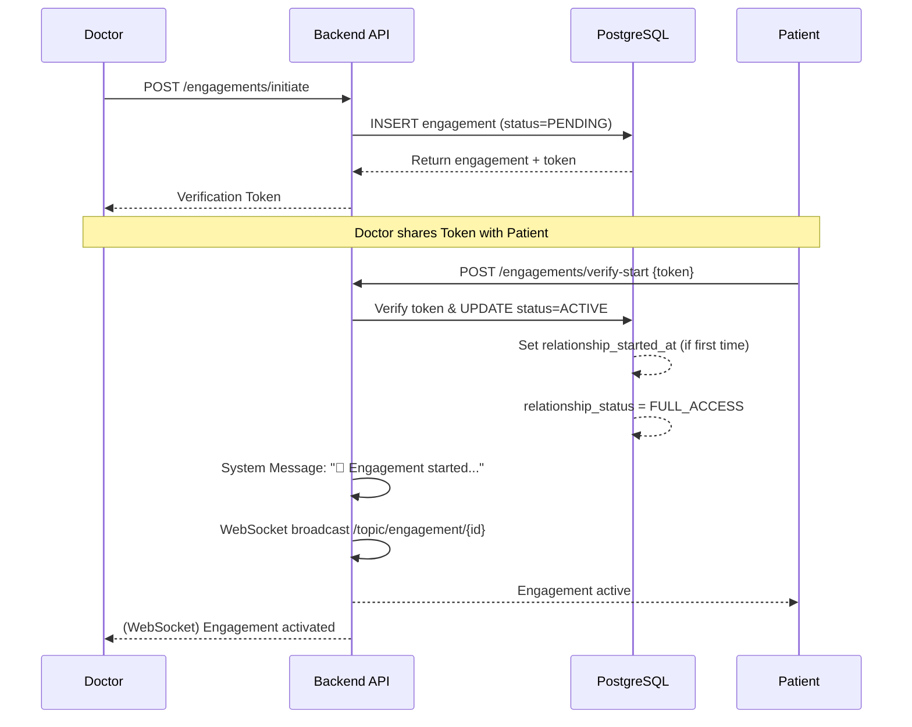
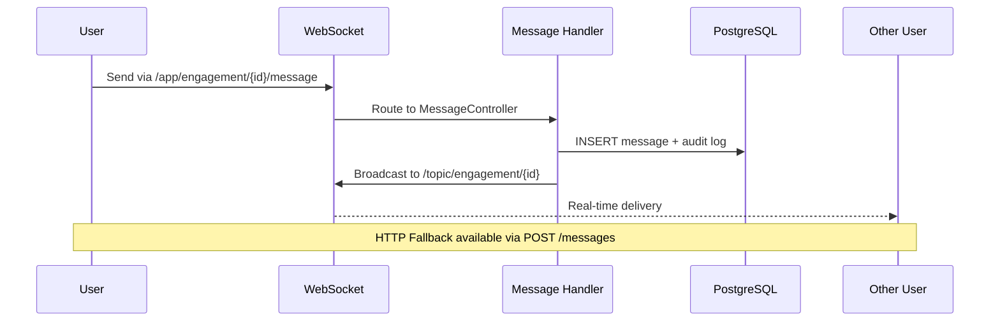
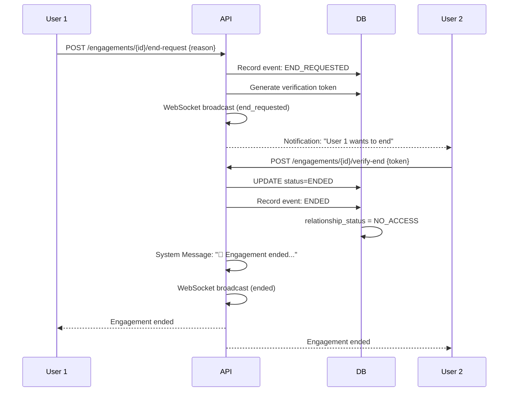

# NeuralHealer Backend

**Version:** 0.6.0 | **Tier:** 1 (Pre-production) | **Read Time:** ~15 min

## 📋 Overview

NeuralHealer is a secure, regulated healthcare platform facilitating AI-enhanced engagements between doctors and patients. Built with Spring Boot 3 and PostgreSQL, it prioritizes data integrity, real-time responsiveness, and regulatory compliance.

### Key Capabilities
- 🔐 **Secure Authentication**: HTTPOnly Cookie-based JWT (XSS protection)
- 🤝 **Regulated Engagements**: 2FA-verified doctor-patient interactions
- 💬 **Real-Time Communication**: WebSocket/STOMP messaging with typing indicators
- 🏛️ **3-Plane Architecture**: Optimized for correctness, persistence, and speed
- 🔄 **State Machine Workflow**: Explicit lifecycle management with database triggers

---

## 🏗️ Architecture Philosophy

NeuralHealer uses a **3-Plane Architecture** to separate concerns and optimize performance:

### 1. Control Plane (Critical & Regulated)
**Goal:** Correctness > Speed

- Authentication & Authorization
- Engagement lifecycle state transitions
- Business rule enforcement
- Data integrity (PostgreSQL triggers)

**Components:**
- `SecurityConfig` (AuthZ/CORS)
- `EngagementService` (State Machine)
- Database Triggers (Automated consistency)

**Characteristics:** Synchronous, ACID transactions, high consistency

### 2. Data Plane (Persistent & Traceable)
**Goal:** Consistency + Audit Trails

- Message history storage
- Engagement states persistence
- Notification logs
- Historical data retrieval

**Components:**
- `MessageRepository`
- `NotificationService`
- Indexed database tables

**Characteristics:** Optimized for read/write throughput, audit-ready

### 3. Real-Time Plane (Fast & Volatile)
**Goal:** Low Latency (< 50ms delivery)

- WebSocket chat delivery
- Typing indicators
- Live status updates
- Real-time notifications

**Components:**
- `WebSocketConfig`
- STOMP message routing
- In-memory session management

**Characteristics:** Asynchronous, eventual consistency acceptable

---

## 🔄 Engagement Lifecycle State Machine

All engagements follow this explicit state flow:

```
NONE → PENDING → ACTIVE → END_REQUESTED → ENDED
         ↓
      CANCELLED
```

### State Definitions

| State | Entry Condition | Allowed Actions | Exit Condition |
|-------|----------------|-----------------|----------------|
| **PENDING** | Doctor calls `/initiate` | Patient: Verify start<br>Either: Cancel | Patient verifies OR Either cancels |
| **ACTIVE** | Patient calls `/verify-start` | Both: Send messages<br>Either: Request end | One party requests end |
| **END_REQUESTED** | Either calls `/end-request` | Other party: Verify end<br>Both: Continue messaging | Other party verifies end |
| **ENDED** | Other party calls `/verify-end` | Both: View history only | Terminal state |
| **CANCELLED** | Either calls `/{id}/cancel` | None | Terminal state |

> **Note:** State transitions are enforced via database triggers (`update_relationship_status_on_engagement`) for data integrity.

---

## 📊 Key Workflows

### 1. Engagement Initiation (2FA Flow)



### 2. Real-Time Messaging



### 3. Login Flow

```mermaid
sequenceDiagram
    participant Client
    participant API as /auth/login
    participant DB as PostgreSQL
    participant JWT as JWT Service

    Client->>API: POST {email, password}
    API->>DB: SELECT user WHERE email=?
    DB-->>API: User record
    API->>API: Verify password (BCrypt)
    API->>JWT: Generate token
    JWT-->>API: JWT string
    API-->>Client: Set-Cookie: jwt=...; HttpOnly; Secure
    Client->>API: GET /users/me (Cookie auto-sent)
    API->>JWT: Validate token from cookie
    JWT-->>API: Claims
    API-->>Client: User profile
```

### 4. Engagement Termination



---

## 🛠️ Technology Stack

### Core
- **Java 21**: Modern language features
- **Spring Boot 3.2.5**: Application framework
- **Spring Security 6**: Cookie-based authentication
- **Spring WebSocket**: STOMP over WebSocket
- **Spring Data JPA**: ORM abstraction

### Database
- **PostgreSQL 15**: Primary data store
- **Liquibase**: Schema versioning (optional)
- **PL/pgSQL Triggers**: Automated business logic
  - `update_relationship_status_on_engagement`
  - `generate_engagement_id`
  - Message retention enforcement

### Real-Time
- **STOMP Protocol**: WebSocket message routing
- **SockJS Fallback**: Browser compatibility
- **In-Memory Routing**: Current session management

---

## 📚 Documentation Structure

| Topic | File | Description |
|-------|------|-------------|
| **Architecture** | `ARCHITECTURE.md` | 3-Plane model, State Machines |
| **Security** | `SECURITY.md` | Auth, Threat Model, Compliance |
| **API Reference** | `API_REFERENCE.md` | REST & WebSocket endpoints |
| **Deployment** | `DEPLOYMENT.md` | Docker, Local, Production setup |
| **Contributing** | `CONTRIBUTING.md` | Standards & Testing guidelines |
| **Roadmap** | `MICROSERVICES_ROADMAP.md` | Go Migration & Scaling |
| **Engagement Logic** | [ENGAGEMENT_LOGIC.md](docs/ENGAGEMENT_LOGIC.md) | State machine & API flows |
| **AI Subscription** | [AI_SUBSCRIPTION.md](docs/AI_SUBSCRIPTION.md) | AI Chatbot STOMP API & Logic |

---

## ⚙️ Environment Configuration

NeuralHealer uses environment variables for secure configuration. Copy `.env.example` to `.env` (or set them in your environment) before running.

| Variable | Description | Default (Dev) |
|----------|-------------|---------------|
| `DB_URL` | PostgreSQL JDBC URL | `jdbc:postgresql://localhost:5432/neuralhealer` |
| `DB_USERNAME` | Database username | `postgres` |
| `DB_PASSWORD` | Database password | `aaa` |
| `JWT_SECRET` | Base64 encoded secret for JWT | (Dev default provided) |
| `AI_SERVICE_URL` | External AI Chatbot URL | (Ngrok dev URL) |
| `AI_SERVICE_TIMEOUT_SECONDS` | Timeout for AI calls | `90` |

---

## 🚀 Quick Start

### Prerequisites
- Java 21 SDK
- Docker & Docker Compose
- Maven (wrapper included)

### Setup Steps

```bash
# 1. Start PostgreSQL
docker-compose up -d

# 2. Configure credentials (if needed)
# Edit src/main/resources/application.yml

# 3. Run application
./mvnw spring-boot:run

# 4. Verify health
curl http://localhost:8080/api/actuator/health
```

**First run automatically initializes the database schema via `schema.sql`.**

---

## 🔌 API Overview

**Base URL:** `http://localhost:8080/api`

> [!TIP]
> **Interactive Documentation**: Access the [Swagger UI](http://localhost:8080/api/swagger) for live testing.
> **Raw API Specs**: [OpenAPI JSON](http://localhost:8080/api/docs)

### Authentication
| Method | Endpoint | Description | Auth Required |
|--------|----------|-------------|---------------|
| POST | `/auth/register` | Register new user | No |
| POST | `/auth/login` | Login (Returns HTTPOnly Cookie) | No |
| POST | `/auth/logout` | Logout (Clears Cookie) | Yes |
| GET | `/users/me` | Get current profile | Yes |

### Engagements
| Method | Endpoint | Description | Auth Required |
|--------|----------|-------------|---------------|
| POST | `/engagements/initiate` | Start engagement (returns QR token) | Doctor |
| POST | `/engagements/verify-start` | Activate engagement with token | Patient |
| GET | `/engagements/my-engagements` | List user's engagements | Yes |
| DELETE | `/engagements/{id}` | Cancel pending engagement | Doctor |
| POST | `/engagements/{id}/end-request` | Request to end | Yes |
| POST | `/engagements/{id}/verify-end` | Confirm end with token | Yes |

### Messaging
| Method | Endpoint | Description | Auth Required |
|--------|----------|-------------|---------------|
| POST | `/engagements/{id}/messages` | Send message (REST fallback) | Yes |
| GET | `/engagements/{id}/messages` | Get message history | Yes |

### WebSockets (STOMP)
**Connect:** `ws://localhost:8080/ws`

**Subscribe to:**
- `/topic/engagement/{id}` - Live chat & status updates
- `/topic/user/{userId}` - Personal notifications
- `/user/queue/ai` - AI responses

**Send to:**
- `/app/engagement/{id}/message` - Send chat message
- `/app/ai/ask` - Ask AI a question
- `/app/engagement/{id}/typing` - Typing indicator

> **Full AI API guide:** See `AI_SUBSCRIPTION.md`

---

## 📈 Performance & Scalability

### Scenario: 1,000 Active Chats

| Component | Impact | Mitigation |
|-----------|--------|------------|
| **JWT Validation** | O(1) per request - negligible | Cookie-based auth eliminates per-message overhead |
| **Memory** | ~100MB RAM for 1,000 WebSocket sessions | Vertical scaling sufficient |
| **Database I/O** | 1,000 writes/sec = Primary bottleneck | Horizontal read replicas, Connection pooling |
| **CPU** | Message routing O(n) where n = participants | Current: In-memory broadcast, Future: Redis Pub/Sub |

### Scaling Path
1. **Vertical** (Current): Single server handles 1,000+ sessions
2. **Horizontal**: Load balancer + sticky sessions
3. **Microservices** (Planned): Go-based WebSocket service + Redis

> **See:** `MICROSERVICES_ROADMAP.md` for v1.0 architecture

---

## ✨ Feature Status

### ✅ Completed (v0.6.0)
- Secure authentication (HTTPOnly cookies)
- Full engagement lifecycle with 2FA
- **Audit Logging**: Comprehensive event recording (`INITIATED`, `VERIFIED`, `ENDED`, `CANCELLED`)
- **Relationship Lifecycle**: First-activation timestamp tracking & status synchronization
- **System Messaging**: Automated professional audit messages in chat history
- Real-time WebSocket messaging (STOMP)
- Typing indicators
- Engagement cancellation (Doctor & Patient unilateral termination)
- REST fallback for messages
- Database trigger enforcement
- **Integrated AI Chatbot (STOMP-based, Unified session tracking, Heartbeat support)**

### 🚧 In Progress
- AI Health Assistant integration (Phase 5)
- Analytics dashboard (Phase 6)

### 📋 Planned
- Load testing & security audit (Phase 7)
- Microservices migration (Phase 8)
- Video consultation support
- Blockchain audit logs

---

## 🐳 Docker Integration

**Current Setup:** Docker Compose for PostgreSQL only

```yaml
services:
  neuralhealer-db:
    image: postgres:15
    ports: ["5432:5432"]
    volumes: ["./data:/var/lib/postgresql/data"]
    healthcheck: pg_isready
```

**Usage:**
```bash
docker-compose up -d    # Start database
docker-compose down     # Stop database
./mvnw spring-boot:run  # Run Spring Boot app
```

> **Production:** Use managed RDS instead of Docker. See `DEPLOYMENT.md`

---

## 🔮 Future Architecture

### AI Inference Gateway
- High-performance data processing
- Aggregates patient data for ML models
- Isolation from main backend

### Audit Logging Sidecar (Go)
- Asynchronous compliance log ingestion
- Writes to immutable storage/blockchain
- Non-blocking architecture

### Proposed Stack
```
Client
  ↓
API Gateway (NGINX)
  ├→ Spring Boot (Control + Data Planes)
  ├→ Go WebSocket Service (Real-Time Plane)
  └→ Go Audit Service (Logging)
       ↓
[PostgreSQL] ← [Redis Pub/Sub]
```

---

## 🤝 Contributing

We follow strict development standards to maintain code quality:

### The 3-Plane Rule
Classify every feature:
- **Control Plane**: Business rules (e.g., Billing, Verification)
- **Data Plane**: Historical data (e.g., Reports, Archives)
- **Real-Time Plane**: Live UX (e.g., Live Status, Video)

### Security Requirements
- ✅ Use HTTPOnly cookies (never `localStorage`)
- ✅ Add `@Transactional` to state-changing methods
- ✅ Check `canAccessEngagement()` before resource access

### Testing
```bash
mvn test  # Run before every PR
```

### Commit Convention
- `feat:` New features
- `fix:` Bug fixes
- `docs:` Documentation
- `refactor:` Code improvements

> **Full guide:** `CONTRIBUTING.md`

---

## 📞 Support & Resources

- **Issues:** [GitHub Issues](#)
- **Discussions:** [GitHub Discussions](#)
- **Security:** Report vulnerabilities to security@neuralhealer.com

---

## 📄 License

© 2026 NeuralHealer Team. All rights reserved.

---

## 🎯 Next Steps

1. **Set up locally:** Follow the [Quick Start](#-quick-start)
2. **Read architecture:** Understand the [3-Plane model](#️-architecture-philosophy)
3. **Explore APIs:** Check the [API Reference](#-api-overview)
4. **Contribute:** See [Contributing guidelines](#-contributing)

**Questions?** Open an issue or check our documentation files!
