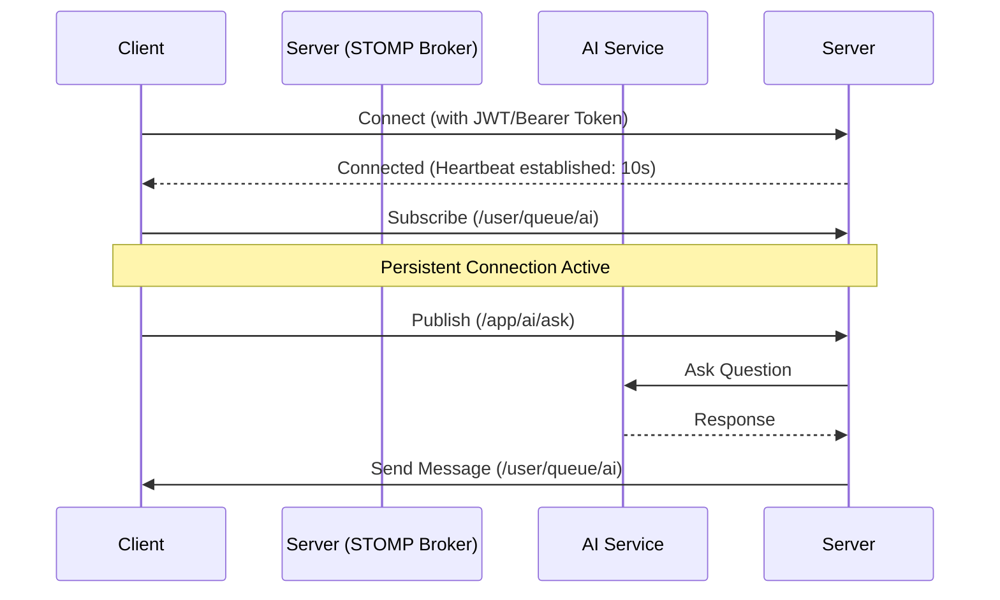

# AI Chat & Subscription (STOMP API)

---
**Last Updated:** 2025-01-15
**Version:** 1.0
**Status:** Production-Ready
**Changes:** 
- Consolidated AI API details and Subscription logic into a single document
- Migrated from Raw WebSocket (`/ai-ws`) to STOMP (`/ws`)
- Implemented STOMP heartbeats (10s) for session robustness
---

This document defines the core logic, architecture, and API protocols for the NeuralHealer AI Chatbot system, leveraging the standard **STOMP Broker** for structured communication.

## 1. Overview
The AI Chat system enables real-time, bi-directional interaction between users and the AI Assistant.

*   **Protocol**: STOMP over WebSocket
*   **Endpoint**: `ws://localhost:8080/ws`
*   **Authentication**: Bearer Token in `Authorization` header OR `neuralhealer_token` cookie.
*   **Subscription Topic**: `/user/queue/ai` (Specific to the authenticated user session)
*   **Message Destination**: `/app/ai/ask`

---

## 2. Subscription Flow Diagram



---

## 3. Message API Details

### 3.1 Sending Questions
Send questions to the STOMP destination using a JSON payload.
**Destination**: `/app/ai/ask`

**Payload:**
```json
{
  "question": "What are the common symptoms of stress?"
}
```

### 3.2 Receiving Events
The server broadcasts events to your subscribed queue `/user/queue/ai`.

#### AI Typing Start
Indicates the AI is processing the request. Use this to show a "Thinking..." indicator.
```json
{
  "type": "AI_TYPING_START",
  "senderName": "AI Assistant",
  "content": "المساعد الذكي يكتب...",
  "sentAt": "2025-01-15T03:00:00"
}
```

#### AI Response
Final answer from the AI service. Includes the full text answer.
```json
{
  "type": "AI_RESPONSE",
  "senderName": "AI Assistant",
  "content": "Common symptoms of stress include fatigue, headache, and sleep disturbances. Would you like exercises to manage it?",
  "sentAt": "2025-01-15T03:00:05"
}
```

#### AI Error
Sent if the AI service is unavailable, timed out, or if the question was invalid.
```json
{
  "type": "AI_ERROR",
  "senderName": "System",
  "content": "عذراً، حدث خطأ أثناء الاتصال بالذكاء الاصطناعي. يرجى المحاولة مرة أخرى لاحقاً.",
  "sentAt": "2025-01-15T03:00:10"
}
```

---

## 4. Subscription Lifecycle & Policies

### Creation & Maintenance
- **Creation**: Subscriptions are established client-side after a successful STOMP `CONNECT`.
- **Maintenance**: Connections are kept alive via **STOMP Heartbeats**.
  - **Interval**: 10,000ms (10 seconds).
  - **Timeout**: If the server doesn't receive data or a heartbeat from the client within the negotiated interval, the session is terminated.
- **Destruction**: Subscriptions are destroyed when the WebSocket session closes.

### Policies
- **Session Timeout**: Underlying JWT authentication must remain valid. Re-authentication on reconnect is mandatory.
- **Maximum Idle Time**: Tested to support 30+ minutes of idle time provided heartbeats are maintained.

## 5. Message Delivery Guarantees
- **Persistent Sessions**: Subscriptions remain active throughout the user session.
- **Order Guarantees**: STOMP ensures FIFO (First-In-First-Out) ordering for messages within a single session.
- **Disconnection**: Messages sent while a client is disconnected are **not queued** by the in-memory broker. Clients must reconnect and resubscribe.

---

## 6. Client Example (JavaScript / StompJS)

```javascript
/* 
 * NeuralHealer AI WebSocket Client
 * Library: @stomp/stompjs
 */

const client = new StompJs.Client({
    brokerURL: "ws://localhost:8080/ws",
    connectHeaders: {
        Authorization: "Bearer <YOUR_JWT_TOKEN>"
    },
    // Heartbeat: 10s
    heartbeatIncoming: 10000,
    heartbeatOutgoing: 10000,
    reconnectDelay: 5000,

    onConnect: (frame) => {
        console.log("Connected to AI Broker");

        // Subscribe to AI responses
        client.subscribe("/user/queue/ai", (message) => {
            const data = JSON.parse(message.body);
            console.log("AI Event:", data.type, data.content);
        });
        
        // Send a question
        client.publish({
            destination: "/app/ai/ask",
            body: JSON.stringify({ question: "How to reduce anxiety?" })
        });
    }
});

client.activate();
```

---

## 7. Troubleshooting Guide

| Issue | Cause | Solution |
| :--- | :--- | :--- |
| **Connection Drops** | Missing Heartbeats | Verify heartbeat settings in client config. |
| **401 Unauthorized** | Invalid Token | Refresh the Bearer token in headers. |
| **No Responses** | Wrong Path | Ensure subscription is to `/user/queue/ai`. |

### Debugging Steps
1. **Frames tab**: Check Chrome DevTools -> Network -> WS -> Frames for STOMP frames.
2. **Heartbeat Check**: Verify `heartbeats: [10000, 10000]` in the `CONNECTED` frame.
