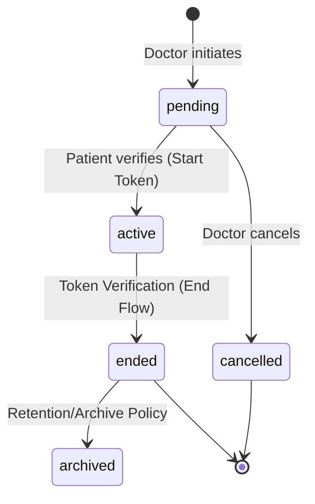
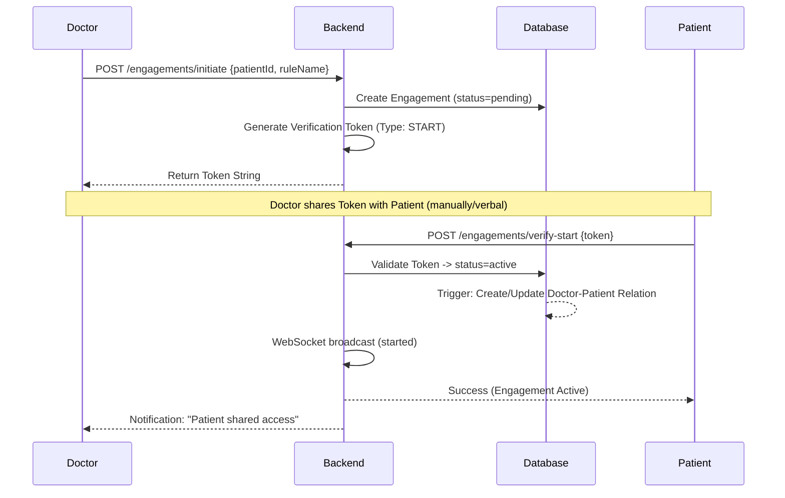
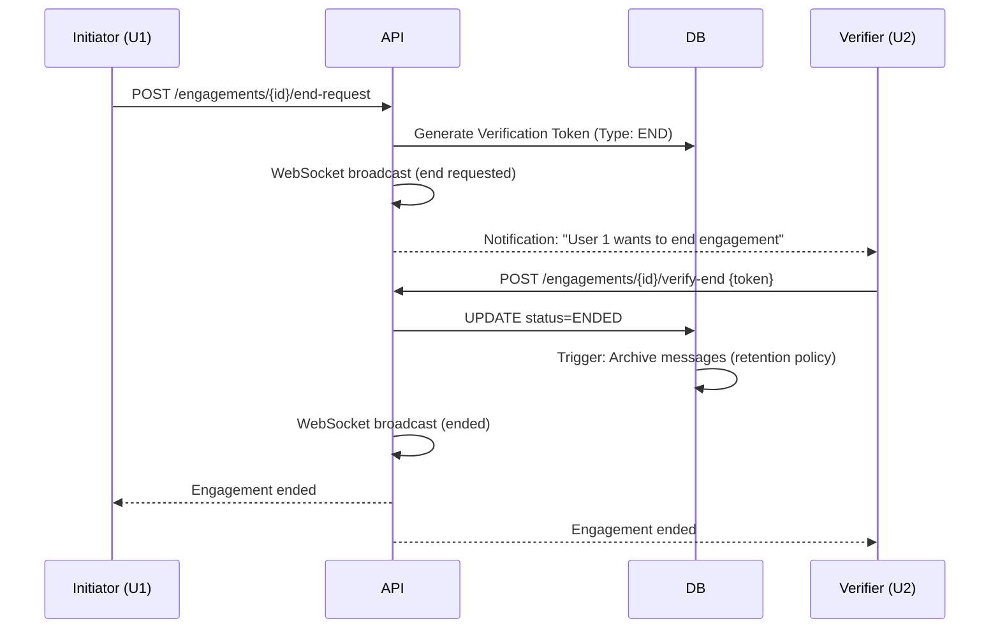

# Engagement System Logic - NeuralHealer
**Version:** 0.5

This document defines the core logic, state machine, and API protocols for the NeuralHealer Engagement system.

---

## 🏗️ 1. Conceptual Overview
An **Engagement** is a secure, documented, and time-bound interaction between a **Doctor** and a **Patient**. It is governed by an **Access Rule** that defines what data the doctor can access during and after the engagement.

### Key Components:
- **Engagement**: The central entity tracking the relationship status.
- **Verification Token**: A secure 2FA token used to transition between critical states (Start/End).
- **Access Rule**: A policy-based permission sets (e.g., `FULL_ACCESS`, `READ_ONLY`).
- **Doctor-Patient Relationship**: A semi-permanent link updated by engagement lifecycle events.

---

## 🔄 2. Engagement State Machine

The engagement lifecycle flows through several states, ensuring mutual consent and data protection.

### State Definitions:

| Status | Description | Transitions |
| :--- | :--- | :--- |
| **Pending** | Engagement created but not yet active. | `active` (verify), `cancelled` (delete) |
| **Active** | Live engagement. Messages and AI interactions allowed. | `ended` (verify-end) |
| **Ended** | Engagement concluded. Access restricted based on rules. | `archived` (auto-trigger) |
| **Cancelled** | Aborted before activation. | None |
| **Archived** | Historic data processed for long-term storage. | None |

---

## 📡 3. Engagement Protocols

### 3.1 Initiation & Activation Flow
The Doctor starts the engagement, and the Patient must verify it using a secure token.

> [!IMPORTANT]
> **Change Log (v0.5)**: QR Code verification has been removed in favor of direct token input for improved accessibility and simplicity.

### 3.2 Termination Flow (Ending an Engagement)
Either party can request to end an engagement. The other party must verify the termination.

---

## 🛠️ 4. API Reference (Lifecycle Only)

### `POST /api/engagements/initiate`
- **Role**: Doctor
- **Payload**: `{ "patientId": "UUID", "accessRuleName": "STRING" }`
- **Response**: Returns the **START** verification token.

### `POST /api/engagements/verify-start`
- **Role**: Patient
- **Payload**: `{ "token": "STRING" }`
- **Transition**: `pending` -> `active`.

### `POST /api/engagements/{id}/end-request`
- **Role**: Any participant
- **Transition**: Generates an **END** verification token.
- **Side Effect**: Broadcasts `end_requested` status via WebSocket.

### `POST /api/engagements/{id}/verify-end`
- **Role**: Any participant (usually the counter-party)
- **Payload**: `{ "token": "STRING" }`
- **Transition**: `active` -> `ended`.
- **Side Effect**: Triggers data archiving and relationship updates.

---

## 🔔 5. WebSocket Event Schema

Topic: `/topic/engagement/{id}`

| Event Type | Payload Category | Description |
| :--- | :--- | :--- |
| `ENGAGEMENT_STATUS` | `active` | Engagement is now live. |
| `ENGAGEMENT_STATUS` | `end_requested` | A termination request is pending verification. |
| `ENGAGEMENT_STATUS` | `ended` | Engagement has concluded. |
| `ENGAGEMENT_STATUS` | `cancelled` | Pending engagement was aborted. |

---

## 📂 6. Data Archiving & Retention
When an engagement transitions to `ENDED`, the following occurs:
1.  **Relationship Update**: The `doctor_patients` entry is updated with the end date.
2.  **Access Revocation**: If the rule is `NO_ACCESS`, the relationship `is_active` becomes `false`.
3.  **Message Scoping**: Messages are no longer returned in active chat queries but are accessible through the `get_accessible_messages` audit function based on retention rules.
