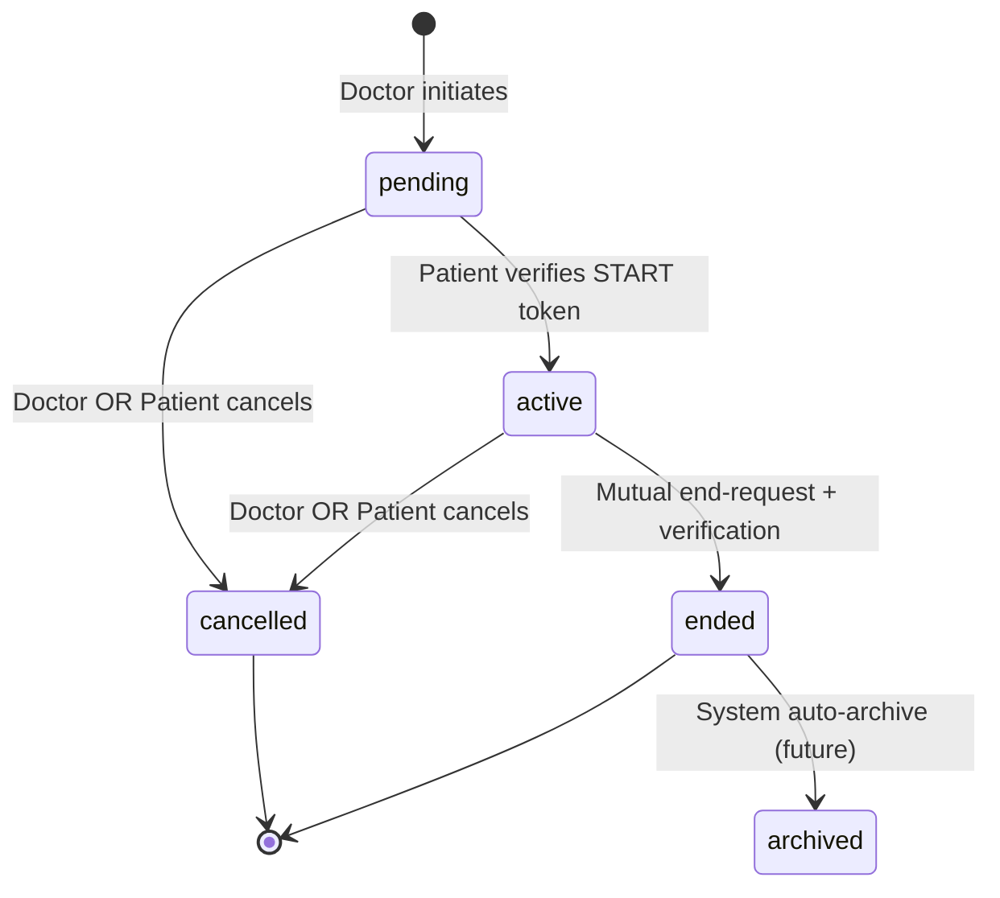

# Engagement System - Complete Implementation Guide
## NeuralHealer Platform

---
**Document Type:** Complete Implementation Specification  
**Version:** 2.0.0  
**Last Updated:** 2026-01-22  
**Status:** ✅ REQUIRED IMPLEMENTATION  
**Purpose:** This document defines ALL required logic, behaviors, and rules for the Engagement system. Everything here MUST be implemented.

---

## 📋 Table of Contents

1. [System Overview](#1-system-overview)
2. [Data Model & Enums](#2-data-model--enums)
3. [State Machine](#3-state-machine)
4. [Doctor-Patient Relationship Lifecycle](#4-doctor-patient-relationship-lifecycle)
5. [DELETE vs CANCEL Operations](#5-delete-vs-cancel-operations)
6. [Token Management System](#6-token-management-system)
7. [API Endpoints Specification](#7-api-endpoints-specification)
8. [Authorization & Security Rules](#8-authorization--security-rules)
9. [Business Logic Rules](#9-business-logic-rules)
10. [Error Handling](#10-error-handling)
11. [WebSocket Events](#11-websocket-events)
12. [Complete Flow Scenarios](#12-complete-flow-scenarios)

---

## 1. System Overview

### 1.1 What is an Engagement?

An **Engagement** is a secure, time-bound, documented interaction between ONE doctor and ONE patient. It controls:
- When the doctor can access patient data
- What level of access the doctor has
- How long the access persists after engagement ends

### 1.2 Core Entities

| Entity | Purpose | Lifecycle |
|--------|---------|-----------|
| `engagements` | Temporal episodes of interaction | Created → Active → Ended/Cancelled |
| `doctor_patients` | Permanent lifetime relationship record | Created on first engagement, NEVER deleted (except special case) |
| `engagement_verification_tokens` | 2FA security tokens | 24-hour expiry, can be refreshed |
| `engagement_access_rules` | Permission templates | Static configuration |

### 1.3 Key Principles

✅ **`doctor_patients` is PERMANENT** - It's the source of truth for relationship history  
✅ **`engagements` are EPISODES** - Multiple engagements can exist between the same doctor-patient pair  
✅ **TOKEN REFRESH exists** - Expired tokens can be regenerated by the doctor  
✅ **BOTH parties can CANCEL** - Doctor and patient have equal cancellation rights  
✅ **DELETE ≠ CANCEL** - Completely different operations with different purposes  

---

## 2. Data Model & Enums

### 2.1 Engagement Status Enum

```sql
CREATE TYPE engagement_status AS ENUM (
  'pending',    -- Created, awaiting patient verification
  'active',     -- Patient verified, engagement is live
  'ended',      -- Gracefully concluded (mutual agreement)
  'cancelled',  -- Unilaterally terminated by either party
  'archived'    -- System-archived for long-term storage
);
```

### 2.2 Doctor-Patient Relationship Status Enum

```sql
CREATE TYPE relationship_status AS ENUM (
  'INITIAL_PENDING',              -- First engagement request sent, not verified
  'INITIAL_CANCELLED_PENDING',    -- First engagement cancelled before activation
  'FULL_ACCESS',                  -- Complete data access
  'READ_ONLY_ACCESS',             -- View-only permissions
  'CURRENT_ENGAGEMENT_ACCESS',    -- Access only during active engagement
  'LIMITED_ENGAGEMENT_ACCESS',    -- Restricted access
  'NO_ACCESS'                     -- All access revoked
);
```

### 2.3 Token Type Enum

```sql
CREATE TYPE verification_type AS ENUM (
  'start',  -- Used to activate pending engagement
  'end'     -- Used to confirm engagement termination
);
```

### 2.4 Token Status Enum

```sql
CREATE TYPE token_status AS ENUM (
  'pending',    -- Awaiting verification
  'verified',   -- Successfully used
  'expired',    -- Past expiration time
  'cancelled'   -- Manually invalidated
);
```

### 2.5 Critical Fields in `doctor_patients`

| Field | Type | Meaning | Changes When |
|-------|------|---------|--------------|
| `relationship_status` | relationship_status | Current access level | Engagement activates, ends, or is cancelled |
| `current_engagement_id` | UUID or NULL | Active/pending engagement | Engagement created (set), ended/cancelled (NULL) |
| `is_active` | boolean | Has any access right now | Based on relationship_status (NO_ACCESS → false) |
| `relationship_started_at` | TIMESTAMP or NULL | **FIRST EVER activation date** | Set once on first activation, **NEVER CHANGES** |
| `relationship_ended_at` | TIMESTAMP or NULL | Last engagement end date | Updated when engagement ends with NO_ACCESS |

---

## 3. State Machine

### 3.1 Engagement State Diagram



### 3.2 State Transition Rules

| From State | To State | Trigger | Authorization | Reversible? |
|------------|----------|---------|---------------|-------------|
| `pending` | `active` | Patient verifies START token | Patient only | No |
| `pending` | `cancelled` | Either party cancels | Doctor OR Patient | No |
| `active` | `cancelled` | Either party cancels | Doctor OR Patient | No |
| `active` | `ended` | End-request + verification | Both parties (2-step) | No |
| `ended` | `archived` | System auto-trigger | System | No |

### 3.3 Terminal States

**Once an engagement reaches `cancelled`, `ended`, or `archived`, its status CANNOT change.**

---

## 4. Doctor-Patient Relationship Lifecycle

### 4.1 First Engagement (No Prior Relationship)

#### Step 1: Doctor Initiates
```
ACTION: Doctor calls POST /api/engagements/initiate

CREATES:
├─ engagement {
│   status: 'pending'
│   doctor_id: <doctor profile UUID>
│   patient_id: <patient profile UUID>
│   access_rule_name: "FULL_ACCESS" (from request)
│   start_at: NULL
│   end_at: NULL
│   ended_by: NULL
│  }
│
└─ doctor_patients {
    doctor_id: <doctor profile UUID>
    patient_id: <patient profile UUID>
    relationship_status: 'INITIAL_PENDING'
    current_engagement_id: <new engagement UUID>
    is_active: false
    relationship_started_at: NULL
    relationship_ended_at: NULL
   }

ALSO CREATES:
└─ engagement_verification_tokens {
    engagement_id: <new engagement UUID>
    token: "NH-123456" (6 random digits)
    verification_type: 'start'
    status: 'pending'
    expires_at: NOW() + 24 hours
   }
```

#### Step 2: Patient Verifies START Token
```
ACTION: Patient calls POST /api/engagements/verify-start with token

UPDATES:
├─ engagement {
│   status: 'pending' → 'active'
│   start_at: NULL → NOW()
│  }
│
└─ doctor_patients {
    relationship_status: 'INITIAL_PENDING' → 'FULL_ACCESS' (from engagement.access_rule_name)
    is_active: false → true
    relationship_started_at: NULL → NOW() ← ⚠️ SET ONCE, NEVER CHANGES
   }

ALSO UPDATES:
└─ engagement_verification_tokens {
    status: 'pending' → 'verified'
    verified_by: <patient user_id>
    verified_at: NOW()
   }
```

### 4.2 Subsequent Engagements (Relationship Exists)

#### Step 1: Doctor Initiates New Engagement
```
ACTION: Doctor calls POST /api/engagements/initiate again

CREATES:
└─ engagement {
    status: 'pending'
    (new engagement with new UUID)
   }

UPDATES EXISTING:
└─ doctor_patients {
    current_engagement_id: <old> → <new engagement UUID>
    relationship_status: UNCHANGED (keeps previous status until patient verifies)
   }
```

#### Step 2: Patient Verifies New Engagement
```
ACTION: Patient verifies START token

UPDATES:
├─ engagement {
│   status: 'pending' → 'active'
│   start_at: NOW()
│  }
│
└─ doctor_patients {
    relationship_status: <old status> → <new engagement's access_rule_name>
    is_active: true
    relationship_started_at: UNCHANGED ← ⚠️ KEEPS ORIGINAL DATE
    relationship_ended_at: NULL (reset if was previously set)
   }
```

### 4.3 Relationship Status Transitions

| Event | Old Status | New Status | is_active | relationship_ended_at |
|-------|------------|------------|-----------|----------------------|
| First verify | INITIAL_PENDING | FULL_ACCESS | true | NULL |
| Engagement ends (NO_ACCESS retention) | FULL_ACCESS | NO_ACCESS | false | NOW() |
| Engagement ends (retention allowed) | FULL_ACCESS | READ_ONLY_ACCESS | true | NULL |
| Patient cancels active (chooses NO_ACCESS) | FULL_ACCESS | NO_ACCESS | false | NOW() |
| Patient cancels active (chooses READ_ONLY) | FULL_ACCESS | READ_ONLY_ACCESS | true | NULL |
| Doctor cancels pending (first engagement) | INITIAL_PENDING | INITIAL_CANCELLED_PENDING | false | NULL |
| New engagement verified | READ_ONLY_ACCESS | FULL_ACCESS | true | NULL (reset) |

---

## 5. DELETE vs CANCEL Operations


markdown
### 5.1 Hard DELETE - System Admin Nuclear Option

**Purpose:** Complete removal for system administration/emergency cleanup. **SYSTEM ADMIN ONLY**. DANGEROUS operation that bypasses normal business logic.

**API:** `DELETE /api/engagements/{id}`

**Authorization:**
- ✅ **System Admin role ONLY** (requires special permission)
- ✅ Works for **ANY** status (pending, active, cancelled, ended)
- ❌ Regular doctors/patients CANNOT use this

**Special Handling for ACTIVE Engagements:**
IF engagement.status == 'active':
  1. Update engagement.status = 'cancelled'
  2. Update engagement.end_at = NOW()
  3. Update engagement.ended_by = SYSTEM_ADMIN_USER_ID
  4. Update engagement.termination_reason = "System admin emergency cleanup"
  5. Update doctor_patients.relationship_status = 'NO_ACCESS'
  6. Update doctor_patients.is_active = false
  7. Update doctor_patients.relationship_ended_at = NOW()
  8. Update doctor_patients.current_engagement_id = NULL
  9. **Send notifications** to doctor and patient
  10. **Create audit log** entry

**What Gets Deleted:**
CASCADE DELETE:
├─ engagement (the record itself)
├─ engagement_verification_tokens
├─ engagement_messages
├─ engagement_events
└─ engagement_analytics

KEEP (do not delete):
└─ doctor_patients record (update only, never delete)
└─ notifications (set engagement_id = NULL)
└─ audit_log entries (for accountability)

text

**Important:** This is **NOT for normal operations**. Only for:
- Emergency data cleanup
- Compliance requirements  
- System migration scenarios
---

### 5.2 Soft CANCEL

**Purpose:** Mark as cancelled, preserve full audit trail. SAFE operation.

**API:** `POST /api/engagements/{id}/cancel`

**Authorization:**
- ✅ Doctor who is part of this engagement
- ✅ Patient who is part of this engagement
- ✅ Works for both `pending` and `active` engagements

**Request Body:**
```json
{
  "reason": "Treatment completed",  // REQUIRED: string, 1-500 chars
  "newAccessRule": "READ_ONLY_ACCESS"  // OPTIONAL: only for patient cancelling active engagement
}
```

**Validation Steps:**
1. Check: User is authenticated
2. Check: Engagement exists
3. Check: Engagement status is `pending` or `active` (cannot cancel already ended/cancelled)
4. Check: Requester is either the doctor or patient in this engagement
5. If patient is cancelling active engagement: Check that `newAccessRule` is provided and valid

**Behavior Matrix:**

#### 5.2.1 PENDING + Doctor Cancels

```
UPDATES engagement:
├─ status: 'pending' → 'cancelled'
├─ end_at: NULL → NOW()
├─ ended_by: NULL → doctor's user_id
└─ termination_reason: NULL → request.reason

UPDATES doctor_patients:
├─ relationship_status: 
│   IF was 'INITIAL_PENDING': → 'INITIAL_CANCELLED_PENDING'
│   ELSE: → UNCHANGED
├─ is_active: → false
├─ current_engagement_id: → NULL
└─ relationship_ended_at: UNCHANGED (NULL if first engagement)

CREATES system message in engagement_messages:
{
  content: "🚫 Dr. [FirstName LastName] cancelled the pending engagement request.\nReason: [reason]"
  is_system_message: true
  system_message_type: 'engagement_cancelled'
}

CREATES notification for patient:
{
  type: "ENGAGEMENT_CANCELLED"
  title: "Engagement Request Cancelled"
  message: "Dr. [FirstName LastName] cancelled the engagement request before activation."
  engagement_id: <engagement uuid>
}

WEBSOCKET BROADCAST:
Topic: /topic/engagement/{id}
Payload: {
  type: "ENGAGEMENT_STATUS",
  status: "cancelled",
  cancelledBy: "doctor",
  reason: "[reason]"
}
```

#### 5.2.2 PENDING + Patient Cancels

```
UPDATES engagement:
├─ status: 'pending' → 'cancelled'
├─ end_at: NULL → NOW()
├─ ended_by: NULL → patient's user_id
└─ termination_reason: NULL → request.reason

UPDATES doctor_patients:
├─ relationship_status:
│   IF was 'INITIAL_PENDING': → 'INITIAL_CANCELLED_PENDING'
│   ELSE: → UNCHANGED
├─ is_active: → false
├─ current_engagement_id: → NULL
└─ relationship_ended_at: UNCHANGED

CREATES system message:
{
  content: "🚫 Patient [FirstName LastName] declined the engagement request.\nReason: [reason]"
  is_system_message: true
  system_message_type: 'engagement_cancelled'
}

CREATES notification for doctor:
{
  type: "ENGAGEMENT_CANCELLED"
  title: "Engagement Request Declined"
  message: "Patient [FirstName LastName] declined your engagement request."
  engagement_id: <engagement uuid>
}

WEBSOCKET BROADCAST:
Topic: /topic/engagement/{id}
Payload: {
  type: "ENGAGEMENT_STATUS",
  status: "cancelled",
  cancelledBy: "patient",
  reason: "[reason]"
}
```

#### 5.2.3 ACTIVE + Doctor Cancels

```
STEP 1: Get retention rule from access_rule
SELECT retains_history_access, retains_no_access 
FROM engagement_access_rules 
WHERE rule_name = engagement.access_rule_name;

STEP 2: Determine new relationship_status
IF retains_no_access = true:
  new_status = 'NO_ACCESS'
  new_is_active = false
  new_ended_at = NOW()
ELSE IF retains_history_access = true:
  new_status = engagement.access_rule_name (keep same)
  new_is_active = true
  new_ended_at = NULL
ELSE:
  new_status = 'CURRENT_ENGAGEMENT_ACCESS'
  new_is_active = true
  new_ended_at = NULL

UPDATES engagement:
├─ status: 'active' → 'cancelled'
├─ end_at: NULL → NOW()
├─ ended_by: NULL → doctor's user_id
└─ termination_reason: NULL → request.reason

UPDATES doctor_patients:
├─ relationship_status: → [new_status from above]
├─ is_active: → [new_is_active from above]
├─ current_engagement_id: → NULL
└─ relationship_ended_at: → [new_ended_at from above]

CREATES system message:
{
  content: "🚫 Dr. [FirstName LastName] cancelled the active engagement.\nReason: [reason]\nAccess changed to: [new_status]"
  is_system_message: true
  system_message_type: 'engagement_cancelled'
}

CREATES notification for patient:
{
  type: "ENGAGEMENT_CANCELLED"
  title: "Engagement Cancelled by Doctor"
  message: "Dr. [FirstName LastName] has cancelled your engagement. Access updated based on retention policy."
  engagement_id: <engagement uuid>
}

WEBSOCKET BROADCAST:
Topic: /topic/engagement/{id}
Payload: {
  type: "ENGAGEMENT_STATUS",
  status: "cancelled",
  cancelledBy: "doctor",
  reason: "[reason]",
  newAccessLevel: "[new_status]"
}
```

#### 5.2.4 ACTIVE + Patient Cancels

```
VALIDATION: request.newAccessRule must be provided and must be one of:
- FULL_ACCESS
- READ_ONLY_ACCESS
- CURRENT_ENGAGEMENT_ACCESS
- LIMITED_ENGAGEMENT_ACCESS
- NO_ACCESS

DETERMINE new state based on patient's choice:
IF newAccessRule = 'NO_ACCESS':
  new_is_active = false
  new_ended_at = NOW()
ELSE:
  new_is_active = true
  new_ended_at = NULL

UPDATES engagement:
├─ status: 'active' → 'cancelled'
├─ end_at: NULL → NOW()
├─ ended_by: NULL → patient's user_id
└─ termination_reason: NULL → request.reason

UPDATES doctor_patients:
├─ relationship_status: → request.newAccessRule (PATIENT CONTROLS THIS)
├─ is_active: → [new_is_active from above]
├─ current_engagement_id: → NULL
└─ relationship_ended_at: → [new_ended_at from above]

CREATES system message:
{
  content: "🚫 You cancelled the engagement with Dr. [FirstName LastName].\nReason: [reason]\nDr. [LastName]'s access has been set to: [newAccessRule]"
  is_system_message: true
  system_message_type: 'engagement_cancelled'
}

CREATES notification for doctor:
{
  type: "ENGAGEMENT_CANCELLED"
  title: "Engagement Cancelled by Patient"
  message: "Patient [FirstName LastName] cancelled the engagement. Your access is now: [newAccessRule]"
  engagement_id: <engagement uuid>
}

WEBSOCKET BROADCAST:
Topic: /topic/engagement/{id}
Payload: {
  type: "ENGAGEMENT_STATUS",
  status: "cancelled",
  cancelledBy: "patient",
  reason: "[reason]",
  newAccessLevel: "[newAccessRule]"
}
```

---

## 6. Token Management System

### 6.1 Token Lifecycle

**Creation Triggers:**
- Doctor initiates engagement → START token generated
- Either party requests end → END token generated

**Token Structure:**
```
{
  token: "NH-XXXXXX"  // 6 random digits
  verification_type: 'start' | 'end'
  status: 'pending' | 'verified' | 'expired' | 'cancelled'
  expires_at: creation_time + 24 hours
}
```

**Status Transitions:**
```
pending → verified (successfully used)
pending → expired (time passes expiry)
pending → cancelled (manually invalidated)
```

### 6.2 Token Expiration Problem

**Scenario:**
1. Doctor creates engagement at 10:00 AM Monday
2. Token expires at 10:00 AM Tuesday
3. Doctor shares token with patient Wednesday (too late)
4. Patient tries to verify → ERROR: "Token has expired"

**Solution:** Token refresh mechanism

### 6.3 Refresh Token Endpoint

**API:** `POST /api/engagements/{id}/refresh-token`

**Authorization:**
- ✅ Only the doctor who created the engagement
- ✅ Only works for PENDING engagements
- ❌ Cannot refresh tokens for active/ended/cancelled engagements

**Validation Steps:**
1. Check: Engagement exists
2. Check: Engagement status is `pending`
3. Check: Requester is the doctor who created it

**Logic:**
```
STEP 1: Find existing START token
SELECT * FROM engagement_verification_tokens
WHERE engagement_id = {id}
  AND verification_type = 'start'
ORDER BY created_at DESC
LIMIT 1;

STEP 2: Check if token is still valid
IF token.expires_at > NOW() AND token.status = 'pending':
  → Return existing token (no change needed)

STEP 3: If expired or doesn't exist, generate new one
UPDATE existing token SET status = 'expired';  // Mark old as expired

INSERT INTO engagement_verification_tokens {
  engagement_id: {id}
  token: "NH-" + generateRandom6Digits()
  verification_type: 'start'
  status: 'pending'
  expires_at: NOW() + 24 hours
  doctor_id: requester.user_id
  patient_id: engagement.patient.user_id
}

STEP 4: Return new token to doctor
```

**Response:**
```json
{
  "token": "NH-789012",
  "expiresAt": "2026-01-23T10:00:00Z",
  "status": "pending",
  "isNew": true  // true if regenerated, false if existing returned
}
```

**Important:** Doctor must manually share the new token with patient (verbal, secure message, etc.)

### 6.4 Get Current Token Endpoint

**API:** `GET /api/engagements/{id}/token`

**Authorization:** Same as refresh-token

**Logic:**
```
STEP 1: Find current START token
SELECT * FROM engagement_verification_tokens
WHERE engagement_id = {id}
  AND verification_type = 'start'
  AND status = 'pending'
  AND expires_at > NOW()
ORDER BY created_at DESC
LIMIT 1;

STEP 2: If found, return it
IF token exists:
  → Return token details
ELSE:
  → Return 404 with message "No valid token exists. Please refresh token."
```

**Response (Success):**
```json
{
  "token": "NH-123456",
  "expiresAt": "2026-01-23T10:00:00Z",
  "status": "pending"
}
```

**Response (No Valid Token):**
```json
{
  "status": 404,
  "message": "No valid token exists. Please call /refresh-token to generate a new one."
}
```

---

## 7. API Endpoints Specification

### 7.1 Complete Endpoint List

| Method | Endpoint | Purpose | Auth | Status Required |
|--------|----------|---------|------|-----------------|
| POST | `/api/engagements/initiate` | Doctor creates engagement | Doctor | N/A (creates new) |
| POST | `/api/engagements/verify-start` | Patient activates engagement | Patient | pending |
| POST | `/api/engagements/{id}/end-request` | Request termination | Doctor or Patient | active |
| POST | `/api/engagements/{id}/verify-end` | Confirm termination | Other party | active |
| DELETE | `/api/engagements/{id}` | Hard delete (testing) | Creator doctor | pending only |
| POST | `/api/engagements/{id}/cancel` | Soft cancel with reason | Doctor or Patient | pending or active |
| POST | `/api/engagements/{id}/refresh-token` | Regenerate START token | Creator doctor | pending |
| GET | `/api/engagements/{id}/token` | Get current valid token | Creator doctor | pending |
| GET | `/api/engagements/my-engagements` | List user's engagements | Any user | N/A |
| GET | `/api/engagements/{id}` | Get engagement details | Participant | any |

### 7.2 Detailed Endpoint Specs

#### POST /api/engagements/initiate

**Request:**
```json
{
  "patientId": "uuid-here",  // patient_profiles.id
  "accessRuleName": "FULL_ACCESS"
}
```

**Validations:**
- patientId must exist in patient_profiles
- accessRuleName must exist in engagement_access_rules
- Doctor cannot create engagement with themselves

**Response (Success 200):**
```json
{
  "engagementId": "uuid",
  "engagementCode": "ENG-2026-000123",
  "status": "pending",
  "doctor": {
    "id": "uuid",
    "firstName": "John",
    "lastName": "Doe",
    "email": "doctor@example.com"
  },
  "patient": {
    "id": "uuid",
    "firstName": "Jane",
    "lastName": "Smith",
    "email": "patient@example.com"
  },
  "accessRule": "FULL_ACCESS",
  "verification": {
    "token": "NH-123456",
    "expiresAt": "2026-01-23T10:00:00Z"
  },
  "createdAt": "2026-01-22T10:00:00Z"
}
```

#### POST /api/engagements/verify-start

**Request:**
```json
{
  "token": "NH-123456"
}
```

**Validations:**
- Token must exist
- Token must be type 'start'
- Token must be status 'pending'
- Token must not be expired
- Requester must be the patient for this engagement

**Response (Success 200):**
```json
{
  "id": "uuid",
  "engagementId": "ENG-2026-000123",
  "status": "active",
  "startAt": "2026-01-22T10:15:00Z",
  "doctor": { ... },
  "patient": { ... },
  "accessRule": "FULL_ACCESS"
}
```

**Error Cases:**
```json
{ "status": 400, "message": "Token has expired" }
{ "status": 400, "message": "Token not found" }
{ "status": 403, "message": "Only the patient can verify this engagement" }
{ "status": 400, "message": "Engagement is already active" }
```

#### DELETE /api/engagements/{id}

**No request body**

**Response (Success 200):**
```json
{
  "success": true,
  "message": "Engagement permanently deleted",
  "deletedEngagementId": "uuid",
  "deletedRelationship": false
}
```

#### POST /api/engagements/{id}/cancel

**Request:**
```json
{
  "reason": "Treatment completed successfully",
  "newAccessRule": "READ_ONLY_ACCESS"  // Only if patient cancelling active
}
```

**Response (Success 200):**
```json
{
  "success": true,
  "engagementId": "uuid",
  "status": "cancelled",
  "cancelledBy": "doctor",  // or "patient"
  "cancelledAt": "2026-01-22T11:00:00Z",
  "newRelationshipStatus": "NO_ACCESS"
}
```

#### POST /api/engagements/{id}/refresh-token

**No request body**

**Response (Success 200):**
```json
{
  "token": "NH-789012",
  "expiresAt": "2026-01-23T11:00:00Z",
  "status": "pending",
  "isNew": true
}
```

#### GET /api/engagements/{id}/token

**No request body**

**Response (Success 200):**
```json
{
  "token": "NH-123456",
  "expiresAt": "2026-01-23T10:00:00Z",
  "status": "pending"
}
```

**Response (No Valid Token 404):**
```json
{
  "status": 404,
  "message": "No valid token exists. Please call /refresh-token."
}
```

---

## 8. Authorization & Security Rules

### 8.1 Role-Based Access Control

**Doctor Permissions:**
- ✅ Create engagements with any patient
- ✅ Cancel own pending engagements
- ✅ Cancel own active engagements
- ✅ Delete own pending engagements (hard delete)
- ✅ Refresh tokens for own pending engagements
- ✅ Request end for own active engagements
- ✅ Verify end if patient requested end
- ❌ Cannot verify START token (only patient can)
- ❌ Cannot delete/cancel other doctors' engagements
- ❌ Cannot delete active/ended/cancelled engagements

**Patient Permissions:**
- ✅ Verify START token for engagements directed at them
- ✅ Cancel pending engagements directed at them
- ✅ Cancel active engagements they're part of (with access rule choice)
- ✅ Request end for active engagements
- ✅ Verify end if doctor requested end
- ❌ Cannot create engagements
- ❌ Cannot refresh tokens
- ❌ Cannot delete engagements
- ❌ Cannot cancel/end engagements they're not part of

### 8.2 Authorization Checks (Per Request)

**For EVERY endpoint, MUST check:**

1. **Authentication:** User has valid session/JWT
2. **Engagement Existence:** Engagement with given ID exists
3. **Participation:** User is either the doctor or patient in this engagement
4. **Role Permission:** User's role allows this specific action
5. **Status Validation:** Engagement's current status allows this action

**Implementation Pattern:**
```
STEP 1: Get user from session/JWT
STEP 2: Load engagement with ID
STEP 3: Check if user.id matches engagement.doctor.user_id OR engagement.patient.user_id
STEP 4: Check if user's role (doctor/patient) can perform this action
STEP 5: Check if engagement.status allows this action
STEP 6: If all pass, proceed with business logic
STEP 7: If any fail, return 403 Forbidden
```

### 8.3 Status-Action Matrix

| Current Status | CREATE | VERIFY_START | CANCEL | DELETE | REFRESH_TOKEN | END_REQUEST | VERIFY_END |
|----------------|--------|--------------|--------|--------|---------------|-------------|------------|
| N/A (new) | ✅ | ❌ | ❌ | ❌ | ❌ | ❌ | ❌ |
| pending | ❌ | ✅ | ✅ | ✅ (doctor) | ✅ (doctor) | ❌ | ❌ |
| active | ❌ | ❌ | ✅ | ❌ | ❌ | ✅ | ✅ |
| ended | ❌ | ❌ | ❌ | ❌ | ❌ | ❌ | ❌ |
| cancelled | ❌ | ❌ | ❌ | ❌ | ❌ | ❌ | ❌ |

---

## 9. Business Logic Rules

### 9.1 Immutability Rules

**NEVER CHANGE:**
- `doctor_patients.relationship_started_at` (set once on first activation)
- `engagement.engagement_id` (auto-generated, unique identifier)
- `engagement.doctor_id` (cannot reassign engagement to different doctor)
- `engagement.patient_id` (cannot reassign engagement to different patient)

**CAN CHANGE:**
- `doctor_patients.relationship_status` (updates based on engagement lifecycle)
- `doctor_patients.current_engagement_id` (points to latest engagement)
- `doctor_patients.is_active` (based on access level)
- `doctor_patients.relationship_ended_at` (updates when NO_ACCESS)
- `engagement.status` (follows state machine)

### 9.2 Relationship Status Logic

**Rule 1: First Activation Sets relationship_started_at**
```
IF doctor_patients.relationship_started_at IS NULL
AND engagement transitions to 'active':
  SET relationship_started_at = NOW()
```

**Rule 2: Subsequent Activations Keep Original Date**
```
IF doctor_patients.relationship_started_at IS NOT NULL
AND new engagement transitions to 'active':
  DO NOT CHANGE relationship_started_at
```

**Rule 3: NO_ACCESS Sets relationship_ended_at**
```
IF new relationship_status = 'NO_ACCESS':
  SET relationship_ended_at = NOW()
ELSE:
  SET relationship_ended_at = NULL
```

**Rule 4: is_active Reflects Current Access**
```
IF relationship_status = 'NO_ACCESS':
  SET is_active = false
ELSE:
  SET is_active = true
```

### 9.3 Token Generation Rules

**Rule 1: Token Format**
```
Pattern: "NH-" + 6 random digits
Example: "NH-847293"
Must be unique across all active tokens
```

**Rule 2: Token Expiration**
```
All tokens expire 24 hours after creation
expires_at = created_at + 24 hours
```

**Rule 3: Token Reuse**
```
If valid token exists (pending, not expired):
  Return existing token (don't create new)
If token expired:
  Mark old as 'expired', create new
```

**Rule 4: Token Types Cannot Mix**
```
START token can only be used for verify-start
END token can only be used for verify-end
```

### 9.4 Access Rule Application

**During Active Engagement:**
```
Doctor has permissions defined in engagement.access_rule_name
Example: FULL_ACCESS grants all permissions
```

**After Engagement Ends (Normal):**
```
Apply retention rules from engagement_access_rules:
- If retains_no_access = true: doctor_patients.relationship_status = 'NO_ACCESS'
- If retains_history_access = true: keep same access_rule_name
- If retains_period_access = true: change to 'CURRENT_ENGAGEMENT_ACCESS'
```

**After Engagement Cancelled (Patient):**
```
Patient explicitly chooses newAccessRule
Doctor has no say, must accept patient's decision
```

**After Engagement Cancelled (Doctor):**
```
Apply retention rules (same as normal end)
Patient has no choice in this case
```

### 9.5 Notification Timing

**MUST send notifications for:**
- ✅ Engagement created (to patient)
- ✅ Engagement activated (to doctor)
- ✅ Engagement cancelled (to other party)
- ✅ End requested (to other party)
- ✅ End verified (to both parties)
- ✅ Token expired (to patient, if still pending)

**DO NOT send notifications for:**
- ❌ Token refreshed (doctor action, no need to notify)
- ❌ Hard delete (testing operation, silent)

---

## 10. Error Handling

### 10.1 Standard Error Response Format

```json
{
  "status": 400,  // HTTP status code
  "message": "Human-readable error message",
  "timestamp": "2026-01-22T10:00:00Z",
  "path": "/api/engagements/verify-start",
  "details": {  // Optional, for validation errors
    "field": "token",
    "constraint": "Token has expired"
  }
}
```

### 10.2 Common Error Codes

| Status | When to Use | Example Message |
|--------|-------------|-----------------|
| 400 | Bad request, validation failed | "Token has expired" |
| 401 | Not authenticated | "Authentication required" |
| 403 | Authenticated but not authorized | "Only the patient can verify this engagement" |
| 404 | Resource not found | "Engagement not found" |
| 409 | Conflict, invalid state | "Engagement is already active" |
| 500 | Unexpected server error | "An unexpected error occurred" |

### 10.3 Validation Error Messages

**Token Errors:**
- "Token not found"
- "Token has expired"
- "Token has already been used"
- "Invalid token format"

**Authorization Errors:**
- "Only the creator doctor can delete this engagement"
- "Only the patient can verify this engagement"
- "You are not part of this engagement"

**Status Errors:**
- "Can only delete pending engagements. Current status: active"
- "Cannot cancel an already ended engagement"
- "Engagement must be active to request termination"

**Validation Errors:**
- "Patient not found"
- "Access rule 'INVALID_RULE' does not exist"
- "Reason is required when cancelling"
- "newAccessRule is required when patient cancels active engagement"

### 10.4 Database Constraint Handling

**If Foreign Key Violation:**
```json
{
  "status": 400,
  "message": "Invalid patient ID or access rule name"
}
```

**If Unique Constraint Violation:**
```json
{
  "status": 409,
  "message": "An engagement already exists between this doctor and patient"
}
```

**If Null Constraint Violation:**
```json
{
  "status": 400,
  "message": "Required field is missing"
}
```

---

## 11. WebSocket Events

### 11.1 Event Topics

**Topic Pattern:** `/topic/engagement/{engagementId}`

**Subscription:** Clients subscribe to specific engagement by UUID

### 11.2 Event Payloads

#### Engagement Created
```json
{
  "type": "ENGAGEMENT_STATUS",
  "status": "pending",
  "engagementId": "uuid",
  "timestamp": "2026-01-22T10:00:00Z"
}
```

#### Engagement Activated
```json
{
  "type": "ENGAGEMENT_STATUS",
  "status": "active",
  "activatedBy": "patient",
  "activatedAt": "2026-01-22T10:15:00Z",
  "accessLevel": "FULL_ACCESS"
}
```

#### Engagement Cancelled
```json
{
  "type": "ENGAGEMENT_STATUS",
  "status": "cancelled",
  "cancelledBy": "doctor",  // or "patient"
  "reason": "Treatment completed",
  "newAccessLevel": "READ_ONLY_ACCESS",
  "timestamp": "2026-01-22T11:00:00Z"
}
```

#### End Requested
```json
{
  "type": "ENGAGEMENT_STATUS",
  "status": "end_requested",
  "requestedBy": "doctor",  // or "patient"
  "reason": "Session complete",
  "timestamp": "2026-01-22T12:00:00Z"
}
```

#### Engagement Ended
```json
{
  "type": "ENGAGEMENT_STATUS",
  "status": "ended",
  "endedAt": "2026-01-22T12:05:00Z",
  "finalAccessLevel": "NO_ACCESS"
}
```

### 11.3 Real-time Updates

**Clients MUST listen for:**
- Status changes (pending → active → ended/cancelled)
- Cancellation events (to show immediate UI feedback)
- End request events (to prompt other party for verification)

**Server MUST broadcast:**
- Immediately after any status change
- To all connected clients subscribed to that engagement topic

---

## 12. Complete Flow Scenarios

### Scenario 1: Happy Path - First Engagement Success

```
T+0min: Doctor initiates engagement
├─ POST /api/engagements/initiate
├─ engagement created (status: pending)
├─ doctor_patients created (relationship_status: INITIAL_PENDING)
├─ START token generated: "NH-123456" (expires in 24h)
└─ Notification sent to patient

T+5min: Doctor shares token with patient verbally

T+10min: Patient verifies engagement
├─ POST /api/engagements/verify-start {token: "NH-123456"}
├─ engagement.status: pending → active
├─ doctor_patients.relationship_status: INITIAL_PENDING → FULL_ACCESS
├─ doctor_patients.is_active: false → true
├─ doctor_patients.relationship_started_at: NULL → NOW()
├─ System message created in engagement_messages
├─ Notification sent to doctor
└─ WebSocket broadcast: status = active

T+60min: Doctor and patient exchange messages in engagement chat

T+120min: Doctor requests end
├─ POST /api/engagements/{id}/end-request {reason: "Treatment complete"}
├─ END token generated
├─ Notification sent to patient
└─ WebSocket broadcast: status = end_requested

T+125min: Patient verifies end
├─ POST /api/engagements/{id}/verify-end {token: "END-789012"}
├─ engagement.status: active → ended
├─ engagement.end_at: NOW()
├─ doctor_patients.relationship_status: FULL_ACCESS → NO_ACCESS (retention rule)
├─ doctor_patients.is_active: true → false
├─ doctor_patients.current_engagement_id: uuid → NULL
├─ doctor_patients.relationship_ended_at: NOW()
├─ System message created
└─ WebSocket broadcast: status = ended

Result: Clean lifecycle, all data preserved, doctor has no more access
```

### Scenario 2: Token Expiration & Refresh

```
T+0min: Doctor initiates engagement
├─ Token "NH-123456" created (expires at T+24h)
└─ Doctor forgets to share token

T+25h: Patient receives token (too late)

T+25h+5min: Patient tries to verify
├─ POST /api/engagements/verify-start {token: "NH-123456"}
└─ ERROR 400: "Token has expired"

T+25h+10min: Patient contacts doctor

T+25h+15min: Doctor refreshes token
├─ POST /api/engagements/{id}/refresh-token
├─ Old token marked as 'expired'
├─ New token "NH-789012" created (expires at T+49h)
└─ Response: {token: "NH-789012", isNew: true}

T+25h+20min: Doctor shares new token with patient

T+25h+25min: Patient verifies successfully
├─ POST /api/engagements/verify-start {token: "NH-789012"}
└─ engagement.status: pending → active

Result: Token refresh solved the expiration problem
```

### Scenario 3: Patient Cancels Active, Grants Limited Access

```
T+0min: Active engagement exists (FULL_ACCESS)

T+60min: Patient decides to switch to another doctor

T+60min: Patient cancels engagement
├─ POST /api/engagements/{id}/cancel
├─ Body: {
│   reason: "Switching to specialist",
│   newAccessRule: "READ_ONLY_ACCESS"
│  }
├─ engagement.status: active → cancelled
├─ engagement.ended_by: patient_user_id
├─ doctor_patients.relationship_status: FULL_ACCESS → READ_ONLY_ACCESS
├─ doctor_patients.is_active: true (still has access)
├─ doctor_patients.current_engagement_id: uuid → NULL
├─ doctor_patients.relationship_ended_at: NULL (not ended, just downgraded)
├─ System message: "Patient Jane Doe cancelled engagement. Doctor access: READ_ONLY_ACCESS"
└─ Notification to doctor: "Your access has been changed to READ_ONLY_ACCESS"

Result: Doctor can still view historical data (read-only), but cannot modify or message
```

### Scenario 4: Doctor Deletes Pending Engagement (Testing)

```
T+0min: Doctor creates engagement for testing
├─ engagement created (status: pending)
└─ doctor_patients created (relationship_status: INITIAL_PENDING)

T+2min: Doctor realizes it's a test, wants to clean up

T+2min: Doctor hard deletes
├─ DELETE /api/engagements/{id}
├─ engagement deleted (cascades to tokens, messages, events)
├─ notifications.engagement_id set to NULL
├─ doctor_patients record DELETED (because was INITIAL_PENDING)
└─ Response: {deletedRelationship: true}

Result: Complete cleanup, no trace left (except nullified notifications)
```

### Scenario 5: Second Engagement Between Same Pair

```
INITIAL STATE:
doctor_patients: {
  relationship_status: "READ_ONLY_ACCESS"
  is_active: true
  relationship_started_at: "2025-06-15"
  relationship_ended_at: NULL
  current_engagement_id: NULL
}

T+0min: Doctor initiates new engagement
├─ New engagement created (status: pending, access_rule: FULL_ACCESS)
├─ doctor_patients.current_engagement_id: NULL → new_uuid
└─ doctor_patients.relationship_status: UNCHANGED (still READ_ONLY_ACCESS)

T+10min: Patient verifies new engagement
├─ engagement.status: pending → active
├─ doctor_patients.relationship_status: READ_ONLY_ACCESS → FULL_ACCESS
├─ doctor_patients.relationship_started_at: UNCHANGED ("2025-06-15")
└─ doctor_patients.relationship_ended_at: NULL (reset if was set)

Result: New engagement active, original relationship_started_at preserved
```

### Scenario 6: Doctor Cancels Pending (First Engagement)

```
T+0min: Doctor initiates first engagement
├─ engagement created (status: pending)
└─ doctor_patients created (relationship_status: INITIAL_PENDING)

T+5min: Doctor changes mind, cancels
├─ POST /api/engagements/{id}/cancel {reason: "Patient unavailable"}
├─ engagement.status: pending → cancelled
├─ doctor_patients.relationship_status: INITIAL_PENDING → INITIAL_CANCELLED_PENDING
├─ doctor_patients.is_active: false
├─ doctor_patients.current_engagement_id: NULL
└─ Notification to patient: "Dr. John Doe cancelled the engagement request"

Result: Engagement cancelled, relationship status shows it was initial cancellation
```

---

## 13. Implementation Checklist

### Phase 1: Core Engagement CRUD
- [ ] POST /api/engagements/initiate
- [ ] POST /api/engagements/verify-start
- [ ] GET /api/engagements/{id}
- [ ] GET /api/engagements/my-engagements

### Phase 2: DELETE vs CANCEL
- [ ] DELETE /api/engagements/{id} (hard delete with cascade)
- [ ] POST /api/engagements/{id}/cancel (soft cancel with role detection)
- [ ] Role-based authorization checks
- [ ] Status validation matrix

### Phase 3: Token Refresh
- [ ] POST /api/engagements/{id}/refresh-token
- [ ] GET /api/engagements/{id}/token
- [ ] Token expiration detection
- [ ] Old token invalidation

### Phase 4: doctor_patients Lifecycle
- [ ] Relationship status enum implementation
- [ ] relationship_started_at immutability
- [ ] relationship_ended_at logic
- [ ] is_active updates based on access level

### Phase 5: System Messages
- [ ] engagement_messages with is_system_message flag
- [ ] Different messages for doctor-cancel vs patient-cancel
- [ ] Include actor name and reason in messages

### Phase 6: WebSocket Events
- [ ] /topic/engagement/{id} subscription
- [ ] Real-time status broadcasts
- [ ] Event payload structure

### Phase 7: Error Handling
- [ ] Standard error response format
- [ ] Specific validation messages
- [ ] HTTP status code mapping

---

## 14. Testing Requirements

### Unit Tests Required:
- [ ] Token generation uniqueness
- [ ] Token expiration logic
- [ ] relationship_started_at immutability
- [ ] Access rule retention logic
- [ ] Status transition validation

### Integration Tests Required:
- [ ] Complete happy path (Scenario 1)
- [ ] Token refresh flow (Scenario 2)
- [ ] Patient cancel with access choice (Scenario 3)
- [ ] Hard delete cascade (Scenario 4)
- [ ] Multiple engagements between same pair (Scenario 5)

### Authorization Tests Required:
- [ ] Doctor cannot verify START token
- [ ] Patient cannot create engagement
- [ ] Doctor cannot delete other's engagement
- [ ] Patient cannot refresh token
- [ ] Cannot cancel already ended engagement

---

**END OF SPECIFICATION**

This document defines EVERYTHING required for the Engagement system. All logic, rules, and behaviors MUST be implemented exactly as specified.