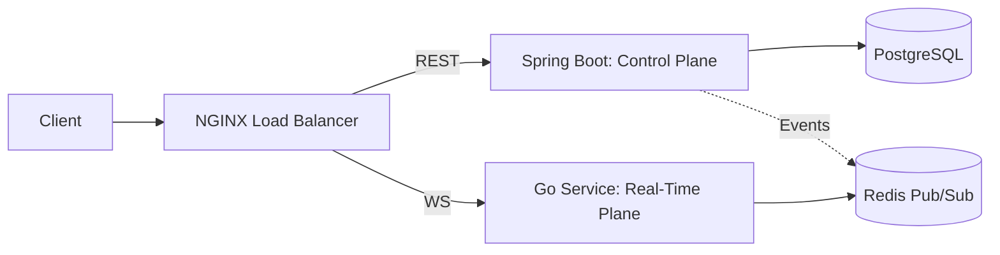

# Microservices Roadmap - NeuralHealer
**Version:** 0.4

As NeuralHealer grows, we plan to shift from a monolithic architecture to a distributed system to handle extreme scale in the Real-Time Plane.

---

## 🎯 1. Why Go for WebSockets?

While Spring Boot handles business logic beautifully, **Golang** is superior for handling massive numbers of concurrent long-lived connections (WebSockets) due to:
- **Goroutines**: extremely low memory footprint (~2KB vs 1MB for Java Threads).
- **Static Binaries**: Fast startup and slim Docker images.

---

## 🏗️ 2. Target Architecture (Phase 8)

---

## 📅 3. Migration Phases

### Phase 1: Event-Driven Foundation (v0.7)
- Integrate **Redis** into the Spring Boot monolith.
- Every engagement update publishes an event to a Redis channel.

### Phase 2: The Go Sidecar (v0.8)
- Build a Go service that subscribes to Redis and broadcasts to connected clients.
- Spring Boot still handles the database, but Go handles the "Real-Time Delivery".

### Phase 3: Total Separation (v1.0)
- Move Typing Indicators and Live Statuses entirely to Go (No database hits).
- Spring Boot focuses exclusively on AI inference and Regulated Control logic.

---

## 📈 4. Scaling Projections

| Strategy | Capacity (Concurrent Chats) |
| :--- | :--- |
| **Current (Single Node Spring)** | ~1,000 - 5,000 |
| **Horizontal Spring** | ~10,000 - 20,000 |
| **Go + Redis Microservices** | **100,000+** |
