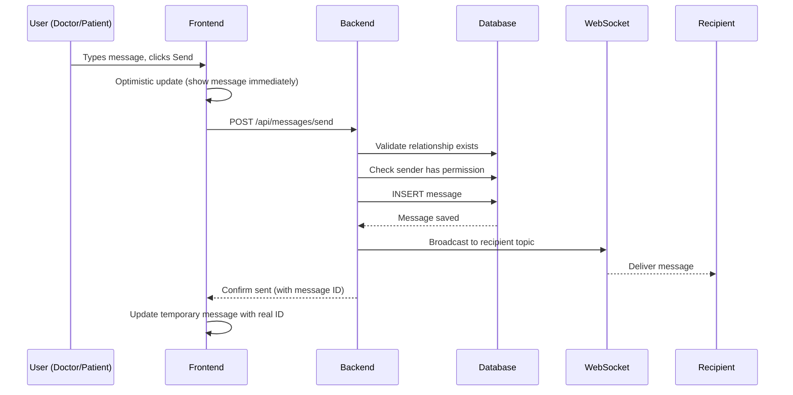
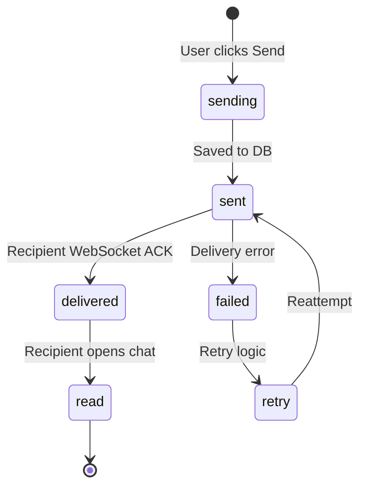
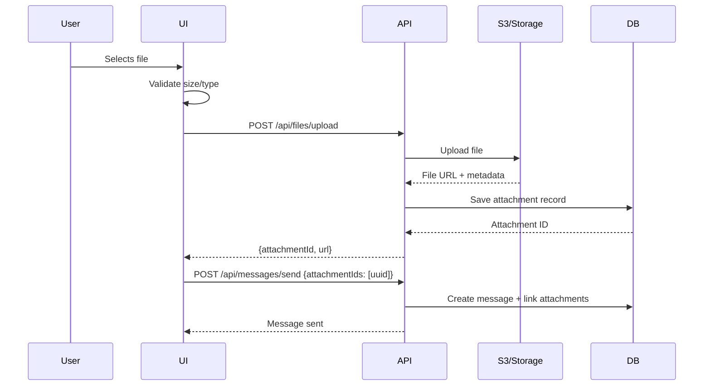

# Messaging System - Goal Specification
## NeuralHealer Platform

---
**Document Type:** Future Goal Specification  
**Version:** 1.0.0  
**Last Updated:** 2026-01-22  
**Status:** 🎯 PLANNED (Partial Implementation Exists)  
**Purpose:** Define the complete messaging system architecture, behaviors, and requirements for doctor-patient communication.

---

## 📋 Table of Contents

1. [System Overview](#1-system-overview)
2. [Message Types](#2-message-types)
3. [Data Model](#3-data-model)
4. [Message Lifecycle](#4-message-lifecycle)
5. [Real-time Communication](#5-real-time-communication)
6. [Access Control Rules](#6-access-control-rules)
7. [Message Retention & Archiving](#7-message-retention--archiving)
8. [File Attachments](#8-file-attachments)
9. [System Messages](#9-system-messages)
10. [Read Receipts & Delivery Status](#10-read-receipts--delivery-status)
11. [Search & History](#11-search--history)
12. [Future: doctor_patients-Based Messaging](#12-future-doctor_patients-based-messaging)

---

## 1. System Overview

### 1.1 Current State

**Existing Implementation:**
- Engagement-based messaging (messages tied to specific engagements)
- Basic send/receive functionality
- System messages for engagement events
- WebSocket real-time delivery

**Table:** `engagement_messages`

### 1.2 Future Vision

**Goal: Transition to doctor_patients-Based Messaging**

**Why?**
- `engagement_messages` are temporary (deleted when engagement ends)
- `doctor_patients` is permanent (represents lifetime relationship)
- Enable continuous conversation across multiple engagements
- Preserve chat history even after engagement cancellation

**Migration Path:**
```
Current: engagement_messages (engagement-scoped)
    ↓
Future: doctor_patient_messages (relationship-scoped)
```

### 1.3 Core Principles

✅ **Continuity** - Chat history persists across engagements  
✅ **Access Control** - Messages visible based on current relationship_status  
✅ **Real-time** - Instant delivery via WebSocket  
✅ **Secure** - End-to-end encryption (future goal)  
✅ **Auditable** - Full message history for compliance  

---

## 2. Message Types

### 2.1 User Messages

**Regular Text Messages:**
```json
{
  "type": "user",
  "content": "Hello, how are you feeling today?",
  "senderId": "user-uuid",
  "recipientId": "user-uuid",
  "contentType": "text"
}
```

**Rich Text Messages (Future):**
```json
{
  "type": "user",
  "content": "<p>Here's your <strong>treatment plan</strong>:</p><ul><li>Item 1</li></ul>",
  "contentType": "html"
}
```

### 2.2 System Messages

**Engagement Events:**
```json
{
  "type": "system",
  "content": "🟢 Engagement activated with access level: FULL_ACCESS",
  "systemMessageType": "engagement_started",
  "isSystemMessage": true
}
```

**Access Changes:**
```json
{
  "type": "system",
  "content": "🔄 Access level changed to: READ_ONLY_ACCESS",
  "systemMessageType": "access_changed"
}
```

**Engagement Termination:**
```json
{
  "type": "system",
  "content": "🚫 Dr. John Doe cancelled the engagement. Reason: Treatment completed",
  "systemMessageType": "engagement_cancelled"
}
```

### 2.3 File Messages (Future)

**Image Messages:**
```json
{
  "type": "user",
  "content": "Check out this X-ray",
  "contentType": "image",
  "attachments": [{
    "fileId": "uuid",
    "fileName": "xray.jpg",
    "fileSize": 2048000,
    "mimeType": "image/jpeg",
    "url": "/api/files/uuid"
  }]
}
```

**Document Messages:**
```json
{
  "type": "user",
  "content": "Here's your treatment plan",
  "contentType": "document",
  "attachments": [{
    "fileId": "uuid",
    "fileName": "treatment_plan.pdf",
    "fileSize": 512000,
    "mimeType": "application/pdf",
    "url": "/api/files/uuid"
  }]
}
```

---

## 3. Data Model

### 3.1 Current Model: engagement_messages

```sql
CREATE TABLE engagement_messages (
  id UUID PRIMARY KEY DEFAULT gen_random_uuid(),
  engagement_id UUID NOT NULL REFERENCES engagements(id) ON DELETE CASCADE,
  message_uuid UUID DEFAULT gen_random_uuid(),
  
  sender_id UUID REFERENCES users(id),
  recipient_id UUID REFERENCES users(id),
  
  content TEXT,
  content_type VARCHAR(50) DEFAULT 'text',
  
  sent_at TIMESTAMP DEFAULT now(),
  delivered_at TIMESTAMP,
  read_at TIMESTAMP,
  
  is_encrypted BOOLEAN DEFAULT true,
  encryption_key_id VARCHAR(255),
  
  -- System messages
  is_system_message BOOLEAN DEFAULT false,
  system_message_type VARCHAR(50),
  
  created_at TIMESTAMP DEFAULT now()
);
```

**Issues with Current Model:**
- ❌ Tied to engagement (deleted when engagement deleted)
- ❌ No continuity across engagements
- ❌ Cannot message without active engagement

### 3.2 Future Model: doctor_patient_messages (NEW)

```sql
CREATE TABLE doctor_patient_messages (
  id UUID PRIMARY KEY DEFAULT gen_random_uuid(),
  relationship_id UUID NOT NULL REFERENCES doctor_patients(id) ON DELETE CASCADE,
  engagement_id UUID REFERENCES engagements(id) ON DELETE SET NULL,  -- Optional: track which engagement context
  
  sender_id UUID NOT NULL REFERENCES users(id),
  recipient_id UUID NOT NULL REFERENCES users(id),
  
  content TEXT NOT NULL,
  content_type VARCHAR(50) DEFAULT 'text',
  
  -- Attachments (future)
  has_attachments BOOLEAN DEFAULT false,
  attachment_count INTEGER DEFAULT 0,
  
  -- Delivery tracking
  sent_at TIMESTAMP DEFAULT now(),
  delivered_at TIMESTAMP,
  read_at TIMESTAMP,
  
  -- Encryption
  is_encrypted BOOLEAN DEFAULT false,
  encryption_key_id VARCHAR(255),
  
  -- System messages
  is_system_message BOOLEAN DEFAULT false,
  system_message_type VARCHAR(50),
  
  -- Soft delete
  deleted_at TIMESTAMP,
  deleted_by UUID REFERENCES users(id),
  
  created_at TIMESTAMP DEFAULT now()
);

CREATE INDEX idx_doctor_patient_messages_relationship 
ON doctor_patient_messages(relationship_id, created_at DESC);

CREATE INDEX idx_doctor_patient_messages_sender 
ON doctor_patient_messages(sender_id, created_at DESC);
```

### 3.3 Message Attachments Table (Future)

```sql
CREATE TABLE message_attachments (
  id UUID PRIMARY KEY DEFAULT gen_random_uuid(),
  message_id UUID NOT NULL REFERENCES doctor_patient_messages(id) ON DELETE CASCADE,
  
  file_name VARCHAR(255) NOT NULL,
  file_size BIGINT NOT NULL,  -- bytes
  mime_type VARCHAR(100) NOT NULL,
  storage_path TEXT NOT NULL,  -- S3 key or file path
  
  -- Metadata
  width INTEGER,  -- for images
  height INTEGER,  -- for images
  duration INTEGER,  -- for videos/audio (seconds)
  
  -- Access control
  expires_at TIMESTAMP,  -- auto-delete after date
  download_count INTEGER DEFAULT 0,
  max_downloads INTEGER,  -- null = unlimited
  
  uploaded_at TIMESTAMP DEFAULT now(),
  created_at TIMESTAMP DEFAULT now()
);
```

---

## 4. Message Lifecycle

### 4.1 Sending a Message



### 4.2 Message States



### 4.3 State Definitions

| State | Meaning | Timestamp Field |
|-------|---------|-----------------|
| `sending` | Client submitting to server | N/A (client-side only) |
| `sent` | Saved to database | `sent_at` |
| `delivered` | Recipient received (WebSocket ACK) | `delivered_at` |
| `read` | Recipient marked as read | `read_at` |
| `failed` | Delivery failed | N/A (error log) |

---

## 5. Real-time Communication

### 5.1 WebSocket Topics

**Current Implementation (Engagement-Based):**
```
Topic: /topic/engagement/{engagementId}/messages
Subscription: When user opens engagement chat
Unsubscription: When user leaves chat
```

**Future Implementation (Relationship-Based):**
```
Topic: /user/{userId}/messages
Subscription: On login (global message listener)
Unsubscription: On logout

OR

Topic: /topic/doctor-patient/{relationshipId}/messages
Subscription: When user opens doctor-patient chat
Unsubscription: When user leaves chat
```

### 5.2 Message Delivery Flow

**Scenario 1: Both Users Online**
```
Doctor sends message
├─ POST /api/messages/send
├─ Save to database
├─ WebSocket broadcast → Patient's topic
├─ Patient receives immediately
├─ Patient client sends ACK (delivered)
├─ Update message.delivered_at
└─ WebSocket broadcast delivery status → Doctor
```

**Scenario 2: Recipient Offline**
```
Doctor sends message
├─ POST /api/messages/send
├─ Save to database
├─ WebSocket broadcast → No active connection
├─ Mark as "sent but not delivered"
├─ When patient logs in:
│  ├─ GET /api/messages/unread
│  ├─ Display all unread messages
│  ├─ Send ACK for each delivered
│  └─ Trigger notification
```

### 5.3 Typing Indicators (Future)

**WebSocket Event:**
```json
{
  "type": "typing",
  "userId": "doctor-user-id",
  "relationshipId": "uuid",
  "isTyping": true
}
```

**Logic:**
```
User starts typing:
  ├─ WebSocket emit: {type: "typing", isTyping: true}
  └─ Set timeout 3 seconds

User stops typing OR timeout:
  └─ WebSocket emit: {type: "typing", isTyping: false}

Recipient sees:
  └─ "Dr. John Doe is typing..."
```

---

## 6. Access Control Rules

### 6.1 Messaging Permission Matrix

**Based on `doctor_patients.relationship_status`:**

| Relationship Status | Doctor Can Message | Patient Can Message | Notes |
|---------------------|-------------------|-------------------|-------|
| `INITIAL_PENDING` | ❌ | ❌ | No messaging before activation |
| `FULL_ACCESS` | ✅ | ✅ | Full two-way communication |
| `READ_ONLY_ACCESS` | ❌ | ✅ | Doctor can view but not send |
| `CURRENT_ENGAGEMENT_ACCESS` | ✅ (if active eng.) | ✅ | Only during active engagement |
| `LIMITED_ENGAGEMENT_ACCESS` | ⚠️ (restricted) | ✅ | Doctor can send but limited |
| `NO_ACCESS` | ❌ | ❌ | No communication allowed |
| `INITIAL_CANCELLED_PENDING` | ❌ | ❌ | Relationship never activated |

### 6.2 Permission Checks (Backend)

**Before Sending Message:**
```
STEP 1: Load doctor_patients relationship
SELECT * FROM doctor_patients
WHERE (doctor_id = sender_profile_id AND patient_id = recipient_profile_id)
   OR (patient_id = sender_profile_id AND doctor_id = recipient_profile_id);

STEP 2: Check relationship exists
IF relationship NOT FOUND:
  → REJECT: "No relationship exists"

STEP 3: Load access rule
SELECT can_message_patient FROM engagement_access_rules
WHERE rule_name = relationship.relationship_status;

STEP 4: Check sender role
IF sender is doctor:
  IF can_message_patient = false:
    → REJECT: "Doctor cannot message patient with current access level"
  IF relationship_status = 'CURRENT_ENGAGEMENT_ACCESS':
    IF no active engagement:
      → REJECT: "Can only message during active engagement"

IF sender is patient:
  → ALLOW (patients can always message their doctors)

STEP 5: Allow message
→ PROCEED with save and delivery
```

### 6.3 Message Visibility Rules

**Doctor Viewing Messages:**
```
Based on access_rule.can_view_all_history:

IF can_view_all_history = true:
  → Show all messages in relationship history
ELSE IF can_view_current_only = true:
  → Show only messages from current engagement period
ELSE:
  → Show no messages (NO_ACCESS)
```

**Patient Viewing Messages:**
```
Patients can ALWAYS view all messages in their relationships
(Their data, their right to see)
```

---

## 7. Message Retention & Archiving

### 7.1 Retention Policies

**Current (engagement_messages):**
- Messages deleted when engagement deleted (CASCADE)
- No long-term retention
- Lost when doctor hard-deletes engagement

**Future (doctor_patient_messages):**
- Messages persist across engagement lifecycle
- Tied to doctor_patients (permanent record)
- Only deleted if relationship explicitly deleted (rare)

### 7.2 Soft Delete

**User-Initiated Deletion:**
```
User clicks "Delete message"
├─ UPDATE doctor_patient_messages
│  SET deleted_at = NOW(), deleted_by = user_id
│  WHERE id = message_id
├─ Message hidden from chat UI
├─ Message still exists in database (audit trail)
└─ WebSocket broadcast: {type: "message_deleted", messageId: uuid}
```

**Rules:**
- Sender can delete own messages within 5 minutes of sending
- Recipients cannot delete messages (only hide for themselves)
- Deleted messages show as "[Message deleted]" in chat
- System messages cannot be deleted

### 7.3 Archiving Logic

**Auto-Archive After Engagement Ends:**
```
IF engagement.status = 'ended' OR 'cancelled':
  ├─ Messages remain in database
  ├─ Access controlled by retention rules
  └─ Doctor may lose access based on relationship_status
```

**Manual Archive (Future):**
```
User clicks "Archive conversation"
├─ UPDATE doctor_patient_messages
│  SET is_archived = true
│  WHERE relationship_id = {id}
├─ Conversation hidden from main inbox
└─ Accessible via "Archived Chats" section
```

---

## 8. File Attachments

### 8.1 Supported File Types

**Phase 1 (MVP):**
- Images: JPEG, PNG, GIF (max 10MB each)
- Documents: PDF (max 25MB)

**Phase 2:**
- Documents: DOCX, XLSX (max 25MB)
- Medical Images: DICOM (max 100MB)

**Phase 3:**
- Audio: MP3, WAV (max 50MB)
- Video: MP4 (max 200MB)

### 8.2 Upload Flow



### 8.3 Security & Access Control

**Download Authorization:**
```
User requests: GET /api/files/{fileId}

STEP 1: Load attachment
SELECT * FROM message_attachments WHERE id = {fileId};

STEP 2: Load message
SELECT * FROM doctor_patient_messages WHERE id = attachment.message_id;

STEP 3: Check user is part of relationship
IF user is sender OR recipient:
  → ALLOW download
ELSE:
  → REJECT: 403 Forbidden

STEP 4: Check access rules (if doctor)
IF user is doctor AND relationship_status = 'NO_ACCESS':
  → REJECT: 403 Forbidden

STEP 5: Generate signed URL
→ Return temporary download link (expires in 1 hour)
```

### 8.4 File Storage

**Storage Backend:** AWS S3 (or compatible)

**Bucket Structure:**
```
neuralhealer-attachments/
├─ messages/
│  ├─ {relationship_id}/
│  │  ├─ {message_id}/
│  │  │  ├─ {attachment_id}.jpg
│  │  │  └─ {attachment_id}.pdf
```

**Metadata in Database:**
- Original filename (for display)
- Storage path (S3 key)
- MIME type (for rendering)
- File size (for quotas)

---

## 9. System Messages

### 9.1 Purpose

System messages provide context and audit trail for engagement events within the chat.

**Examples:**
- "🟢 Engagement activated"
- "🚫 Dr. Smith cancelled the engagement"
- "🔄 Access level changed to: READ_ONLY_ACCESS"
- "⏱️ Engagement ended"

### 9.2 Generation Rules

**Automatically Created When:**
- Engagement status changes (pending → active → ended/cancelled)
- Relationship status changes (FULL_ACCESS → READ_ONLY_ACCESS)
- Access rules updated manually by patient

**Template:**
```json
{
  "content": "{{icon}} {{action}} by {{actor}}\n{{details}}",
  "isSystemMessage": true,
  "systemMessageType": "{{event_type}}",
  "senderId": null,  // No sender (system)
  "recipientId": null  // Visible to both
}
```

### 9.3 System Message Types

| Type | Icon | Example Content |
|------|------|-----------------|
| `engagement_started` | 🟢 | "Engagement activated with access level: FULL_ACCESS" |
| `engagement_cancelled` | 🚫 | "Dr. John Doe cancelled the engagement. Reason: Treatment completed" |
| `engagement_ended` | ⏱️ | "Engagement ended successfully. Access updated to: NO_ACCESS" |
| `access_changed` | 🔄 | "Access level changed from FULL_ACCESS to READ_ONLY_ACCESS" |
| `relationship_created` | 🤝 | "Doctor-patient relationship established" |

### 9.4 Styling in UI

**Visual Distinction:**
```
Regular Message:
├─ Avatar (sender photo)
├─ Sender name
├─ Message bubble (left/right based on sender)
└─ Timestamp

System Message:
├─ Centered layout
├─ Grey background
├─ Icon + text (no avatar)
├─ Smaller font
└─ Timestamp (subtle)
```

---

## 10. Read Receipts & Delivery Status

### 10.1 Status Indicators

**For Sender (Doctor/Patient):**

```
Single Checkmark (✓): Sent
├─ Message saved to database
└─ Not yet delivered to recipient

Double Checkmark (✓✓): Delivered
├─ Recipient's WebSocket received message
└─ Message displayed in recipient's chat

Blue Double Checkmark (✓✓): Read
├─ Recipient opened chat
└─ Message marked as read
```

### 10.2 Read Receipt Logic

**Automatic Read Marking:**
```
User opens chat:
├─ GET /api/messages?relationshipId={id}
├─ Backend returns messages
├─ For each unread message:
│  ├─ UPDATE read_at = NOW()
│  └─ WebSocket broadcast: {type: "message_read", messageId: uuid}
└─ Sender sees blue checkmarks
```

**Privacy Option (Future):**
```
User can disable read receipts in settings:
├─ Messages still marked as read internally (for counts)
├─ But sender does NOT see blue checkmarks
└─ Only shows "delivered" status
```

### 10.3 Delivery Confirmation

**WebSocket ACK Pattern:**
```
Sender sends message → WebSocket broadcast
Recipient receives → Client sends ACK
Backend updates delivered_at → Broadcast to sender
Sender's UI updates to double checkmark
```

---

## 11. Search & History

### 11.1 Message Search

**Search Scope:**
- Within specific doctor-patient relationship
- Across all relationships (global search)

**Search Criteria:**
- Text content (full-text search)
- Date range
- Sender (doctor/patient/system)
- Message type (user/system)
- Has attachments

**API Endpoint (Future):**
```
GET /api/messages/search?q={query}&relationshipId={id}&from={date}&to={date}

Response:
{
  "results": [
    {
      "messageId": "uuid",
      "content": "...matching text...",
      "sentAt": "timestamp",
      "sender": {...},
      "relationshipId": "uuid",
      "highlight": "...query in context..."
    }
  ],
  "total": 42,
  "page": 1
}
```

### 11.2 Chat History UI

**Layout:**
```
Chat Interface
├─ Header
│  ├─ Recipient name (Dr. John Doe / Patient Jane Smith)
│  ├─ Online status indicator
│  └─ Actions: Search, Archive, Settings
│
├─ Message List (infinite scroll, load on demand)
│  ├─ Date separators ("Today", "Yesterday", "Jan 20, 2026")
│  ├─ Messages (grouped by sender)
│  └─ Load older messages (scroll up)
│
└─ Input Area
   ├─ Text input (with rich text editor - future)
   ├─ Attachment button
   ├─ Emoji picker (future)
   └─ Send button
```

### 11.3 Pagination & Performance

**Strategy:**
```
Initial load:
├─ Load last 50 messages
└─ Display in reverse chronological order

Scroll up (load older):
├─ Load next 50 messages before oldest loaded
└─ Append to top of list

Scroll down (if not at bottom):
├─ Load next 50 messages after newest loaded
└─ Append to bottom of list
```

**Database Query Optimization:**
```sql
-- Efficient pagination with cursor
SELECT * FROM doctor_patient_messages
WHERE relationship_id = {id}
  AND created_at < {cursor}  -- cursor = oldest loaded message timestamp
ORDER BY created_at DESC
LIMIT 50;
```

---

## 12. Future: doctor_patients-Based Messaging

### 12.1 Migration Strategy

**Phase 1: Dual System (Transition Period)**
```
├─ Keep engagement_messages (existing chats)
├─ Create doctor_patient_messages (new chats)
└─ Both systems run in parallel
```

**Phase 2: Data Migration**
```
FOR each engagement_messages record:
  ├─ Find corresponding doctor_patients relationship
  ├─ Copy message to doctor_patient_messages
  ├─ Link to engagement_id (for context)
  └─ Mark as migrated
```

**Phase 3: Cutover**
```
├─ All new messages use doctor_patient_messages
├─ Old engagement_messages remain read-only
└─ UI shows unified chat view (both tables)
```

**Phase 4: Deprecation**
```
├─ Archive engagement_messages to cold storage
└─ Remove engagement_messages table
```

### 12.2 Unified Chat View

**Goal:** Single continuous chat showing all messages across all engagements

**UI Design:**
```
Chat with Dr. John Doe
├─ Messages from Engagement #1 (Jan 2025)
├─ System: "Engagement ended"
├─ [Gap of 2 months]
├─ Messages from Engagement #2 (Mar 2025)
├─ System: "Engagement cancelled by patient"
├─ [Gap of 1 month]
└─ Messages from Engagement #3 (Apr 2025 - Active)
```

**Technical Implementation:**
```sql
SELECT * FROM doctor_patient_messages
WHERE relationship_id = {id}
ORDER BY created_at ASC;

-- Group by engagement_id for context:
SELECT 
  m.*,
  e.engagement_id AS engagement_code,
  e.status AS engagement_status
FROM doctor_patient_messages m
LEFT JOIN engagements e ON m.engagement_id = e.id
WHERE m.relationship_id = {id}
ORDER BY m.created_at ASC;
```

### 12.3 Benefits of Relationship-Based Messaging

**Continuity:**
- Chat history persists indefinitely
- Patient can reference old conversations
- Doctor sees complete treatment timeline

**Flexibility:**
- Can message between engagements (if access allows)
- Not forced to create new engagement just to send message
- Natural continuation of relationship

**Data Integrity:**
- Messages not deleted when engagement cancelled
- Full audit trail for compliance
- Better for long-term patient care

---

## 13. API Endpoints (Future)

### 13.1 Message Management

| Method | Endpoint | Purpose |
|--------|----------|---------|
| GET | `/api/messages?relationshipId={id}` | Get messages in relationship (paginated) |
| POST | `/api/messages/send` | Send new message |
| GET | `/api/messages/{id}` | Get specific message details |
| PUT | `/api/messages/{id}` | Edit message (within 5min of sending) |
| DELETE | `/api/messages/{id}` | Soft delete message |
| POST | `/api/messages/{id}/read` | Mark message as read |
| GET | `/api/messages/unread` | Get all unread messages |
| GET | `/api/messages/search` | Search messages |

### 13.2 Attachment Management

| Method | Endpoint | Purpose |
|--------|----------|---------|
| POST | `/api/files/upload` | Upload file attachment |
| GET | `/api/files/{id}` | Download attachment (signed URL) |
| DELETE | `/api/files/{id}` | Delete attachment |
| GET | `/api/files/metadata/{id}` | Get file metadata |

### 13.3 Chat Management

| Method | Endpoint | Purpose |
|--------|----------|---------|
| GET | `/api/chats` | List all active chats |
| GET | `/api/chats/{relationshipId}` | Get chat details |
| POST | `/api/chats/{relationshipId}/archive` | Archive chat |
| POST | `/api/chats/{relationshipId}/unarchive` | Unarchive chat |
| DELETE | `/api/chats/{relationshipId}` | Delete entire chat history |

---

## 14. Implementation Phases

### Phase 1: Core Messaging (Completed/In Progress)
- [x] engagement_messages table
- [x] Basic send/receive
- [x] WebSocket real-time delivery
- [x] System messages
- [ ] Read receipts

### Phase 2: Enhanced UX
- [ ] Typing indicators
- [ ] Delivery status (sent/delivered/read)
- [ ] Message search
- [ ] Pagination/infinite scroll
- [ ] Rich text editor

### Phase 3: File Attachments
- [ ] File upload (images, PDFs)
- [ ] S3 storage integration
- [ ] Signed URL generation
- [ ] Thumbnail generation (images)
- [ ] Download tracking

### Phase 4: Migration to Relationship-Based
- [ ] Create doctor_patient_messages table
- [ ] Migrate existing messages
- [ ] Implement unified chat view
- [ ] Deprecate engagement_messages
- [ ] Update access control logic

### Phase 5: Advanced Features
- [ ] Message editing (5min window)
- [ ] Message reactions (emoji)
- [ ] Voice messages
- [ ] Video messages
- [ ] End-to-end encryption

### Phase 6: Compliance & Security
- [ ] Message retention policies
- [ ] Automatic archiving
- [ ] HIPAA compliance audit
- [ ] Data export (patient request)
- [ ] Right to erasure (GDPR)

---

**END OF SPECIFICATION**

This document defines the complete messaging system goals and requirements for future implementation.