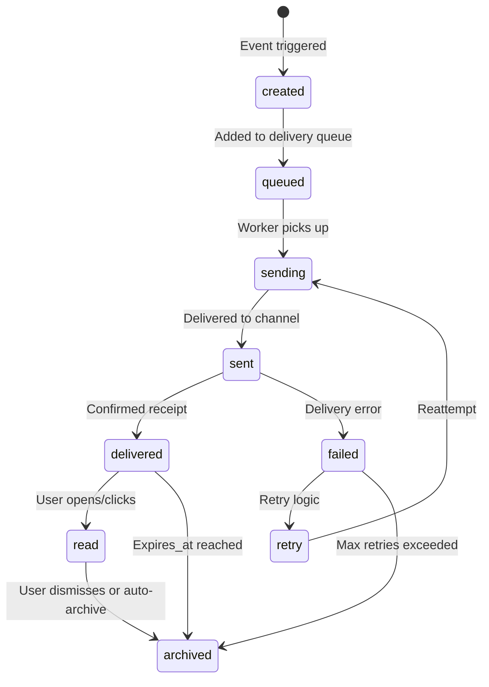

# Notification System - Goal Specification
## NeuralHealer Platform

---
**Document Type:** Future Goal Specification  
**Version:** 1.0.0  
**Last Updated:** 2026-01-22  
**Status:** 🎯 PLANNED (Not Yet Implemented)  
**Purpose:** Define the complete notification system architecture, behaviors, and requirements for future implementation.

---

## 📋 Table of Contents

1. [System Overview](#1-system-overview)
2. [Notification Types](#2-notification-types)
3. [Delivery Channels](#3-delivery-channels)
4. [Data Model](#4-data-model)
5. [Notification Triggers](#5-notification-triggers)
6. [User Preferences](#6-user-preferences)
7. [Notification Lifecycle](#7-notification-lifecycle)
8. [Real-time Delivery](#8-real-time-delivery)
9. [Batching & Throttling](#9-batching--throttling)
10. [Read/Unread Management](#10-readunread-management)
11. [Notification History](#11-notification-history)
12. [Template System](#12-template-system)

---

## 1. System Overview

### 1.1 Purpose

The Notification System is responsible for:
- **Informing users** of important events and updates
- **Enabling real-time communication** without requiring constant polling
- **Managing delivery preferences** per user and notification type
- **Tracking notification state** (sent, delivered, read, dismissed)

### 1.2 Scope

**In Scope:**
- Push notifications (in-app, browser, mobile)
- Email notifications
- SMS notifications (future)
- Notification preferences management
- Read/unread tracking
- Notification history and archive

**Out of Scope:**
- Marketing emails (handled by separate system)
- Billing notifications (separate service)
- System-wide announcements (different mechanism)

### 1.3 Core Principles

✅ **User Control** - Users decide what notifications they receive  
✅ **Timely Delivery** - Critical notifications delivered immediately  
✅ **Non-Intrusive** - Batching and throttling prevent notification fatigue  
✅ **Actionable** - Every notification enables user action  
✅ **Persistent** - Notification history preserved for audit  

---

## 2. Notification Types

### 2.1 Engagement Notifications

| Type | Trigger | Recipient | Priority | Channels |
|------|---------|-----------|----------|----------|
| `ENGAGEMENT_CREATED` | Doctor initiates engagement | Patient | HIGH | In-app, Email |
| `ENGAGEMENT_STARTED` | Patient verifies START token | Doctor | HIGH | In-app, Push |
| `ENGAGEMENT_CANCELLED` | Either party cancels | Other party | HIGH | In-app, Email, Push |
| `ENGAGEMENT_END_REQUESTED` | Either party requests end | Other party | HIGH | In-app, Push |
| `ENGAGEMENT_ENDED` | End verified | Both parties | MEDIUM | In-app, Email |
| `TOKEN_EXPIRED` | START token reaches expiry | Patient | MEDIUM | In-app, Email |
| `TOKEN_REFRESHED` | Doctor generates new token | Doctor only | LOW | In-app |
| `ACCESS_LEVEL_CHANGED` | Relationship status updated | Doctor | MEDIUM | In-app, Email |

### 2.2 Messaging Notifications

| Type | Trigger | Recipient | Priority | Channels |
|------|---------|-----------|----------|----------|
| `NEW_MESSAGE` | New message in engagement chat | Other party | HIGH | In-app, Push |
| `MESSAGE_READ` | Message marked as read | Sender | LOW | In-app |
| `UNREAD_MESSAGES` | Daily digest of unread | User | LOW | Email |

### 2.3 AI Chat Notifications

| Type | Trigger | Recipient | Priority | Channels |
|------|---------|-----------|----------|----------|
| `AI_CHAT_FLAGGED` | AI flags concerning content | Patient's doctor (if exists) | HIGH | In-app, Email |
| `AI_CHAT_SUMMARY` | Weekly AI chat insights | Patient | LOW | Email |

### 2.4 System Notifications

| Type | Trigger | Recipient | Priority | Channels |
|------|---------|-----------|----------|----------|
| `ACCOUNT_SECURITY` | Login from new device | User | HIGH | Email, SMS |
| `PASSWORD_CHANGED` | Password update | User | HIGH | Email |
| `PROFILE_UPDATED` | Profile changes | User | LOW | In-app |
| `SUBSCRIPTION_EXPIRING` | Plan expires in 7 days | User | MEDIUM | In-app, Email |

### 2.5 Doctor-Specific Notifications

| Type | Trigger | Recipient | Priority | Channels |
|------|---------|-----------|----------|----------|
| `PATIENT_SHARED_DATA` | Patient grants data access | Doctor | MEDIUM | In-app, Email |
| `VERIFICATION_APPROVED` | Doctor account verified | Doctor | HIGH | Email |
| `NEW_PATIENT_REQUEST` | Patient requests engagement | Doctor | HIGH | In-app, Push, Email |

### 2.6 Patient-Specific Notifications

| Type | Trigger | Recipient | Priority | Channels |
|------|---------|-----------|----------|----------|
| `APPOINTMENT_REMINDER` | 24h before appointment | Patient | HIGH | In-app, Push, Email |
| `MEDICATION_REMINDER` | Daily medication time | Patient | HIGH | Push |
| `HEALTH_REPORT_READY` | Doctor uploads report | Patient | MEDIUM | In-app, Email |

---

## 3. Delivery Channels

### 3.1 In-App Notifications

**Appearance:** Bell icon with badge count in header  
**Behavior:**
- Real-time delivery via WebSocket
- Popup toast for HIGH priority
- Persistent in notification center
- Click action navigates to relevant page

**Implementation:**
```
Component: NotificationCenter
├─ Bell Icon (badge: unread count)
├─ Dropdown Panel
│  ├─ Notification List (grouped by date)
│  ├─ "Mark All as Read" button
│  └─ "View All" link → /notifications
│
└─ Toast Notifications (HIGH priority only)
   ├─ Auto-dismiss after 5 seconds
   └─ Click to navigate
```

### 3.2 Push Notifications (Browser/Mobile)

**Triggers:** Only for HIGH priority notifications  
**Appearance:** Native OS notification  
**Behavior:**
- Requires user permission
- Works even when app closed (service worker)
- Click opens app to relevant page

**Implementation:**
```
Service Worker Registration
├─ Request permission on first login
├─ Store device token in database
├─ Backend sends to Firebase Cloud Messaging (FCM)
└─ Service worker displays notification
```

### 3.3 Email Notifications

**Triggers:** HIGH/MEDIUM priority, or user preference  
**Appearance:** HTML email template  
**Behavior:**
- Queued in message_queues table
- Processed by background worker
- Includes direct action links

**Email Template Structure:**
```
├─ Header (NeuralHealer logo)
├─ Greeting ("Hi [FirstName],")
├─ Notification Content
│  ├─ Icon (based on type)
│  ├─ Title (bold)
│  └─ Message (description)
├─ Action Button (CTA)
├─ Footer
│  ├─ Unsubscribe link
│  └─ Notification preferences link
```

### 3.4 SMS Notifications (Future)

**Triggers:** CRITICAL priority only (security, emergencies)  
**Appearance:** Plain text message  
**Behavior:**
- Requires verified phone number
- Costs per message, use sparingly
- Short message + link to app

---

## 4. Data Model

### 4.1 notifications Table (Existing)

```sql
CREATE TABLE notifications (
  id UUID PRIMARY KEY DEFAULT gen_random_uuid(),
  user_id UUID NOT NULL REFERENCES users(id) ON DELETE CASCADE,
  type VARCHAR(100) NOT NULL,
  title VARCHAR(255),
  message TEXT,
  engagement_id UUID REFERENCES engagements(id) ON DELETE SET NULL,
  payload JSONB,  -- Additional data (IDs, URLs, metadata)
  is_read BOOLEAN DEFAULT false,
  sent_at TIMESTAMP DEFAULT now(),
  read_at TIMESTAMP,
  expires_at TIMESTAMP,  -- Optional: auto-archive after date
  created_at TIMESTAMP DEFAULT now()
);
```

### 4.2 notification_preferences Table (NEW - To Be Created)

```sql
CREATE TABLE notification_preferences (
  id UUID PRIMARY KEY DEFAULT gen_random_uuid(),
  user_id UUID NOT NULL REFERENCES users(id) ON DELETE CASCADE,
  notification_type VARCHAR(100) NOT NULL,
  
  -- Channel preferences
  in_app_enabled BOOLEAN DEFAULT true,
  push_enabled BOOLEAN DEFAULT true,
  email_enabled BOOLEAN DEFAULT true,
  sms_enabled BOOLEAN DEFAULT false,
  
  -- Frequency settings
  immediate BOOLEAN DEFAULT true,  -- Send immediately
  digest BOOLEAN DEFAULT false,    -- Include in daily/weekly digest
  digest_frequency VARCHAR(20),    -- 'daily', 'weekly', 'never'
  
  created_at TIMESTAMP DEFAULT now(),
  updated_at TIMESTAMP DEFAULT now(),
  
  CONSTRAINT unique_user_type UNIQUE (user_id, notification_type)
);
```

### 4.3 notification_delivery_log Table (NEW - To Be Created)

```sql
CREATE TABLE notification_delivery_log (
  id UUID PRIMARY KEY DEFAULT gen_random_uuid(),
  notification_id UUID NOT NULL REFERENCES notifications(id) ON DELETE CASCADE,
  channel VARCHAR(50) NOT NULL,  -- 'in_app', 'push', 'email', 'sms'
  status VARCHAR(50) NOT NULL,   -- 'pending', 'sent', 'delivered', 'failed', 'bounced'
  sent_at TIMESTAMP,
  delivered_at TIMESTAMP,
  failed_at TIMESTAMP,
  error_message TEXT,
  external_id VARCHAR(255),  -- FCM message ID, email provider ID, etc.
  
  created_at TIMESTAMP DEFAULT now()
);
```

### 4.4 device_tokens Table (NEW - To Be Created)

```sql
CREATE TABLE device_tokens (
  id UUID PRIMARY KEY DEFAULT gen_random_uuid(),
  user_id UUID NOT NULL REFERENCES users(id) ON DELETE CASCADE,
  device_type VARCHAR(50) NOT NULL,  -- 'browser', 'ios', 'android'
  token VARCHAR(500) NOT NULL UNIQUE,  -- FCM token or browser push subscription
  device_name VARCHAR(255),  -- "Chrome on Windows", "iPhone 12", etc.
  last_used_at TIMESTAMP DEFAULT now(),
  is_active BOOLEAN DEFAULT true,
  
  created_at TIMESTAMP DEFAULT now(),
  updated_at TIMESTAMP DEFAULT now()
);
```

---

## 5. Notification Triggers

### 5.1 Event-Driven Triggers

**Pattern:** Backend service emits event → Notification service listens → Creates notification

```
Example: Engagement Created
├─ EngagementService.createEngagement()
├─ Emits: EngagementCreatedEvent {
│   engagementId: uuid
│   doctorId: uuid
│   patientId: uuid
│   accessRule: string
│  }
├─ NotificationService listens
├─ Creates notification record
├─ Determines delivery channels
├─ Queues for delivery
└─ Delivers via channels
```

### 5.2 Scheduled Triggers

**Pattern:** Background job runs on schedule → Checks conditions → Sends notifications

```
Example: Token Expiration Warning
├─ Cron job runs every hour
├─ Query: SELECT * FROM engagement_verification_tokens
│   WHERE status = 'pending'
│   AND expires_at BETWEEN NOW() AND NOW() + 2 hours
├─ For each expiring token:
│   ├─ Create notification
│   └─ Send to patient
```

### 5.3 User Action Triggers

**Pattern:** User performs action → Backend validates → Sends notification to other party

```
Example: Message Sent
├─ User sends message in engagement chat
├─ Backend saves message
├─ Check if recipient is online
│  ├─ If online: WebSocket notification (in-app)
│  └─ If offline: Push + Email notification
```

---

## 6. User Preferences

### 6.1 Default Preferences

**When user creates account, initialize preferences for all notification types:**

| Type | In-App | Push | Email | SMS | Immediate | Digest |
|------|--------|------|-------|-----|-----------|--------|
| ENGAGEMENT_* | ✅ | ✅ | ✅ | ❌ | ✅ | ❌ |
| NEW_MESSAGE | ✅ | ✅ | ❌ | ❌ | ✅ | ❌ |
| ACCOUNT_SECURITY | ✅ | ✅ | ✅ | ✅ | ✅ | ❌ |
| AI_CHAT_SUMMARY | ✅ | ❌ | ✅ | ❌ | ❌ | ✅ (weekly) |

### 6.2 Preference Management UI

**Location:** Settings → Notifications

**UI Structure:**
```
Notifications Settings Page
├─ Section: Engagement Notifications
│  ├─ Row: "New engagement requests"
│  │  ├─ Toggle: In-App [ON]
│  │  ├─ Toggle: Push [ON]
│  │  ├─ Toggle: Email [ON]
│  │  └─ Toggle: SMS [OFF]
│  ├─ Row: "Engagement cancelled"
│  │  └─ ... (same toggles)
│  └─ ...
│
├─ Section: Messaging Notifications
│  └─ ... (same pattern)
│
├─ Section: Digest Preferences
│  ├─ "Daily digest of unread messages" [OFF]
│  └─ "Weekly AI chat summary" [ON]
│
└─ [Save Preferences] button
```

### 6.3 Override Rules

**Some notifications CANNOT be disabled (regulatory/safety):**
- ❌ Cannot disable: ACCOUNT_SECURITY (email)
- ❌ Cannot disable: PASSWORD_CHANGED (email)
- ❌ Cannot disable: ENGAGEMENT_CANCELLED (in-app)
- ✅ Can disable: Everything else

---

## 7. Notification Lifecycle

### 7.1 States



### 7.2 State Definitions

| State | Meaning | Transitions |
|-------|---------|-------------|
| `created` | Notification record created in DB | → `queued` |
| `queued` | Waiting in message_queues for delivery | → `sending` |
| `sending` | Being delivered via channel | → `sent`, `failed` |
| `sent` | Successfully sent to channel | → `delivered`, `read` |
| `delivered` | Confirmed delivered (push ACK, email opened) | → `read` |
| `failed` | Delivery error occurred | → `retry`, `archived` |
| `read` | User marked as read or clicked | → `archived` |
| `archived` | No longer shown in active notifications | Terminal state |

### 7.3 Lifecycle Timestamps

```
notifications {
  created_at: When record created
  sent_at: When first delivery attempted
  delivered_at: When delivery confirmed (if trackable)
  read_at: When user marked as read or clicked
  expires_at: When notification auto-archives
}
```

---

## 8. Real-time Delivery

### 8.1 WebSocket Architecture

**Connection Pattern:**
```
Client connects → Authenticates → Subscribes to /user/{userId}/notifications
Backend sends notification → Pushes to WebSocket topic
Client receives → Updates UI (bell badge, toast, list)
```

**Subscription Topics:**
- `/user/{userId}/notifications` - Personal notifications
- `/topic/engagement/{engagementId}/notifications` - Engagement-specific

### 8.2 Fallback Mechanism

**If WebSocket disconnected:**
1. Client reconnects
2. On reconnect, client calls: `GET /api/notifications/unread-since/{lastReceivedTimestamp}`
3. Backend returns missed notifications
4. Client displays missed notifications with "You have X new notifications while you were away"

### 8.3 Optimistic UI Updates

**When user action triggers notification for self:**
```
Example: User cancels engagement
├─ Client immediately shows "Engagement cancelled" in their UI
├─ Backend processes cancellation
├─ Backend sends notification to other party
├─ No duplicate notification sent to initiator
```

---

## 9. Batching & Throttling

### 9.1 Batching Rules

**Problem:** 50 new messages in 5 minutes = 50 notifications = annoying

**Solution: Batch similar notifications**

**Batching Window:** 5 minutes

**Logic:**
```
IF notification_type = 'NEW_MESSAGE'
AND last_notification_sent < 5 minutes ago
AND from same sender:
  → Don't send new notification
  → Update existing notification count: "3 new messages from Dr. Smith"
ELSE:
  → Send new notification
```

### 9.2 Throttling Rules

**Problem:** User receives 100 engagement requests from spam doctor

**Solution: Rate limit per type**

| Notification Type | Max Per Hour | Max Per Day |
|-------------------|--------------|-------------|
| ENGAGEMENT_CREATED | 10 | 50 |
| NEW_MESSAGE | 30 | Unlimited |
| ACCOUNT_SECURITY | 5 | 20 |
| All Others | 20 | 100 |

**When limit exceeded:**
```
Option 1: Queue for later (next hour)
Option 2: Batch into digest: "You have 15 pending engagement requests"
Option 3: Silent drop (only for LOW priority)
```

### 9.3 Digest Notifications

**Daily Digest (Sent at 8 AM user's timezone):**
```
Subject: Your NeuralHealer Daily Summary

Hi [FirstName],

Here's what happened yesterday:
- 3 unread messages from Dr. Smith
- 1 pending engagement request
- 2 AI chat sessions completed

[View All Notifications] button
```

**Weekly Digest (Sent Monday 8 AM):**
```
Subject: Your Weekly Health Summary

Your AI chat insights:
- 5 sessions completed
- Most discussed: Anxiety management
- Sentiment trend: Improving

[View Detailed Report] button
```

---

## 10. Read/Unread Management

### 10.1 Mark as Read

**Endpoint:** `POST /api/notifications/{id}/read`

**Behavior:**
```
UPDATE notifications
SET is_read = true, read_at = NOW()
WHERE id = {id} AND user_id = {currentUser};

WebSocket broadcast:
  /user/{userId}/notifications → {id: uuid, action: "read"}

Update UI:
  ├─ Remove from unread count
  ├─ Grey out notification in list
  └─ Update bell badge (-1)
```

### 10.2 Mark All as Read

**Endpoint:** `POST /api/notifications/read-all`

**Behavior:**
```
UPDATE notifications
SET is_read = true, read_at = NOW()
WHERE user_id = {currentUser} AND is_read = false;

WebSocket broadcast:
  /user/{userId}/notifications → {action: "read_all"}

Update UI:
  ├─ Clear all unread styling
  └─ Set bell badge to 0
```

### 10.3 Auto-Read Rules

**Automatically mark as read when:**
- ✅ User clicks notification (navigates to relevant page)
- ✅ User views the page the notification points to (engagement details, message thread)
- ❌ User just opens notification dropdown (does NOT auto-mark)

**Implementation:**
```
User clicks notification → Navigate to /engagements/{id}
On page load:
  ├─ Check if any unread notifications point to this engagement
  ├─ If yes: Call POST /api/notifications/mark-read-by-context
  │   Body: {engagementId: uuid}
  └─ Backend marks all related notifications as read
```

---

## 11. Notification History

### 11.1 Notification Center Page

**URL:** `/notifications`

**Layout:**
```
Notification Center
├─ Tabs:
│  ├─ All (default)
│  ├─ Unread
│  └─ Archived
│
├─ Filters:
│  ├─ Type dropdown (Engagements, Messages, System, etc.)
│  ├─ Date range picker
│  └─ Search box
│
├─ Actions:
│  ├─ "Mark All as Read" button
│  └─ "Archive Read" button
│
└─ Notification List (infinite scroll)
   ├─ Grouped by Date ("Today", "Yesterday", "Last Week")
   └─ Each notification:
      ├─ Icon (based on type)
      ├─ Title + Message
      ├─ Timestamp (relative: "2 hours ago")
      ├─ Action buttons (View, Dismiss)
      └─ Styling: Bold if unread, grey if read
```

### 11.2 Archiving Logic

**Auto-Archive Conditions:**
```
Notification is archived when:
├─ expires_at timestamp reached (if set)
├─ User clicks "Dismiss" or "Archive" button
├─ Notification is read AND older than 30 days
└─ User enables "Auto-archive read notifications" in settings
```

**Archived notifications:**
- Not shown in default notification list
- Accessible via "Archived" tab
- Never deleted (kept for audit/history)

### 11.3 Search & Filter

**Search Capability:**
- Search in title and message text
- Search by sender name (e.g., "Dr. Smith")
- Search by engagement ID

**Filter Options:**
- By type (Engagement, Message, System, etc.)
- By read/unread status
- By date range (Last 7 days, Last 30 days, Custom)
- By priority (HIGH, MEDIUM, LOW)

---

## 12. Template System

### 12.1 Notification Templates

**Template Structure:**
```json
{
  "type": "ENGAGEMENT_CREATED",
  "title": "New Engagement Request",
  "message": "Dr. {{doctor.firstName}} {{doctor.lastName}} has requested to start an engagement with you.",
  "icon": "engagement",
  "action": {
    "label": "View Request",
    "url": "/engagements/{{engagement.id}}",
    "method": "navigate"
  },
  "priority": "HIGH",
  "channels": ["in_app", "email", "push"]
}
```

### 12.2 Template Variables

**Available Variables (auto-populated):**
```
{{user.firstName}} - Current user's first name
{{user.lastName}} - Current user's last name
{{doctor.firstName}} - Doctor's first name
{{doctor.lastName}} - Doctor's last name
{{patient.firstName}} - Patient's first name
{{patient.lastName}} - Patient's last name
{{engagement.id}} - Engagement UUID
{{engagement.engagementId}} - Engagement code (ENG-2026-000123)
{{token}} - Verification token
{{reason}} - Cancellation/end reason
{{accessLevel}} - Access rule name
{{timestamp}} - Event timestamp
```

### 12.3 Email Templates

**Email Template Example (HTML):**
```html
<!DOCTYPE html>
<html>
<head>
  <style>
    /* CSS styling for email */
  </style>
</head>
<body>
  <div class="container">
    <div class="header">
      
    </div>
    
    <div class="content">
      <h2>{{title}}</h2>
      <p>Hi {{user.firstName}},</p>
      <p>{{message}}</p>
      
      <a href="{{action.url}}" class="button">{{action.label}}</a>
    </div>
    
    <div class="footer">
      <p>
        <a href="{{unsubscribeUrl}}">Unsubscribe</a> | 
        <a href="{{preferencesUrl}}">Manage Preferences</a>
      </p>
      <p>© 2026 NeuralHealer. All rights reserved.</p>
    </div>
  </div>
</body>
</html>
```

---

## 13. API Endpoints (Future)

### 13.1 Notification Management

| Method | Endpoint | Purpose |
|--------|----------|---------|
| GET | `/api/notifications` | Get user's notifications (paginated) |
| GET | `/api/notifications/unread-count` | Get count of unread notifications |
| GET | `/api/notifications/unread-since/{timestamp}` | Get missed notifications after reconnect |
| POST | `/api/notifications/{id}/read` | Mark single notification as read |
| POST | `/api/notifications/read-all` | Mark all notifications as read |
| POST | `/api/notifications/{id}/archive` | Archive notification |
| DELETE | `/api/notifications/{id}` | Delete notification (soft delete) |

### 13.2 Preference Management

| Method | Endpoint | Purpose |
|--------|----------|---------|
| GET | `/api/notification-preferences` | Get user's notification preferences |
| PUT | `/api/notification-preferences` | Update all preferences |
| PUT | `/api/notification-preferences/{type}` | Update preferences for specific type |
| POST | `/api/notification-preferences/reset` | Reset to default preferences |

### 13.3 Device Token Management

| Method | Endpoint | Purpose |
|--------|----------|---------|
| POST | `/api/device-tokens` | Register new device token |
| GET | `/api/device-tokens` | List user's registered devices |
| DELETE | `/api/device-tokens/{id}` | Unregister device |

---

## 14. Implementation Phases

### Phase 1: Core In-App Notifications (MVP)
- [ ] In-app notification display (bell icon + dropdown)
- [ ] WebSocket real-time delivery
- [ ] Read/unread tracking
- [ ] Basic notification types (engagement events)

### Phase 2: Notification Center
- [ ] Notification history page
- [ ] Search and filter functionality
- [ ] Archive/dismiss actions
- [ ] Pagination and infinite scroll

### Phase 3: Multi-Channel Delivery
- [ ] Email notifications (SMTP integration)
- [ ] Browser push notifications (service worker)
- [ ] Mobile push notifications (FCM)

### Phase 4: User Preferences
- [ ] Notification preferences UI
- [ ] Per-type channel toggles
- [ ] Digest preferences
- [ ] Save/update preferences API

### Phase 5: Advanced Features
- [ ] Batching and throttling logic
- [ ] Scheduled notifications (reminders)
- [ ] Notification templates system
- [ ] SMS notifications (Twilio integration)

### Phase 6: Analytics & Monitoring
- [ ] Notification delivery metrics
- [ ] Open/click tracking
- [ ] Failed delivery alerts
- [ ] User engagement analytics

---

**END OF SPECIFICATION**

This document defines the complete notification system goals and requirements for future implementation.