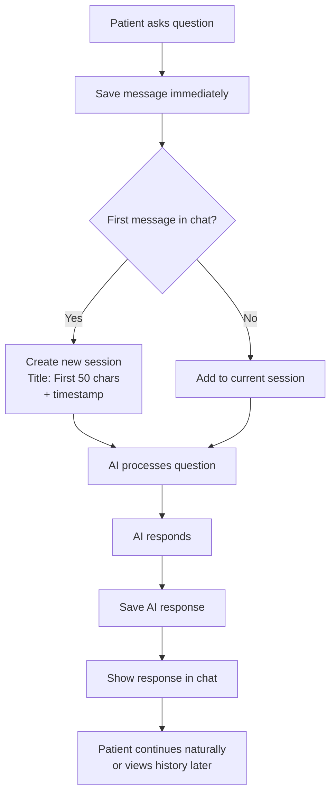
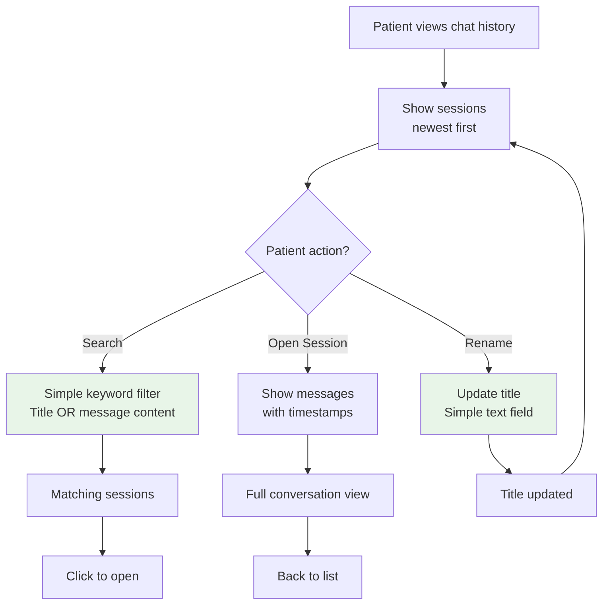
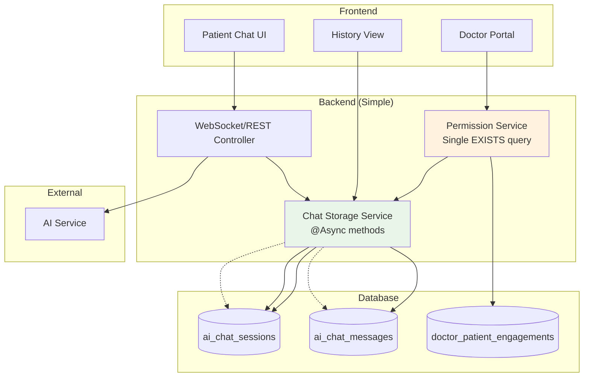

# AI Chat History for NeuralHealer

## 🎯 What This Feature Does

**Simple Version:** It saves your conversations with the AI assistant so you can look back at them later, just like your text message history.

**For Everyone:**
- 💬 **Save your AI chats** - All your conversations with the AI are automatically saved
- 📁 **Organize by session** - Each chat gets its own "folder" you can give a custom title
- 🔍 **Search your history** - Find specific conversations quickly
- 👨‍⚕️ **Doctor access** - Your doctor can view your AI chats to better understand your journey
- ⚡ **Never slows you down** - Saving happens in the background so chatting stays fast

---

## 📱 How It Works for You

### **As a Patient:**
1. **Chat normally** - Just talk to the AI assistant like before
2. **View your history** - Go to "My AI Chats" to see all past conversations
3. **Organize chats** - Give helpful titles to important conversations
4. **Search** - Find specific advice or topics quickly

### **As a Doctor:**
1. **View patient insights** - With permission, see your patient's AI conversations
2. **Better care** - Understand what questions patients are asking the AI
3. **Privacy protected** - Only see chats for patients you're actively treating

---

## 🔄 How Everything Flows Together

### **1. Starting a Chat (Simplified & Practical)**



**Key Points (Simplified):**
- **No "active session" logic** - Use simple "current session" concept
- **Auto-titles = first 50 chars + timestamp** - No complex NLP
- **Always save immediately** - Async, fire-and-forget
- **Continue in same session** - Until user explicitly starts new chat

---

### **2. Managing Your Chat History**



**What You Can Do (Practical):**
1. **Browse** - Scroll through sessions (newest first)
2. **Search** - Simple keyword matching (no fancy search logic)
3. **Read** - View full conversation
4. **Rename** - Edit title with simple text field

---

### **3. Doctor Access Flow (Permission-Based)**

```mermaid
flowchart TD
    A[Doctor opens patient profile] --> B{Active treatment?}
    
    B -- Yes --> C[Show "View AI Chats" button]
    B -- No --> D[No button shown]
    
    C --> E[Doctor clicks button]
    E --> F[List patient's sessions<br>with search]
    
    F --> G{Select session?}
    G -- Yes --> H[View conversation<br>read-only]
    G -- No --> I[Continue browsing]
    
    H --> J[Better understand<br>patient's concerns]
    I --> F
    
    style B fill:#fff3e0
    style F fill:#e8f5e8
```

**Privacy Rules (Simple Implementation):**
- ✅ **Visible only if** doctor has current `doctor_patient_engagement`
- ❌ **No access** to past patients' chats
- 📋 **Simple permission check** - `SELECT EXISTS` query only

---

### **4. Complete System Overview (Simplified Architecture)**



**Architecture Principles:**
1. **Simple async saving** - No complex queues or retry logic
2. **Minimal permission checks** - Single database query
3. **Two-table data model** - Sessions + Messages only
4. **No session management** - Just "latest" session concept

---

## 🔧 Technical Details (Practical Implementation)

### **What Actually Happens (No Magic):**
```
1. You type a message
2. System saves it (async, doesn't wait)
3. AI thinks and responds
4. System saves AI response (async)
5. You see the response

If it's your first message:
   - Creates a session with timestamp-based title
   - "Chat 2025-02-07 14:30"
```

**Key Points (No Over-Engineering):**
- ✅ **Async @Annotation only** - No custom thread pools
- ✅ **Simple timestamp titles** - No AI-generated or smart titles
- ✅ **Fire-and-forget saving** - Basic error logging only
- ✅ **One permission check** - Single SQL query

---

## 🗂️ How Your Data is Organized (Simple)

### **Chat Sessions Structure:**
```
📁 "Chat 2025-02-07 14:30"           (Auto-created title)
   ├── You (14:30): "Having trouble sleeping"
   └── AI (14:31): "Try these relaxation techniques..."
   
📁 "Stress chat - Feb 7"              (You renamed it)
   ├── You (15:15): "Feeling overwhelmed"
   └── AI (15:16): "5 quick stress relief exercises..."
```

### **Simple Features:**
1. **Auto-created titles** - Based on timestamp, not complex logic
2. **Manual renaming** - Click edit, type new name
3. **Simple search** - Type keyword, get matching sessions
4. **Basic filtering** - No advanced date ranges or categories

---

## 🔐 Privacy & Security (Minimal & Effective)

### **Your Data Protection:**
- 🔒 **Standard encryption** - Same as rest of application
- 👤 **Your data only** - No sharing by default
- 👨‍⚕️ **Doctor access** - Only with current treatment relationship
- ⚠️ **Simple permissions** - No complex ACLs or sharing settings

### **Doctor Access Rules:**
```sql
-- Simple permission check (that's it!)
SELECT EXISTS (
    SELECT 1 FROM doctor_patient_engagements 
    WHERE doctor_id = ? AND patient_id = ? 
    AND end_date IS NULL
)
```

---

## 📱 Using the Feature (Simple UX)

### **For Patients:**
1. **Chat** - Just chat normally, everything saves
2. **View history** - Click "AI History" in menu
3. **Search** - Type in search box
4. **Rename** - Click pencil icon, type new name

### **For Doctors:**
1. **Open patient** - Go to patient profile
2. **See button?** - If you're currently treating them
3. **Click** - View their AI conversations
4. **Read** - Understand their concerns better

---

## ❓ Common Questions (Honest Answers)

### **Q: Do I need to do anything to save my chats?**
**A:** No, it happens automatically in the background.

### **Q: Can I delete my chat history?**
**A:** Not yet, but we'll add this if users request it.

### **Q: How are chat titles generated?**
**A:** Simple timestamp format: "Chat YYYY-MM-DD HH:MM"

### **Q: Does saving slow down the AI?**
**A:** No, saving happens separately after you get the response.

### **Q: What if saving fails?**
**A:** Your chat continues, we log the error for fixing later.

---

## ⚡ Performance & Reliability (Simple Approach)

### **What We Guarantee:**
- **Chat speed** - Saving never blocks your conversation
- **History loading** - Under 2 seconds for typical users
- **Search speed** - Fast enough with simple ILIKE queries
- **Reliability** - Basic error handling + logging

### **What We Don't Have (Yet):**
- ❌ Advanced search filters
- ❌ Export functionality  
- ❌ Chat analytics
- ❌ Message editing
- ❌ Bulk operations

**We'll add these only if users explicitly ask for them.**

---

## 📋 Success Metrics (Simple)

**We'll know it's working if:**
- ✅ No chat slowdowns reported
- ✅ History loads in < 2 seconds
- ✅ Search finds relevant chats
- ✅ Doctors find it useful for patient care
- ✅ No saving errors in logs

---

**Thank you for using NeuralHealer!** We built this feature to be simple, fast, and useful without unnecessary complexity. 💚

*Last updated: February 2025*