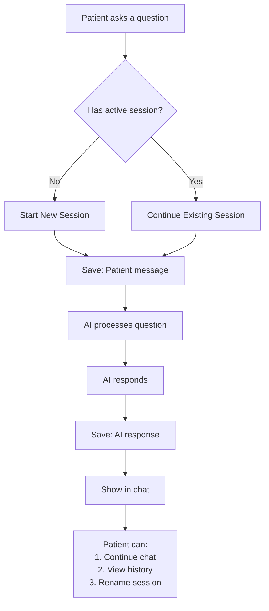
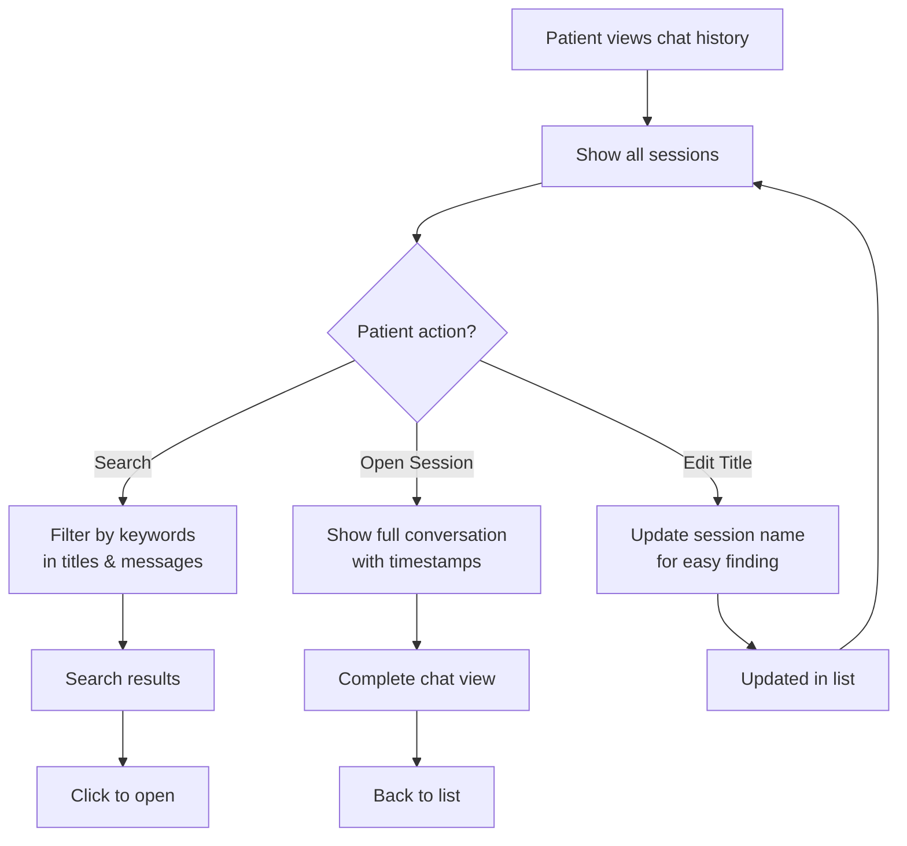
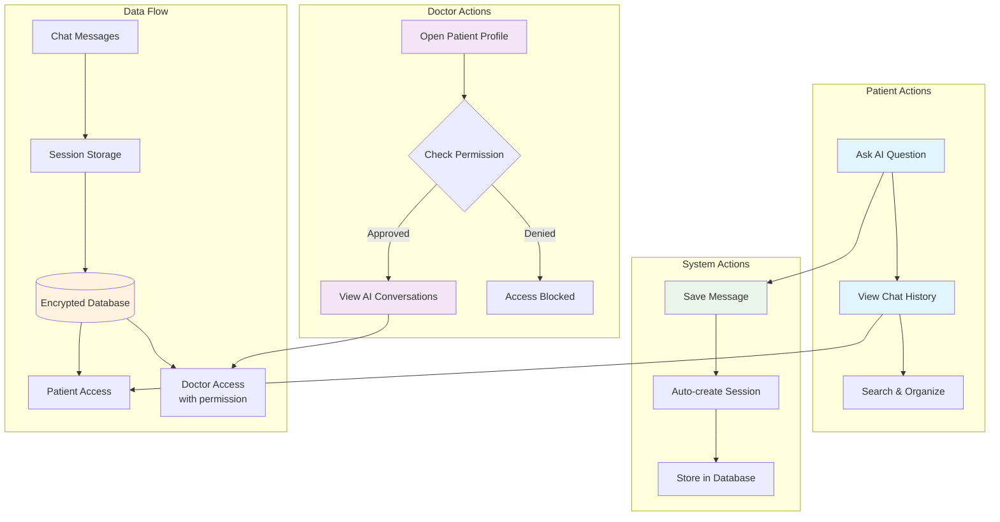

# AI Chat History for NeuralHealer

## 🎯 What This Feature Does

**Simple Version:** It saves your conversations with the AI assistant so you can look back at them later, just like your text message history.

**For Everyone:**
- 💬 **Save your AI chats** - All your conversations with the AI are automatically saved
- 📁 **Organize by session** - Each chat gets its own "folder" you can give a custom title
- 🔍 **Search your history** - Find specific conversations quickly
- 👨‍⚕️ **Doctor access** - Your doctor can view your AI chats to better understand your journey
- ⚡ **Never slows you down** - Saving happens in the background so chatting stays fast

---

## 📱 How It Works for You

### **As a Patient:**
1. **Chat normally** - Just talk to the AI assistant like before
2. **View your history** - Go to "My AI Chats" to see all past conversations
3. **Organize chats** - Give helpful titles to important conversations
4. **Search** - Find specific advice or topics quickly

### **As a Doctor:**
1. **View patient insights** - With permission, see your patient's AI conversations
2. **Better care** - Understand what questions patients are asking the AI
3. **Privacy protected** - Only see chats for patients you're actively treating

---

## 🔄 How Everything Flows Together

### **1. Starting a New Chat Session**



**Key Points:**
- **New chat?** → Automatically creates a session
- **Continuing?** → Messages go to current session
- **Always saved** → Both your questions and AI responses

---

### **2. Managing Your Chat History**



**What You Can Do:**
1. **Browse** - Scroll through all your conversations
2. **Search** - Find "sleep tips" or "stress relief"
3. **Read** - Open any conversation fully
4. **Organize** - Give helpful names to chats

---

### **3. Doctor Access Flow**

```mermaid
flowchart TD
    A[Doctor views patient] --> B{Check permission?}
    
    B -- "Has active engagement<br>with patient" --> C[Access Granted]
    B -- "No current engagement" --> D[Access Denied]
    
    C --> E[Show patient's sessions]
    E --> F{Doctor selects?}
    
    F -- "View session" --> G[Show full conversation]
    F -- "Browse all" --> H[List all sessions<br>with search]
    
    G --> I[Understand patient concerns<br>for better care]
    H --> J[Overview of<br>patient's AI usage]
    
    D --> K[Message: "Requires active<br>treatment relationship"]
```

**Privacy Rules:**
- ✅ **Can see** → Current patients you're treating
- ❌ **Cannot see** → Past patients, other doctors' patients
- ⚠️ **Limited view** → Only during active treatment period

---

### **4. Complete System Overview**



---

## 🔧 Technical Details (Simple Version)

### **What's Happening Behind the Scenes:**

```plaintext
You send a message
    ↓
System: "Got it! Let me save this quickly..."
    ↓
AI Assistant thinks... ✨
    ↓
AI responds
    ↓
System: "Saving AI's response too!"
```

**Key Points:**
- ✅ **Saves automatically** - No buttons to click
- ✅ **Works in background** - Doesn't slow down your chat
- ✅ **Secure** - Only you and your doctor (with permission) can see your chats
- ✅ **Reliable** - Even if something goes wrong, your chat keeps working

---

## 🗂️ How Your Data is Organized

### **Chat Sessions**
Think of these as conversation folders:
```
📁 "Sleep Issues - Jan 15"
   ├── You: "Having trouble sleeping"
   └── AI: "Try these relaxation techniques..."

📁 "Stress Management - Jan 18"
   ├── You: "Feeling overwhelmed at work"
   └── AI: "Here are 5 quick stress relief exercises..."
```

### **You Can:**
1. **Rename folders** - Give them helpful titles
2. **Browse** - Scroll through past conversations
3. **Search** - Find specific advice

---

## 🔐 Privacy & Security

### **Your Data is Protected:**
- 🔒 **Encrypted** - All chats are encrypted in our database
- 👤 **Private by default** - Only you can see your chats
- 👨‍⚕️ **Doctor access** - Requires active treatment relationship + your consent
- 🗑️ **You're in control** - Future features will let you delete chats if desired

### **What Doctors See:**
```
Doctor View → Patient Profile → AI Chats (with permission)
```
Doctors only see:
- Patients they're currently treating
- Chats from the treatment period
- Never see chats from other doctors' patients

---

## 📱 Using the Feature

### **For Patients:**
1. **Chat with AI** - Nothing changes, just chat normally
2. **View history** - Click "My AI History" in your profile
3. **Search** - Use the search bar to find topics
4. **Edit titles** - Click the pencil icon on any session

### **For Doctors:**
1. **Go to patient profile**
2. **Click "View AI Conversations"** (if you have permission)
3. **Read to understand patient concerns better**

---

## ❓ Common Questions

### **Q: Do I need to do anything to save my chats?**
**A:** No! Everything saves automatically.

### **Q: Can I delete my chat history?**
**A:** Currently chats are preserved for your medical journey, but deletion features are planned.

### **Q: How far back does my history go?**
**A:** All the way to when this feature was enabled! We don't delete old chats.

### **Q: Does saving slow down the AI?**
**A:** Not at all! Saving happens in the background.

### **Q: What if I don't want my doctor to see a chat?**
**A:** Currently all chats are visible to doctors with permission, but we're working on selective sharing features.

---

## 🚀 What's Coming Next

### **Planned Improvements:**
- 📤 **Export chats** - Download your conversations
- 🏷️ **Add tags** - Organize chats with custom labels
- 📊 **Insights** - See your most discussed topics
- 🔔 **Highlights** - Bookmark important AI advice

### **Your Feedback Matters!**
What would make chat history more useful for you? Let us know!

---

## ✨ Quick Start Guide

### **Just want to chat?**
Do nothing! Everything works automatically.

### **Want to organize?**
1. Chat with AI
2. Go to "My Profile" → "AI History"
3. Click edit icon on any session to rename

### **Doctor workflow:**
1. Open patient profile
2. Click "AI Conversations" tab
3. Read to understand patient's self-care journey

---

**Thank you for using NeuralHealer!** We're constantly improving to support your mental wellness journey. 💚

*Last updated: February 2025*