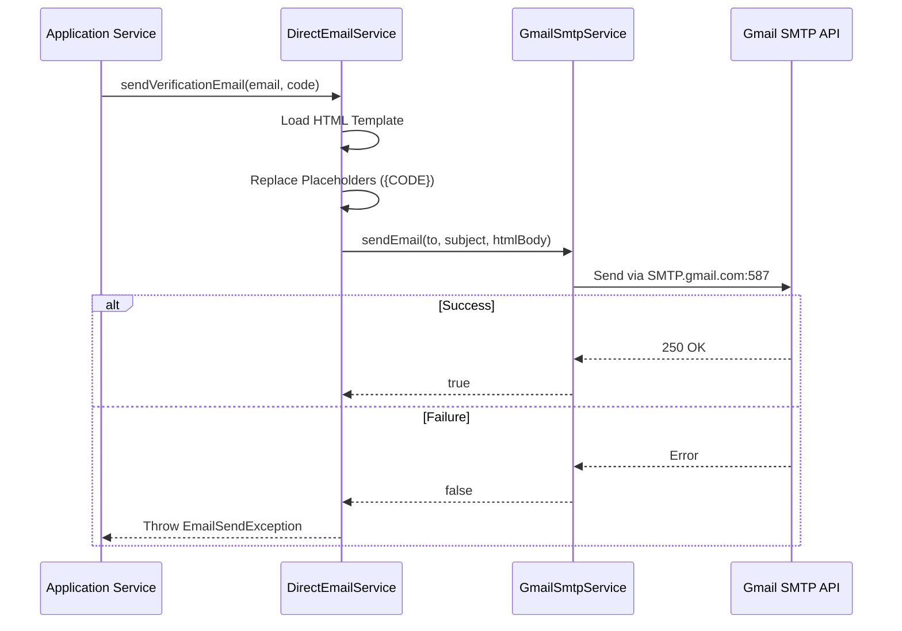

# Email System Documentation

The NeuralHealer email system provides two primary methods for delivering emails: **Direct Delivery** (immediate) and **Queue-Based Delivery** (notifications).

## 1. Architecture Overview

### Direct Email Flow (Immediate)
Used for critical, time-sensitive emails like password resets and verification codes. These bypass the database queue and are sent immediately via the SMTP server.



### Queue-Based Email Flow (Asynchronous)
Used for non-critical notifications (lifecycle events, welcome messages, etc.) to ensure the main application logic remains fast and scales well.

```mermaid
graph TD
    A[Trigger Event] --> B[UserActivityNotificationJob]
    B --> C[(Postgres: message_queues)]
    
    subgraph Scheduled Processing (Every 1 Minute)
    D[EmailQueueProcessor] -- 1. Query Pending --> C
    D -- 2. Send via SMTP --> E[GmailSmtpService]
    E -- 3. Update Status --> C
    end
    
    C -- status: 'completed' --> F[Final State]
    C -- status: 'failed' (after 3 retries) --> G[Error Log]
```

---

## 2. API Reference (Testing)

Simple endpoints for testing email templates.

### A. Test Verification Email

**Endpoint**: `POST /test/email/verification`

**Request Body**:
```json
{
  "email": "test@example.com",
  "code": "987654"
}
```

**Response**:
```json
{
  "message": "Verification email sent to test@example.com"
}
```

**cURL Example**:
```bash
curl -X POST http://localhost:8080/api/test/email/verification \
  -H "Content-Type: application/json" \
  -d '{"email":"test@example.com","code":"987654"}'
```

---

### B. Test Password Reset Email

**Endpoint**: `POST /test/email/password-reset`

**Request Body**:
```json
{
  "email": "test@example.com",
  "token": "my-secret-token"
}
```

**Response**:
```json
{
  "message": "Password reset email sent to test@example.com"
}
```

**cURL Example**:
```bash
curl -X POST http://localhost:8080/api/test/email/password-reset \
  -H "Content-Type: application/json" \
  -d '{"email":"test@example.com","token":"my-secret-token"}'
```

---

### C. Test Engagement Refreshed Email

**Endpoint**: `POST /api/engagements/{id}/refresh-token` (Production usage)

**Method**: `directEmailService.sendEngagementRefreshedToken`

**Template**: `engagement-refreshed.html`

**Variables**:
- `{RECIPIENT_NAME}`: Name of verifier
- `{INITIATOR_NAME}`: Name of person who refreshed
- `{NEW_TOKEN}`: The code (e.g. NH-123456)
- `{EXPIRY_MINUTES}`: Time until expiry
- `{VERIFICATION_URL}`: Direct link to verify

---

## 3. Email Templates List

All templates are located in `src/main/resources/templates/emails/`:

| File | Type | Description |
|------|------|-------------|
| `welcome.html` | Queue | Standard user welcome |
| `email-verification.html` | Direct | 6-digit registration code |
| `password-reset.html` | Direct | Reset link |
| `engagement-request-from-patient.html` | Direct | Initial request notification |
| `engagement-activated-by-doctor.html` | Direct | Activation confirmation |
| `engagement-refreshed.html` | Direct | **NEW**: Notification of refreshed START token |
| `engagement-cancelled.html` | Queue | Notification of unilateral termination |
| `engagement-started.html` | Queue | General activation notification |
| `special-thanks.html` | Direct | Personalized appreciation |

The system uses the following environment variables:
- `GMAIL_USERNAME`: Your Gmail address.
- `GMAIL_APP_PASSWORD`: 16-character App Password (with no spaces).

## 4. Troubleshooting

| Issue | Possible Cause | Solution |
|-------|----------------|----------|
| `AuthenticationFailedException` | Invalid App Password | Re-generate App Password in Google Settings. |
| `MessagingException: Could not connect` | Firewall or Port 587 blocked | Ensure port 587 is open for outbound traffic. |
| Noise in Terminal | DEBUG logging level | Check `application.yml` and ensure `logging.level.com.neuralhealer.backend.integration.gmail` is set to `INFO`. |
