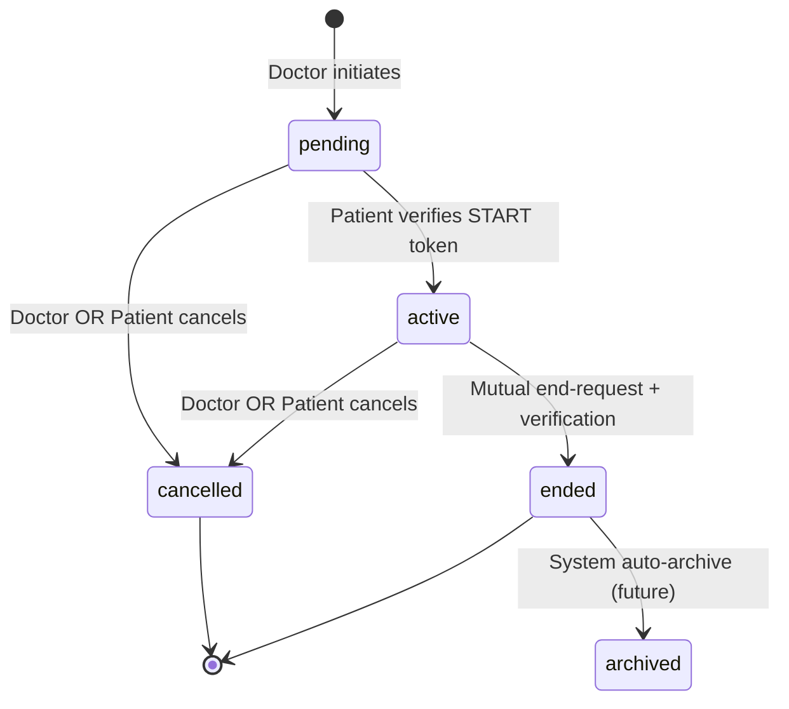
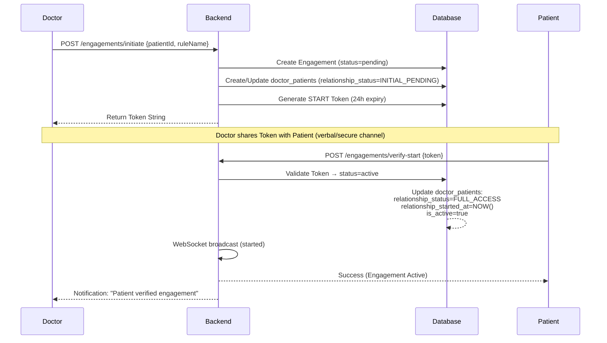
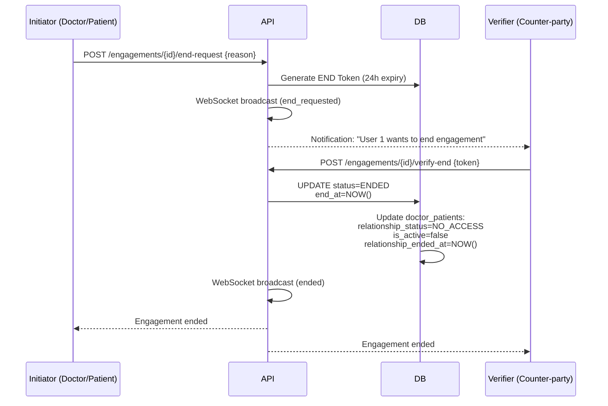
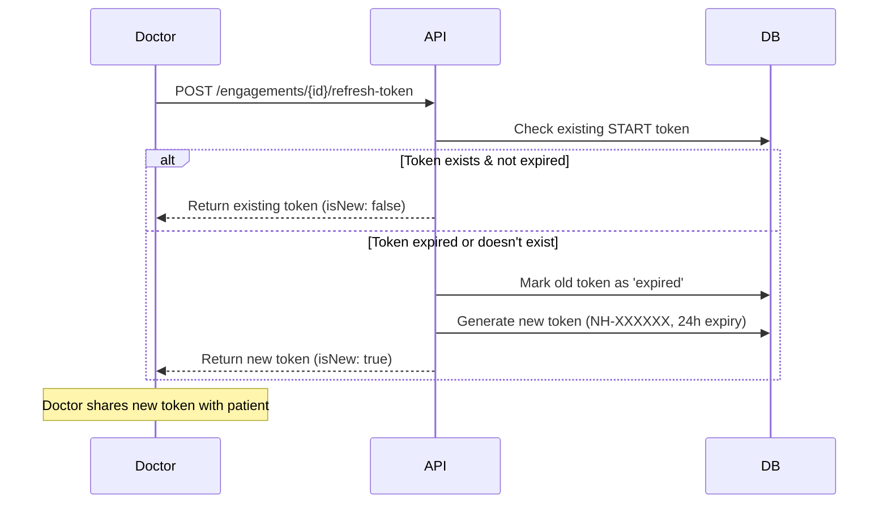

# Engagement System Logic - NeuralHealer

---
**Document Type:** Complete Implementation Specification  
**Version:** 2.0.0  
**Last Updated:** 2026-01-22  
**Status:** ✅ REQUIRED IMPLEMENTATION  
**Purpose:** This document defines ALL required logic, behaviors, and rules for the Engagement system. Everything here MUST be implemented exactly as specified.

---

## 🏗️ 1. System Overview

### 1.1 What is an Engagement?
An **Engagement** is a secure, time-bound, documented interaction between ONE doctor and ONE patient. It controls:
- When the doctor can access patient data
- What level of access the doctor has
- How long the access persists after engagement ends

### 1.2 Core Components & Principles

| Component | Purpose | Key Rule |
|-----------|---------|----------|
| **Engagement** | Temporal episode of interaction | Multiple engagements can exist between same doctor-patient |
| **Doctor-Patient Relationship** | Permanent lifetime relationship record | Created on first activation, NEVER deleted (except special case) |
| **Verification Token** | 2FA security token | 24-hour expiry, can be refreshed by doctor |
| **Access Rule** | Permission template (FULL_ACCESS, READ_ONLY, etc.) | Applied during active engagement |

**Critical Principles:**
✅ **`doctor_patients` is PERMANENT** - Source of truth for relationship history  
✅ **`engagements` are EPISODES** - Temporal interactions within a permanent relationship  
✅ **TOKEN REFRESH exists** - Expired tokens can be regenerated by the doctor  
✅ **BOTH parties can CANCEL** - Doctor and patient have equal cancellation rights  
✅ **DELETE ≠ CANCEL** - Completely different operations with different purposes  

---

## 📊 2. Data Model & Enums

### 2.1 Core Status Enums

```sql
-- Engagement lifecycle states
CREATE TYPE engagement_status AS ENUM (
  'pending',    -- Created, awaiting patient verification
  'active',     -- Patient verified, engagement is live
  'ended',      -- Gracefully concluded (mutual agreement)
  'cancelled',  -- Unilaterally terminated by either party
  'archived'    -- System-archived for long-term storage
);

-- Doctor-Patient relationship access levels
CREATE TYPE relationship_status AS ENUM (
  'INITIAL_PENDING',              -- First engagement request sent, not verified
  'INITIAL_CANCELLED_PENDING',    -- First engagement cancelled before activation
  'FULL_ACCESS',                  -- Complete data access
  'READ_ONLY_ACCESS',             -- View-only permissions
  'CURRENT_ENGAGEMENT_ACCESS',    -- Access only during active engagement
  'LIMITED_ENGAGEMENT_ACCESS',    -- Restricted access
  'NO_ACCESS'                     -- All access revoked
);

-- Token types and statuses
CREATE TYPE verification_type AS ENUM ('start', 'end');
CREATE TYPE token_status AS ENUM ('pending', 'verified', 'expired', 'cancelled');
```

### 2.2 Relationship Access Groups
To simplify implementation, access level enums are categorized into three functional groups:

| Group | Members | Purpose |
|-------|---------|---------|
| **Initialization** | `INITIAL_PENDING`, `INITIAL_CANCELLED_PENDING` | Temporary states used during the first interaction attempt. `is_active` is always false. |
| **Active Access** | `FULL_ACCESS`, `READ_ONLY_ACCESS`, `CURRENT_ENGAGEMENT_ACCESS`, `LIMITED_ENGAGEMENT_ACCESS` | Permission levels applied while an engagement is live. `is_active` is true. |
| **Revocation** | `NO_ACCESS` | The "Safe Harbor" state. Used when an engagement ends without retention or is cancelled by a doctor. All permissions are withdrawn immediately. |

> [!NOTE]
> **Focus: NO_ACCESS**  
> This is the terminal state for relationships that have concluded. When a doctor has `NO_ACCESS`:
> 1. They cannot see the patient in their active lists.
> 2. They cannot read historical messages (unless an audit is triggered).
> 3. They cannot initiate new messages.
> 

### 2.2 Critical Fields in `doctor_patients`

| Field | Type | Meaning | Changes When |
|-------|------|---------|--------------|
| `relationship_status` | relationship_status | Current access level | Engagement activates, ends, or is cancelled |
| `current_engagement_id` | UUID or NULL | Active/pending engagement | Engagement created (set), ended/cancelled (NULL) |
| `is_active` | boolean | Has any access right now | Based on relationship_status (NO_ACCESS → false) |
| `relationship_started_at` | TIMESTAMP or NULL | **FIRST EVER activation date** | Set once on first activation, **NEVER CHANGES** |
| `relationship_ended_at` | TIMESTAMP or NULL | Last engagement end date | Updated when engagement ends with NO_ACCESS |

---

## 🔄 3. Engagement State Machine

### 3.1 Complete State Diagram



### 3.2 State Transition Rules

| From State | To State | Trigger | Authorization | Irreversible? |
|------------|----------|---------|---------------|---------------|
| `pending` | `active` | Patient verifies START token | Patient only | ✅ Yes |
| `pending` | `cancelled` | Either party cancels | Doctor OR Patient | ✅ Yes |
| `active` | `cancelled` | Either party cancels | Doctor OR Patient | ✅ Yes |
| `active` | `ended` | End-request + verification | Both parties (2-step) | ✅ Yes |
| `ended` | `archived` | System auto-trigger | System | ✅ Yes |

**Terminal States:** Once an engagement reaches `cancelled`, `ended`, or `archived`, its status CANNOT change.

---

## 📡 4. Engagement Protocols

### 4.1 Initiation & Activation Flow



> [!IMPORTANT]
> **Token Refresh Available:** If token expires (24h), doctor can call `POST /engagements/{id}/refresh-token` to generate new token.

### 4.2 Termination Flow (Mutual End)



### 4.3 Cancellation Flow (Unilateral)

**Endpoint:** `POST /api/engagements/{id}/cancel`

**Authorization:** Doctor OR Patient (either party can cancel pending/active engagements)

**Key Differences from DELETE:**
- Preserves all data (soft delete)
- Requires reason parameter
- Patient can choose post-cancellation access level
- Creates audit trail and notifications

**Patient Cancelling Active Engagement:**
```json
{
  "reason": "Switching to specialist",
  "newAccessRule": "READ_ONLY_ACCESS"  // Patient chooses: FULL_ACCESS, READ_ONLY, NO_ACCESS, etc.
}
```

**Doctor Cancelling Active Engagement:**
```json
{
  "reason": "Treatment completed"
}
// Doctor cancellation ALWAYS results in NO_ACCESS for security
```

### 4.4 Token Refresh Flow

**Problem:** Token expires after 24h, patient cannot verify

**Solution:** Doctor regenerates token



---

## 🛠️ 5. API Reference & Response Examples

### 5.1 Initiate Engagement
**Endpoint:** `POST /api/engagements/initiate`  
**Role:** Doctor  
**Request:**
```json
{
  "patientId": "550e8400-e29b-41d4-a716-446655440000",
  "accessRuleName": "FULL_ACCESS"
}
```

**Response (200 OK):**
```json
{
  "engagementId": "a1b2c3d4-e5f6-g7h8-i9j0-k1l2m3n4o5p6",
  "engagementCode": "ENG-2026-000123",
  "status": "PENDING",
  "verification": {
    "token": "NH-123456",
    "expiresAt": "2026-01-23T10:00:00Z"
  }
}
```

### 5.2 Verify Start (Activation)
**Endpoint:** `POST /api/engagements/verify-start`  
**Role:** Patient  
**Request:**
```json
{
  "token": "NH-123456"
}
```

**Response (200 OK):**
```json
{
  "id": "a1b2c3d4-e5f6-g7h8-i9j0-k1l2m3n4o5p6",
  "engagementId": "ENG-2026-000123",
  "status": "ACTIVE",
  "doctor": { "id": "...", "firstName": "Ahmed", "lastName": "Raafat" },
  "patient": { "id": "...", "firstName": "Sara", "lastName": "Ali" },
  "accessRule": "FULL_ACCESS",
  "startAt": "2026-01-22T10:15:00Z"
}
```

### 5.3 Cancel Engagement
**Endpoint:** `POST /api/engagements/{id}/cancel`  
**Role:** Doctor OR Patient  
**Request:**
```json
{
  "reason": "Treatment completed successfully",
  "newAccessRule": "READ_ONLY_ACCESS"  // Only if patient cancelling active engagement
}
```

**Response (200 OK):**
```json
{
  "success": true,
  "engagementId": "a1b2c3d4-e5f6-g7h8-i9j0-k1l2m3n4o5p6",
  "status": "cancelled",
  "cancelledBy": "patient",
  "cancelledAt": "2026-01-22T11:00:00Z",
  "newRelationshipStatus": "READ_ONLY_ACCESS"
}
```

### 5.4 Delete Engagement (Hard Delete)
**Endpoint:** `DELETE /api/engagements/{id}`  
**Role:** Doctor OR Patient (participants only)  
**Purpose:** Complete removal for testing/cleanup (DANGEROUS operation)

**Special Handling for Active Engagements:**
1. Update engagement.status = 'cancelled'
2. Update engagement.end_at = NOW()
3. Update doctor_patients.relationship_status = 'NO_ACCESS'
4. Delete ALL related data (cascade)

**Response (200 OK):**
```json
{
  "success": true,
  "message": "Engagement permanently deleted",
  "deletedEngagementId": "a1b2c3d4-e5f6-g7h8-i9j0-k1l2m3n4o5p6",
  "deletedRelationship": false
}
```

### 5.5 Refresh Token
**Endpoint:** `POST /api/engagements/{id}/refresh-token`  
**Role:** Doctor (creator only)  
**Conditions:** Engagement must be PENDING

**Response (200 OK):**
```json
{
  "token": "NH-789012",
  "expiresAt": "2026-01-23T11:00:00Z",
  "status": "pending",
  "isNew": true
}
```

### 5.6 Get Current Token
**Endpoint:** `GET /api/engagements/{id}/token`  
**Role:** Doctor (creator only)

**Response (200 OK):**
```json
{
  "token": "NH-123456",
  "expiresAt": "2026-01-23T10:00:00Z",
  "status": "pending"
}
```

**Response (404 - No Valid Token):**
```json
{
  "status": 404,
  "message": "No valid token exists. Please call /refresh-token to generate a new one."
}
```

---

## 🔐 6. Authorization & Security Rules

### 6.1 Role-Based Access Matrix

| Action | Doctor | Patient |
|--------|--------|---------|
| Create engagement | ✅ | ❌ |
| Verify START token | ❌ | ✅ |
| Cancel pending engagement | ✅ | ✅ |
| Cancel active engagement | ✅ | ✅ (with access rule choice) |
| Delete engagement (hard) | ✅ (own only) | ✅ (own only) |
| Refresh START token | ✅ (own pending only) | ❌ |
| Request end | ✅ | ✅ |
| Verify END token | ✅ (if patient requested) | ✅ (if doctor requested) |

### 6.2 Status-Action Validation Matrix

| Current Status | CREATE | VERIFY_START | CANCEL | DELETE | REFRESH_TOKEN | END_REQUEST | VERIFY_END |
|----------------|--------|--------------|--------|--------|---------------|-------------|------------|
| N/A (new) | ✅ | ❌ | ❌ | ❌ | ❌ | ❌ | ❌ |
| pending | ❌ | ✅ | ✅ | ✅ | ✅ (doctor) | ❌ | ❌ |
| active | ❌ | ❌ | ✅ | ✅ | ❌ | ✅ | ✅ |
| ended | ❌ | ❌ | ❌ | ✅ | ❌ | ❌ | ❌ |
| cancelled | ❌ | ❌ | ❌ | ✅ | ❌ | ❌ | ❌ |

---

## 🔔 7. WebSocket Event Schema

> [!IMPORTANT]
> **Implementation Status**: While basic messaging is functional, the full Engagement Status WebSocket broadcast system described below is currently **under development** and may not be fully integrated into all client-side views yet.

**Topic:** `/topic/engagement/{engagementId}`

| Event Type | Payload Category | Payload Example | Description |
|------------|------------------|-----------------|-------------|
| `ENGAGEMENT_STATUS` | `active` | `{"type":"ENGAGEMENT_STATUS","status":"active","activatedBy":"patient"}` | Engagement is now live |
| `ENGAGEMENT_STATUS` | `end_requested` | `{"type":"ENGAGEMENT_STATUS","status":"end_requested","requestedBy":"doctor"}` | Termination pending verification |
| `ENGAGEMENT_STATUS` | `ended` | `{"type":"ENGAGEMENT_STATUS","status":"ended","finalAccessLevel":"NO_ACCESS"}` | Engagement mutually ended |
| `ENGAGEMENT_STATUS` | `cancelled` | `{"type":"ENGAGEMENT_STATUS","status":"cancelled","cancelledBy":"patient","newAccessLevel":"READ_ONLY"}` | Engagement unilaterally cancelled |

**Broadcast Rules:**
- Immediately after any status change
- To ALL connected clients subscribed to that engagement topic
- Includes actor information and timestamp

---

## 📂 8. Data Archiving & Retention

### 8.1 End-of-Engagement Processing

When an engagement transitions to `ENDED` or `CANCELLED`:

1. **Relationship Update:**
   ```sql
   -- For NO_ACCESS rules:
   UPDATE doctor_patients 
   SET relationship_status = 'NO_ACCESS',
       is_active = false,
       relationship_ended_at = NOW(),
       current_engagement_id = NULL
   WHERE engagement_id = ?;
   
   -- For retention-allowed rules:
   UPDATE doctor_patients 
   SET relationship_status = engagement.access_rule_name,
       is_active = true,
       relationship_ended_at = NULL,
       current_engagement_id = NULL
   WHERE engagement_id = ?;
   ```

2. **Message Scoping:** Messages are no longer returned in active chat queries but remain accessible through audit functions based on retention rules.

3. **System Archiving:** After retention period, engagements transition to `archived` status for long-term storage.

---

## 🎯 9. Complete Flow Scenarios

### Scenario 1: Happy Path - First Engagement Success
```
1. Doctor initiates → engagement (pending), doctor_patients (INITIAL_PENDING)
2. Patient verifies → engagement (active), doctor_patients (FULL_ACCESS, relationship_started_at set)
3. Treatment occurs → messages exchanged
4. Doctor requests end → END token generated
5. Patient verifies end → engagement (ended), doctor_patients (NO_ACCESS, relationship_ended_at set)
```

### Scenario 2: Token Expiration & Refresh
```
1. Doctor initiates → token NH-123456 (expires 24h)
2. Token expires before patient verifies → patient gets "Token expired" error
3. Doctor refreshes token → new token NH-789012 generated
4. Patient verifies with new token → engagement activated
```

### Scenario 3: Patient Cancels Active, Grants Limited Access
```
1. Active engagement exists (FULL_ACCESS)
2. Patient cancels with newAccessRule: "READ_ONLY_ACCESS"
3. Engagement → cancelled
4. doctor_patients.relationship_status → READ_ONLY_ACCESS
5. Doctor retains view-only access to historical data
```

### Scenario 4: Doctor Deletes Pending Engagement (Testing)
```
1. Doctor creates test engagement (pending)
2. Doctor deletes engagement → DELETE /api/engagements/{id}
3. Cascade delete: engagement, tokens, messages, events
4. doctor_patients deleted (was INITIAL_PENDING)
5. Complete cleanup, no trace left
```

### Scenario 5: Second Engagement Between Same Pair
```
INITIAL: doctor_patients (READ_ONLY_ACCESS, relationship_started_at: 2025-06-15)
1. Doctor initiates new engagement → engagement (pending)
2. doctor_patients.current_engagement_id updated to new UUID
3. Patient verifies → engagement (active)
4. doctor_patients.relationship_status → FULL_ACCESS
5. relationship_started_at REMAINS 2025-06-15 (original date preserved)
```

### Scenario 6: Doctor Cancels Pending (First Engagement)
```
1. Doctor initiates first engagement → engagement (pending), doctor_patients (INITIAL_PENDING)
2. Doctor cancels → engagement (cancelled)
3. doctor_patients.relationship_status → INITIAL_CANCELLED_PENDING
4. Patient notified: "Dr. X cancelled the engagement request"
```

---

## ⚠️ 10. Critical Business Rules

### 10.1 Immutability Rules
**NEVER CHANGE:**
- `doctor_patients.relationship_started_at` (set once on first activation)
- `engagement.doctor_id` (cannot reassign to different doctor)
- `engagement.patient_id` (cannot reassign to different patient)

**SET ONCE:**
- `relationship_started_at` set on FIRST EVER activation
- Original date preserved for ALL subsequent engagements between same pair

### 10.2 Access Rule Application
**Patient Cancelling Active Engagement:**
- Patient CHOOSES newAccessRule (FULL_ACCESS, READ_ONLY, NO_ACCESS, etc.)
- Doctor MUST accept patient's decision

**Doctor Cancelling Active Engagement:**
- ALWAYS results in NO_ACCESS (security/privacy)
- Patient has no choice in this case

### 10.3 Token Management Rules
1. **Format:** "NH-" + 6 random digits (e.g., "NH-847293")
2. **Expiry:** 24 hours from creation
3. **Refresh:** Only doctor can refresh, only for pending engagements
4. **Type Safety:** START tokens only for verify-start, END tokens only for verify-end

### 10.4 Error Handling Standards
```json
{
  "status": 400,
  "message": "Human-readable error message",
  "timestamp": "2026-01-22T10:00:00Z",
  "path": "/api/engagements/verify-start"
}
```

**Common Error Messages:**
- "Token has expired" (400)
- "Only the patient can verify this engagement" (403)
- "Engagement is already active" (409)
- "newAccessRule is required when patient cancels active engagement" (400)

---

**END OF SPECIFICATION**

This document defines EVERYTHING required for the Engagement system. All logic, rules, and behaviors MUST be implemented exactly as specified. Any deviation requires explicit approval from architecture team.