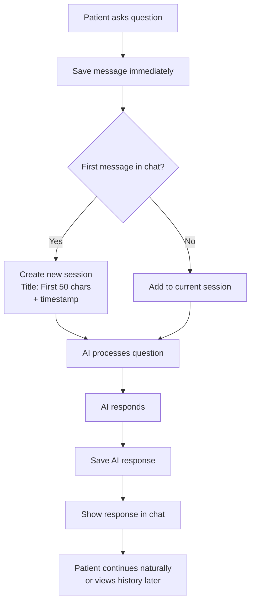
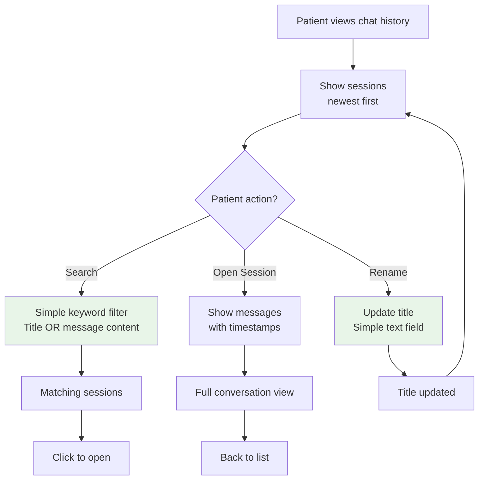
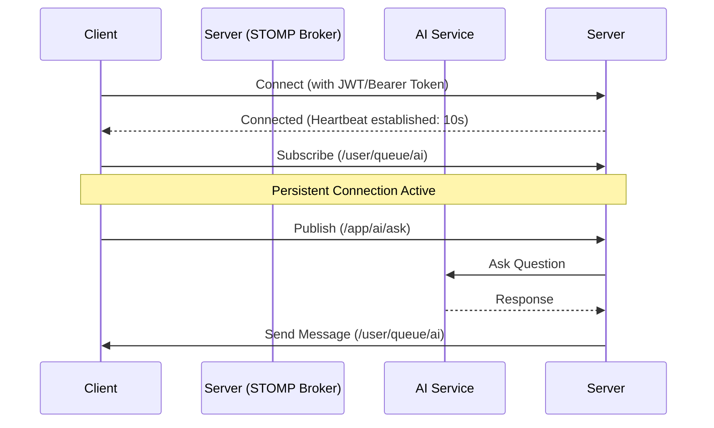
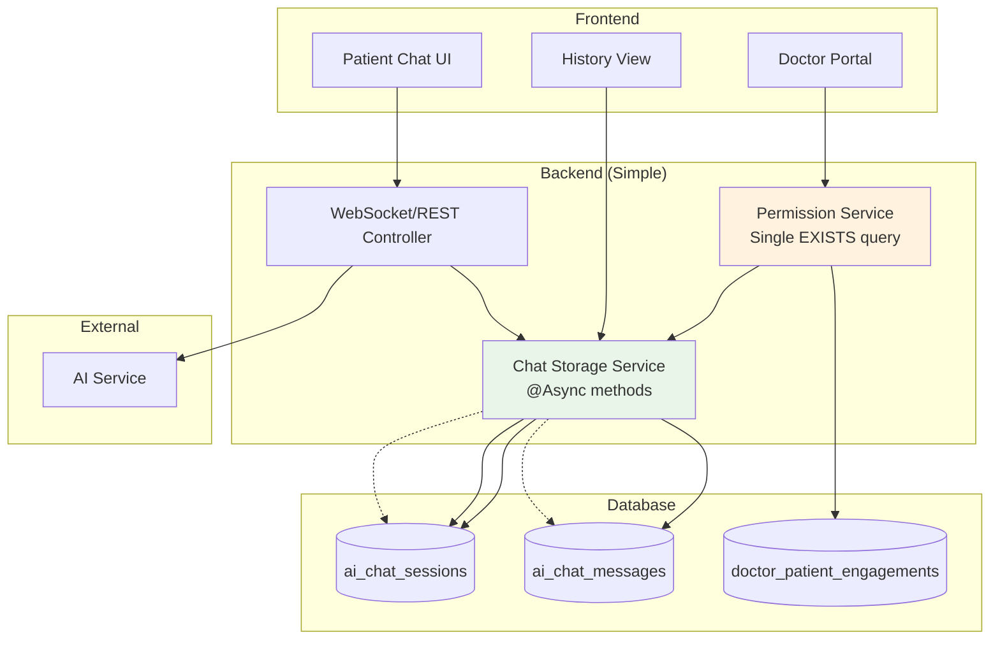

# NeuralHealer AI Chat System Documentation

## 🎯 Overview & Features

### **What This Feature Does**

**Simple Version:** It saves your conversations with the AI assistant so you can look back at them later, just like your text message history.

**For Everyone:**
- 💬 **Save your AI chats** - All your conversations with the AI are automatically saved
- 📁 **Organize by session** - Each chat gets its own "folder" you can give a custom title
- 🔍 **Search your history** - Find specific conversations quickly
- 👨‍⚕️ **Doctor access** - Your doctor can view your AI chats to better understand your journey
- ⚡ **Never slows you down** - Saving happens in the background so chatting stays fast

---

## 📱 How It Works for Users

### **As a Patient:**
1. **Chat normally** - Just talk to the AI assistant like before
2. **View your history** - Go to "My AI Chats" to see all past conversations
3. **Organize chats** - Give helpful titles to important conversations
4. **Search** - Find specific advice or topics quickly

### **As a Doctor:**
1. **View patient insights** - With permission, see your patient's AI conversations
2. **Better care** - Understand what questions patients are asking the AI
3. **Privacy protected** - Only see chats for patients you're actively treating

---

## 🔄 System Flows & Architecture

### **1. Starting a Chat (Simplified & Practical)**



**Key Points (Simplified):**
- **No "active session" logic** - Use simple "current session" concept
- **Smart Auto-titles** - First sentence or phrase (up to 50 chars) from your first message
- **Always save immediately** - Async, fire-and-forget
- **Continue in same session** - Until user explicitly starts new chat

---

### **2. Managing Your Chat History**



**What You Can Do (Practical):**
1. **Browse** - Scroll through sessions (newest first)
2. **Search** - Simple keyword matching (no fancy search logic)
3. **Read** - View full conversation
4. **Rename** - Edit title with simple text field

---

### **3. Doctor Access Flow (Permission-Based)**

```mermaid
flowchart TD
    A[Doctor opens patient profile] --> B{Active treatment?}
    
    B -- Yes --> C[Show "View AI Chats" button]
    B -- No --> D[No button shown]
    
    C --> E[Doctor clicks button]
    E --> F[List patient's sessions<br>with search]
    
    F --> G{Select session?}
    G -- Yes --> H[View conversation<br>read-only]
    G -- No --> I[Continue browsing]
    
    H --> J[Better understand<br>patient's concerns]
    I --> F
    
    style B fill:#fff3e0
    style F fill:#e8f5e8
```

**Privacy Rules (Simple Implementation):**
- ✅ **Visible only if** doctor has current `doctor_patient_engagement`
- ❌ **No access** to past patients' chats
- 📋 **Simple permission check** - `SELECT EXISTS` query only

---

## 🔌 API Reference

### **Base Information**
- **Status:** Production-Ready
- **Last Updated:** 2026-01-21
- **Version:** 0.5.0
- **Protocol:** STOMP over WebSocket (with HTTP REST fallback)
- **Authentication:** Bearer Token or `neuralhealer_token` cookie

### **1. Patient APIs**
**Base Path:** `/api/chats`  
**Access:** Authenticated Users (Patients)

| Method | Endpoint | Description |
|--------|----------|-------------|
| `GET` | `/api/chats` | Retrieve all chat sessions for the current user, ordered by most recent |
| `GET` | `/api/chats/with-doctors` | Optimized endpoint returning sessions with embedded authorized doctors list |
| `GET` | `/api/chats/search?q={query}` | Search sessions by title or message content |
| `GET` | `/api/chats/authorized-doctors` | List doctors who have permission to view your chat history |
| `GET` | `/api/chats/{sessionId}/messages` | Retrieve full message history for a specific session |
| `PUT` | `/api/chats/{sessionId}/title` | Rename a chat session |
| `POST` | `/api/chats` | **TESTING ONLY** Manually create a new session |

### **2. REST AI Ask API**
**Base Path:** `/api/ai`

| Method | Endpoint | Description |
|--------|----------|-------------|
| `POST` | `/api/ai/ask` | Ask AI a question. **Starts a new session every time** and returns the session ID |
| `POST` | `/api/ai/ask/{sessionId}` | Ask AI a question within an existing session |
| `GET` | `/api/ai/health` | Check AI service health |

### **3. Doctor APIs**
**Base Path:** `/api/doctors`  
**Access:** Authenticated Doctors

| Method | Endpoint | Description |
|--------|----------|-------------|
| `GET` | `/api/doctors/patients/{patientId}/chats` | View all chat sessions for a specific patient |
| `GET` | `/api/doctors/patients/{patientId}/chats/{sessionId}/messages` | View message details for a specific patient session |

**Security Note:** Doctors can strictly only access data for patients they have an active or historical relationship with.

---

## 🌐 WebSocket/STOMP Protocol

### **Overview**
The AI Chat system enables real-time, bi-directional interaction between users and the AI Assistant using STOMP over WebSocket.

- **Endpoint:** `ws://localhost:8080/ws`
- **Subscription Topic:** `/user/queue/ai` (Resolved to specific session)
- **Message Destination:** `/app/ai/ask`
- **Heartbeat:** 10,000ms (10 seconds) for session robustness

### **Subscription Flow**



### **Message Types**

#### **Sending Questions**
**Destination:** `/app/ai/ask`
```json
{
  "question": "What are the common symptoms of stress?"
}
```

#### **Receiving Events** (to `/user/queue/ai`)

**AI Typing Start**
```json
{
  "type": "AI_TYPING_START",
  "senderName": "AI Assistant",
  "content": "المساعد الذكي يكتب...",
  "sentAt": "2025-01-15T03:00:00"
}
```

**AI Response**
```json
{
  "type": "AI_RESPONSE",
  "senderName": "AI Assistant",
  "content": "Common symptoms of stress include fatigue...",
  "sentAt": "2025-01-15T03:00:05"
}
```

**AI Typing Stop**
```json
{
  "type": "AI_TYPING_STOP",
  "senderName": "AI Assistant",
  "content": null,
  "sentAt": "2025-01-15T03:00:10"
}
```

**AI Error**
```json
{
  "type": "AI_ERROR",
  "senderName": "System",
  "content": "عذراً، حدث خطأ أثناء الاتصال بالذكاء الاصطناعي...",
  "sentAt": "2025-01-15T03:00:10"
}
```

### **WebSocket Storage Integration**
**Protocol:** STOMP over WebSocket  
The existing AI chat flow has been enhanced to **automatically persist** all interactions.

| Direction | Destination | Action | Persistence |
|-----------|-------------|--------|-------------|
| **Send** | `/app/ai/ask` | User sends a question | ✅ User message saved asynchronously |
| **Receive** | `/user/queue/ai` | AI sends response | ✅ AI response saved asynchronously |

**Data Flow:**
1. User sends message to `/app/ai/ask`
2. System finds active session OR creates new one
3. Saves User message to DB (Async)
4. Sends "Typing..." status
5. Calls AI Service
6. Sends AI Response to `/user/queue/ai`
7. Saves AI Response to DB (Async)

### **Client Example (JavaScript/StompJS)**
```javascript
const client = new StompJs.Client({
    brokerURL: "ws://localhost:8080/ws",
    connectHeaders: { Authorization: "Bearer <YOUR_JWT_TOKEN>" },
    heartbeatIncoming: 10000,
    heartbeatOutgoing: 10000,
    reconnectDelay: 5000,

    onConnect: (frame) => {
        console.log("Connected to AI Broker");
        client.subscribe("/user/queue/ai", (message) => {
            const data = JSON.parse(message.body);
            console.log("AI Event:", data.type, data.content);
        });
        
        client.publish({
            destination: "/app/ai/ask",
            body: JSON.stringify({ question: "How to reduce anxiety?" })
        });
    }
});
client.activate();
```

### **Subscription Policies**
- **Creation:** Established client-side after successful STOMP `CONNECT`
- **Maintenance:** Kept alive via STOMP Heartbeats (10s intervals)
- **Timeout:** Session terminates if no data/heartbeat received within interval
- **Destruction:** When WebSocket session closes
- **Session Timeout:** JWT authentication must remain valid
- **Maximum Idle Time:** Supports 30+ minutes with maintained heartbeats

### **Message Delivery Guarantees**
- **Persistent Sessions:** Subscriptions remain active throughout user session
- **Order Guarantees:** STOMP ensures FIFO ordering within a single session
- **Disconnection:** Messages sent while client is disconnected are **not queued**

---

## 🗂️ Data Organization & Models

### **Chat Sessions Structure:**
```
📁 "Trouble sleeping at night..."    (Smart Title from message)
   ├── You (14:30): "I'm having trouble sleeping at night"
   └── AI (14:31): "Try these relaxation techniques..."
   
📁 "Stress chat - Feb 7"              (You renamed it)
   ├── You (15:15): "Feeling overwhelmed"
   └── AI (15:16): "5 quick stress relief exercises..."
```

### **Data Models**

**AiChatSession**
```json
{
  "id": "uuid",
  "patientId": "uuid",
  "sessionTitle": "General Chat",
  "startedAt": "2023-10-27T10:00:00",
  "isActive": true,
  "messageCount": 5
}
```

**AiChatMessage**
```json
{
  "id": "uuid",
  "sessionId": "uuid",
  "senderType": "PATIENT | AI",
  "content": "Hello, I need help.",
  "sentAt": "2023-10-27T10:00:05"
}
```

**AuthorizedDoctorResponse**
```json
{
  "doctorId": "uuid",
  "fullName": "Dr. Sarah Johnson",
  "title": "Clinical Psychologist",
  "specialities": ["CBT", "Anxiety Disorders"],
  "accessLevel": "Full Access",
  "isCurrentlyActive": true
}
```

**SessionWithDoctorsResponse (Enriched)**
```json
{
  "sessionId": "uuid",
  "sessionTitle": "Anxiety Management",
  "sessionType": "general",
  "startedAt": "2023-10-27T10:00:00",
  "endedAt": null,
  "isActive": true,
  "messageCount": 12,
  "authorizedDoctors": [
    {
      "doctorId": "uuid",
      "fullName": "Dr. Sarah Johnson",
      "title": "Clinical Psychologist",
      "specialities": ["CBT"],
      "accessLevel": "Full Access",
      "isCurrentlyActive": true
    }
  ]
}
```

**AiSessionChatResponse**
```json
{
  "sessionId": "uuid",
  "answer": "Generated AI answer...",
  "sources": ["source 1", "source 2"]
}
```

---

## 🔐 Privacy & Security (Minimal & Effective)

### **Your Data Protection:**
- 🔒 **Standard encryption** - Same as rest of application
- 👤 **Your data only** - No sharing by default
- 👨‍⚕️ **Doctor access** - Only with current treatment relationship
- ⚠️ **Simple permissions** - No complex ACLs or sharing settings

### **Doctor Access Rules:**
```sql
-- Simple permission check
SELECT EXISTS (
    SELECT 1 FROM doctor_patient_engagements 
    WHERE doctor_id = ? AND patient_id = ? 
    AND end_date IS NULL
)
```

---

## 📱 Simple UX Guide

### **For Patients:**
1. **Chat** - Just chat normally, everything saves automatically
2. **View history** - Click "AI History" in menu
3. **Search** - Type in search box
4. **Rename** - Click pencil icon, type new name

### **For Doctors:**
1. **Open patient** - Go to patient profile
2. **See button?** - If you're currently treating them
3. **Click** - View their AI conversations
4. **Read** - Understand their concerns better

---

## 🔧 Technical Implementation Details

### **What Actually Happens (No Magic):**
```
1. You type a message
2. System saves it (async, doesn't wait)
3. AI thinks and responds
4. System saves AI response (async)
5. You see the response

If it's your first message in a session:
   - System analyzes the message
   - Extracts the first sentence or phrase
   - Sets it as the "Smart Title" (e.g., "Trouble sleeping at night...")
```

**Key Points (No Over-Engineering):**
- ✅ **Async @Annotation only** - No custom thread pools
- ✅ **Smart Auto-titles** - Extracted from first user message
- ✅ **Fire-and-forget saving** - Basic error logging only
- ✅ **One permission check** - Single SQL query
- ✅ **Two-table data model** - Sessions + Messages only
- ✅ **No session management** - Just "latest" session concept

### **Complete System Overview**



**Architecture Principles:**
1. **Simple async saving** - No complex queues or retry logic
2. **Minimal permission checks** - Single database query
3. **Two-table data model** - Sessions + Messages only
4. **No session management** - Just "latest" session concept

---

## ⚡ Performance & Reliability (Simple Approach)

### **What We Guarantee:**
- **Chat speed** - Saving never blocks your conversation
- **History loading** - Under 2 seconds for typical users
- **Search speed** - Fast enough with simple ILIKE queries
- **Reliability** - Basic error handling + logging

### **What We Don't Have (Yet):**
- ❌ Advanced search filters
- ❌ Export functionality  
- ❌ Chat analytics
- ❌ Message editing
- ❌ Bulk operations

**We'll add these only if users explicitly ask for them.**

---

## ❓ Common Questions (Honest Answers)

### **Q: Do I need to do anything to save my chats?**
**A:** No, it happens automatically in the background.

### **Q: Can I delete my chat history?**
**A:** Not yet, but we'll add this if users request it.

### **Q: How are chat titles generated?**
**A:** Smart titles are automatically extracted from your first sentence. If you say "I feel anxious today", the title becomes "I feel anxious today...".

### **Q: Does saving slow down the AI?**
**A:** No, saving happens separately after you get the response.

### **Q: What if saving fails?**
**A:** Your chat continues, we log the error for fixing later.

---

## 🛠️ Troubleshooting Guide

| Issue | Cause | Solution |
| :--- | :--- | :--- |
| **Connection Drops** | Missing Heartbeats | Verify heartbeat settings in client config |
| **401 Unauthorized** | Invalid Token | Refresh the Bearer token in headers |
| **No Responses** | Wrong Path | Ensure subscription is to `/user/queue/ai` |
| **Slow History** | Large dataset | Implement pagination if needed |
| **Permission Denied** | No active treatment | Verify doctor-patient engagement status |

### **Debugging Steps:**
1. **Frames tab** - Check Chrome DevTools → Network → WS → Frames for STOMP frames
2. **Heartbeat Check** - Verify `heartbeats: [10000, 10000]` in the `CONNECTED` frame
3. **Token Validation** - Ensure JWT is not expired
4. **Database Logs** - Check async save operations for errors

---

## 📋 Success Metrics (Simple)

**We'll know it's working if:**
- ✅ No chat slowdowns reported
- ✅ History loads in < 2 seconds
- ✅ Search finds relevant chats
- ✅ Doctors find it useful for patient care
- ✅ No saving errors in logs

---

**Thank you for using NeuralHealer!** We built this feature to be simple, fast, and useful without unnecessary complexity. 💚

*Last updated: February 2026*