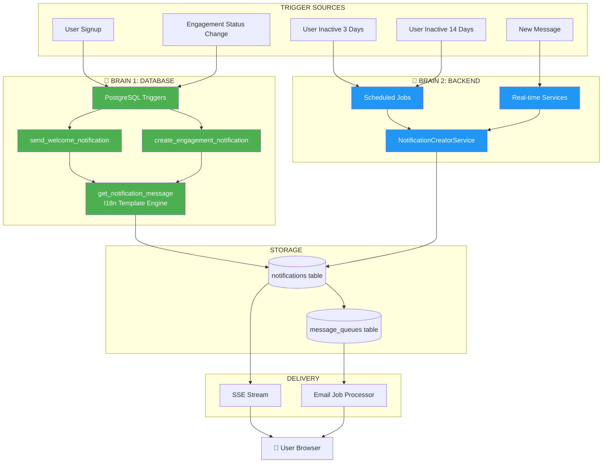
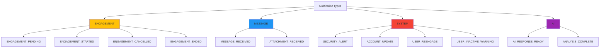
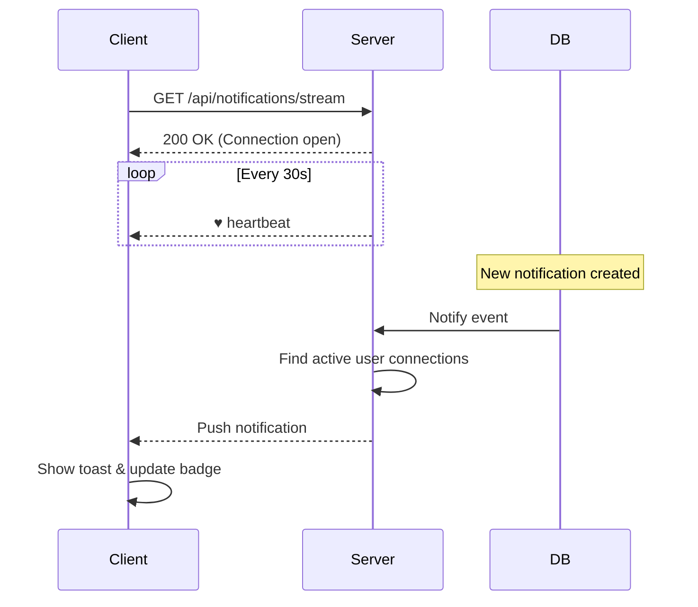
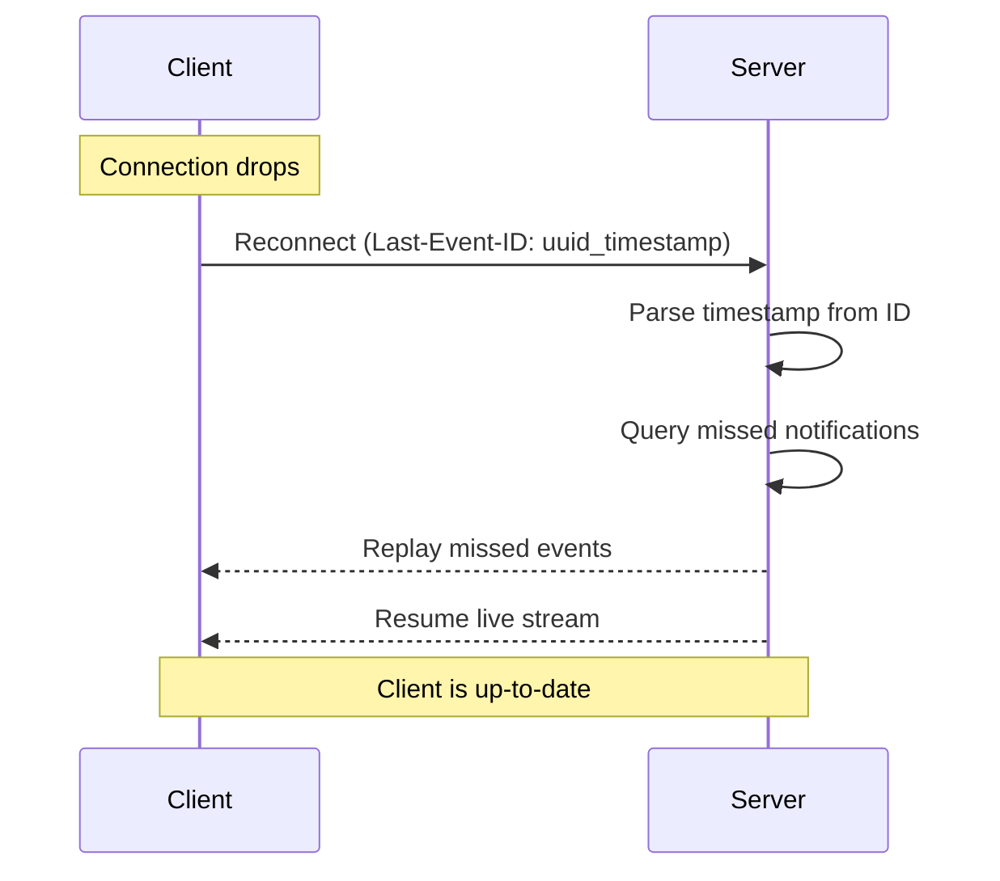
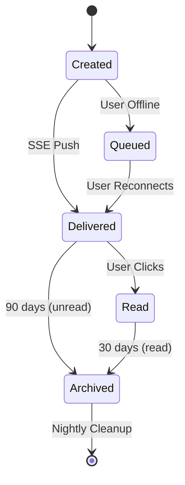
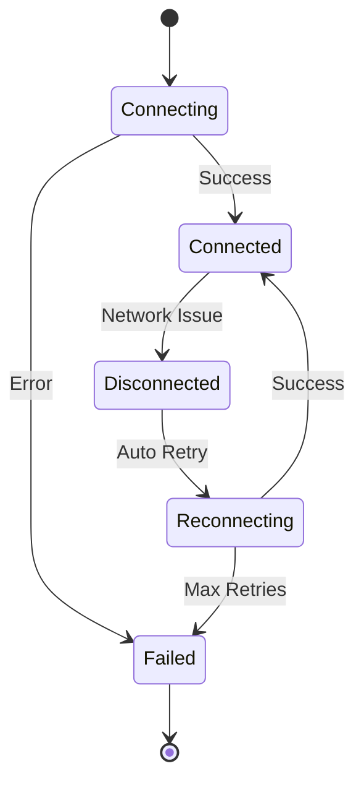

# 📬 Notification System - API Guide
## NeuralHealer Platform

---
**Audience:** Frontend Developers, API Consumers, Integration Teams  
**Version:** 3.0.0  
**Last Updated:** January 27, 2026  
**Status:** ✅ Production Ready

---

## 📋 Table of Contents

1. [System Overview](#1-system-overview)
2. [Dual-Brain Architecture](#2-dual-brain-architecture)
3. [Notification Types](#3-notification-types)
4. [Real-Time Delivery (SSE)](#4-real-time-delivery-sse)
5. [API Endpoints](#5-api-endpoints)
6. [Notification Templates](#6-notification-templates)
7. [Integration Guide](#7-integration-guide)
8. [Troubleshooting](#8-troubleshooting)

---

## 1. System Overview

### 1.1 What is the Notification System?

The Notification System delivers **real-time alerts** about important platform events using Server-Sent Events (SSE) for instant delivery.

### 1.2 Key Features

| Feature | Description |
|---------|-------------|
| ⚡ Real-time Push | Instant delivery via SSE (no polling) |
| 🔄 Auto Reconnection | Automatic catch-up after network issues |
| 📊 Full History | Persistent notification records |
| 🎯 Priority-based | HIGH/NORMAL/LOW with different UI treatment |
| 📧 Multi-channel | SSE (primary) + Email (backup for HIGH priority) |

### 1.3 Core Entities

| Entity | Purpose |
|--------|---------|
| `notifications` | Stores all notification records |
| `message_queues` | Async email delivery queue |
| `notification_templates` | I18n message templates |

---

## 2. Dual-Brain Architecture

### 2.1 Architecture Concept

The system uses a **hybridized approach** where notifications are created by TWO intelligent components:



### 2.2 Responsibility Matrix

| Logic Layer | Responsibility | Component |
|-------------|----------------|-----------|
| **Main Brain (DB)** | Engagement State & Lifecycle | `create_engagement_notification()` (Trigger) |
| **Lifecycle Logic (DB)** | Welcome Messages | `send_welcome_notification()` (Trigger) |
| **Time-Based Logic (App)** | Inactivity (3d, 14d) | `UserActivityNotificationJob` (Spring) |
| **Logic Layer (API)** | Real-time Operations & AI | `NotificationCreatorService` (Spring) |
| **I18n Engine** | Centralized Templates & Rendering | `get_notification_message()` (SQL Helper) |

### 2.3 Why Two Brains?

✅ **Database Triggers** react instantly to data changes (microseconds)  
✅ **Backend Services** handle complex logic and scheduled tasks  
✅ **Combined** they provide reliability and flexibility

---

## 3. Notification Types

### 3.1 Type Hierarchy



### 3.2 Priority Mapping

| Type | Priority | SSE | Email | Sound |
|------|----------|-----|-------|-------|
| `ENGAGEMENT_*` | **HIGH** | ✅ | ✅ | ✅ |
| `SECURITY_ALERT` | **HIGH** | ✅ | ✅ | ✅ |
| `MESSAGE_RECEIVED` | NORMAL | ✅ | ❌ | ✅ |
| `USER_REENGAGE` | NORMAL | ✅ | ✅ | ❌ |
| `ACCOUNT_UPDATE` | LOW | ✅ | ❌ | ❌ |

---

## 4. Real-Time Delivery (SSE)

### 4.1 Connection Flow



### 4.2 Event Format

**SSE Event Structure:**
```
id: {UUID}_{EPOCH_TIMESTAMP}
event: notification
data: {JSON_PAYLOAD}
```

**Example:**
```
id: 550e8400-e29b-41d4-a716-446655440000_1737981600
event: notification
data: {"id":"550e8400-...","type":"MESSAGE_RECEIVED","title":"New Message","message":"You have a message from Dr. Smith","priority":"NORMAL","isRead":false}
```

### 4.3 Reconnection & Catch-up



**Replay Window:** 30 minutes (configurable)

---

## 5. API Endpoints

### 5.1 Endpoint Summary

| Method | Endpoint | Purpose |
|--------|----------|---------|
| `GET` | `/api/notifications/stream` | Connect to SSE stream |
| `GET` | `/api/notifications` | Get notification history |
| `PUT` | `/api/notifications/{id}/read` | Mark as read |
| `GET` | `/api/notifications/unread-count` | Get unread count |

### 5.2 SSE Stream

**Request:**
```http
GET /api/notifications/stream
Authorization: Bearer {token}
Accept: text/event-stream
```

**Response:** Continuous event stream

### 5.3 Get Notification History

**Request:**
```http
GET /api/notifications?page=0&size=20&sort=sentAt,desc
Authorization: Bearer {token}
```

**Response:**
```json
{
  "content": [
    {
      "id": "uuid",
      "type": "ENGAGEMENT_STARTED",
      "title": "Engagement Activated",
      "message": "Dr. Ahmed has started your engagement",
      "priority": "HIGH",
      "isRead": false,
      "sentAt": "2026-01-27T10:15:30Z",
      "payload": {
        "engagementId": "abc-123",
        "doctorName": "Ahmed Raafat"
      }
    }
  ],
  "totalElements": 42,
  "totalPages": 3
}
```

### 5.4 Mark as Read

**Request:**
```http
PUT /api/notifications/{id}/read
Authorization: Bearer {token}
```

**Response:**
```json
{
  "success": true,
  "notification": {
    "id": "uuid",
    "isRead": true
  }
}
```

### 5.5 Get Unread Count

**Request:**
```http
GET /api/notifications/unread-count
Authorization: Bearer {token}
```

**Response:**
```json
{
  "count": 5
}
```

---

## 6. Notification Templates

### 6.1 Template Structure

All notification messages use **I18n templates** stored in the database via `get_notification_message()` SQL function.

### 6.2 Engagement Templates

| Type | English Template | Arabic Template |
|------|------------------|-----------------|
| `ENGAGEMENT_PENDING` | "Dr. {doctorName} wants to start an engagement with you" | "د. {doctorName} يريد بدء متابعة معك" |
| `ENGAGEMENT_STARTED` | "Your engagement with Dr. {doctorName} is now active" | "متابعتك مع د. {doctorName} نشطة الآن" |
| `ENGAGEMENT_CANCELLED` | "Dr. {doctorName} cancelled the engagement" | "د. {doctorName} ألغى المتابعة" |
| `ENGAGEMENT_ENDED` | "Your engagement with Dr. {doctorName} has ended" | "انتهت متابعتك مع د. {doctorName}" |

### 6.3 Welcome Templates

| Type | English Template | Arabic Template |
|------|------------------|-----------------|
| `WELCOME_PATIENT` | "Welcome to NeuralHealer, {firstName}! Complete your profile to get started." | "مرحباً بك في NeuralHealer، {firstName}! أكمل ملفك الشخصي للبدء." |
| `WELCOME_DOCTOR` | "Welcome Dr. {lastName}! Your account is now active." | "مرحباً د. {lastName}! حسابك نشط الآن." |

### 6.4 Re-engagement Templates

| Type | English Template | Arabic Template | Trigger |
|------|------------------|-----------------|---------|
| `USER_REENGAGE_ACTIVE` | "We miss you, {firstName}! Check your health dashboard." | "نفتقدك، {firstName}! تحقق من لوحة الصحة الخاصة بك." | 3 days inactive |
| `USER_INACTIVE_WARNING` | "Your account will be deactivated soon. Log in to keep it active." | "سيتم تعطيل حسابك قريباً. سجل الدخول للحفاظ عليه نشطاً." | 14 days inactive |

### 6.5 System Templates

| Type | English Template | Arabic Template |
|------|------------------|-----------------|
| `SECURITY_ALERT` | "New login from {location} at {time}" | "تسجيل دخول جديد من {location} في {time}" |
| `ACCOUNT_UPDATE` | "Your profile has been updated successfully" | "تم تحديث ملفك الشخصي بنجاح" |

### 6.6 Message Templates

| Type | English Template | Arabic Template |
|------|------------------|-----------------|
| `MESSAGE_RECEIVED` | "New message from {senderName}" | "رسالة جديدة من {senderName}" |
| `ATTACHMENT_RECEIVED` | "{senderName} sent you a file: {fileName}" | "{senderName} أرسل لك ملف: {fileName}" |

### 6.7 AI Templates

| Type | English Template | Arabic Template |
|------|------------------|-----------------|
| `AI_RESPONSE_READY` | "Your AI analysis is ready to view" | "تحليل الذكاء الاصطناعي الخاص بك جاهز للعرض" |
| `ANALYSIS_COMPLETE` | "Analysis of {reportName} completed" | "اكتمل تحليل {reportName}" |

### 6.8 Template Variables

Common placeholders used in templates:

| Variable | Description | Example |
|----------|-------------|---------|
| `{firstName}` | User's first name | "Ahmed" |
| `{lastName}` | User's last name | "Raafat" |
| `{doctorName}` | Full doctor name | "Dr. Ahmed Raafat" |
| `{senderName}` | Message sender name | "Dr. Smith" |
| `{location}` | Login location | "Cairo, Egypt" |
| `{time}` | Timestamp | "10:30 AM" |
| `{fileName}` | Attachment filename | "report.pdf" |
| `{reportName}` | Report title | "Blood Test Results" |

---

## 7. Integration Guide

### 7.1 Basic SSE Client

```javascript
// Connect to notification stream
const eventSource = new EventSource('/api/notifications/stream');

// Listen for notifications
eventSource.addEventListener('notification', (event) => {
  const notification = JSON.parse(event.data);
  handleNotification(notification);
});

// Handle connection errors
eventSource.onerror = () => {
  // Browser auto-reconnects with Last-Event-ID
};
```

### 7.2 Notification Lifecycle



### 7.3 Implementation Steps

1. **Connect** to `/api/notifications/stream` on login
2. **Listen** for `notification` events
3. **Display** toast based on priority (HIGH = red, NORMAL = blue)
4. **Update** badge count
5. **Mark as read** when user interacts
6. **Close** connection on logout

---

## 8. Troubleshooting

### 8.1 Common Issues

| Problem | Solution |
|---------|----------|
| Not receiving notifications | Check SSE connection in Network tab |
| Duplicate notifications | Ensure only one EventSource instance |
| Missing after reconnect | Verify `Last-Event-ID` header is sent |
| 401 Unauthorized | Refresh auth token |

### 8.2 Debug Checklist

- [ ] SSE connection shows "open" status
- [ ] Auth token is valid
- [ ] No CORS errors in console
- [ ] Browser supports EventSource API
- [ ] Only one connection per user

### 8.3 Connection States



---

**Need Help?**  
📧 Backend Team: backend@neuralhealer.com  
📖 Full Spec: [Notification System Master](./notification-system-complete.md)

---

**Version:** 3.0.0  
**Last Updated:** January 27, 2026  
**Status:** ✅ Production Ready