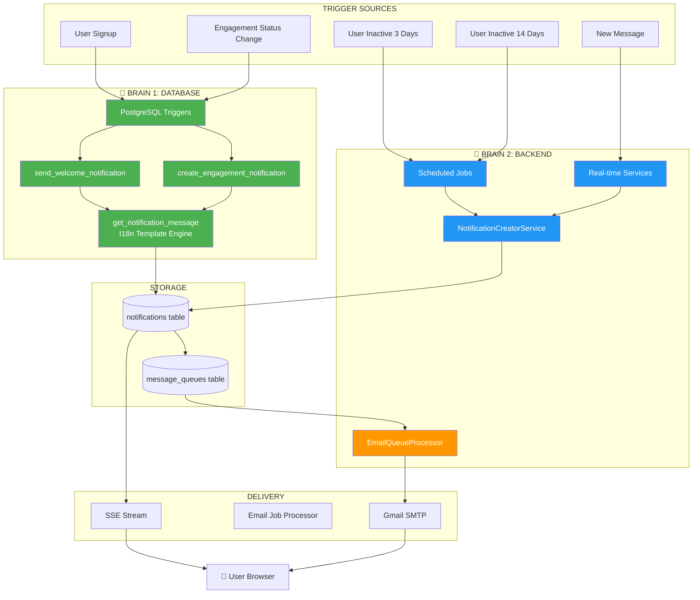
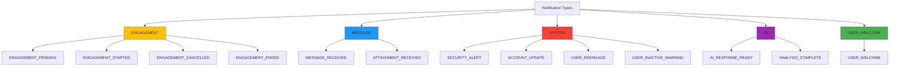
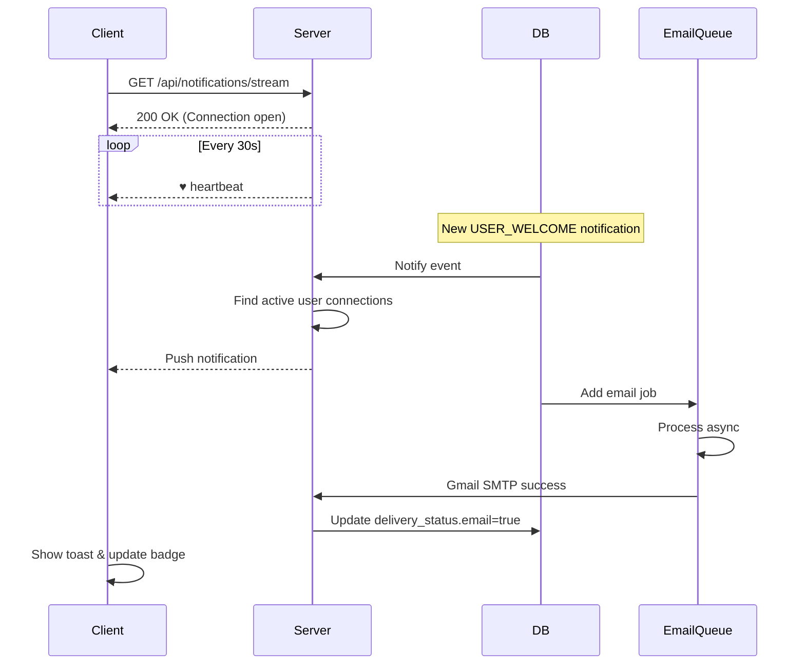
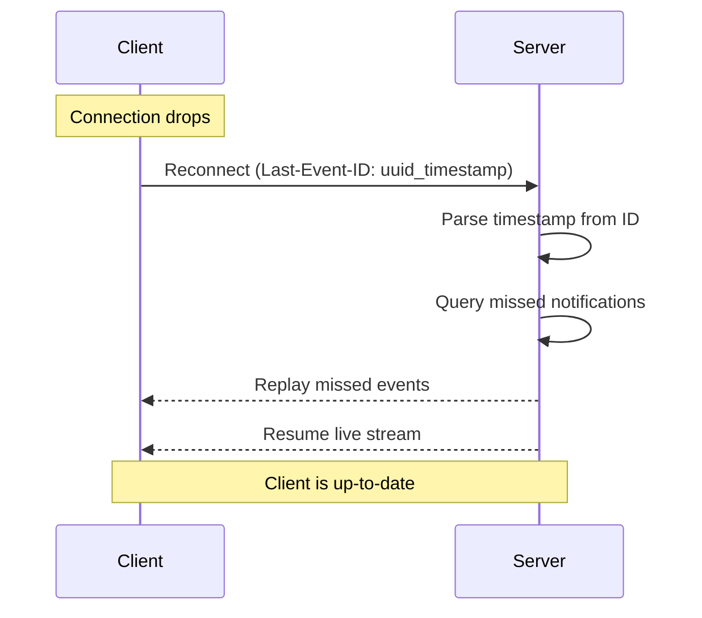
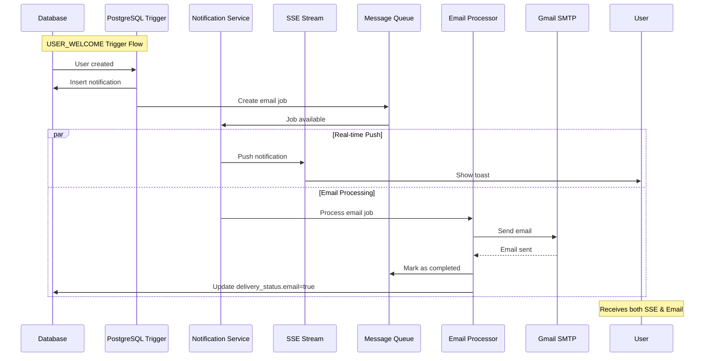
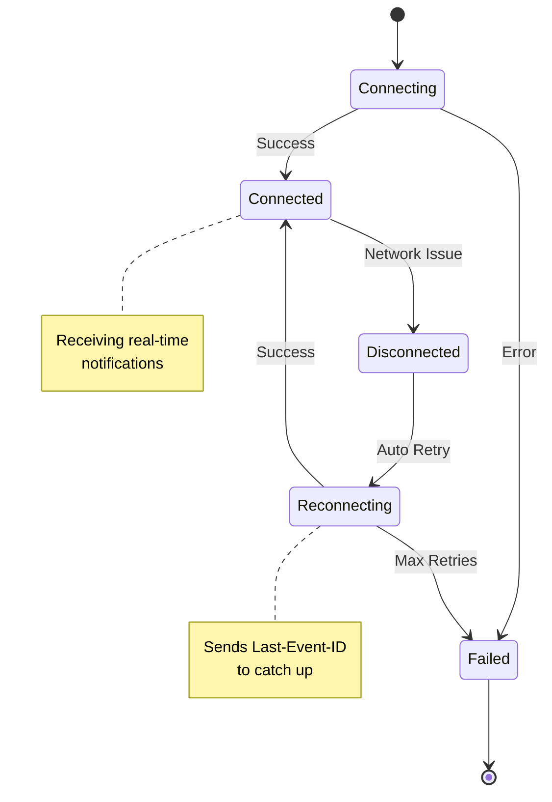

# 📬 Notification System - API Guide
## NeuralHealer Platform

---
**Audience:** Frontend Developers, API Consumers, Integration Teams  
**Version:** 3.1.0  
**Last Updated:** January 30, 2026  
**Status:** ✅ Production Ready

---

## 📋 Table of Contents

1. [System Overview](#1-system-overview)
2. [Dual-Brain Architecture](#2-dual-brain-architecture)
3. [Notification Types](#3-notification-types)
4. [Real-Time Delivery (SSE)](#4-real-time-delivery-sse)
5. [API Endpoints](#5-api-endpoints)
6. [Notification Templates](#6-notification-templates)
7. [Delivery Flow & Email Integration](#7-delivery-flow--email-integration)
8. [Troubleshooting](#8-troubleshooting)

---

## 1. System Overview

### 1.1 What is the Notification System?

The Notification System delivers **real-time alerts** about important platform events using Server-Sent Events (SSE) for instant delivery, with automatic email fallback for critical notifications.

### 1.2 Key Features

| Feature | Description |
|---------|-------------|
| ⚡ Real-time Push | Instant delivery via SSE (no polling) |
| 📧 Email Fallback | Automatic email sending for critical notifications |
| 🔄 Auto Reconnection | Automatic catch-up after network issues |
| 📊 Full History | Persistent notification records |
| 🎯 Priority-based | HIGH/NORMAL/LOW with different UI treatment |
| 🌐 I18n Support | Localized templates for English & Arabic |

### 1.3 Core Entities

| Entity | Purpose |
|--------|---------|
| `notifications` | Stores all notification records |
| `message_queues` | Async email delivery queue |
| `notification_templates` | I18n message templates |

---

## 2. Dual-Brain Architecture

### 2.1 Architecture Concept

The system uses a **hybridized approach** where notifications are created by TWO intelligent components:



### 2.2 Responsibility Matrix

| Logic Layer | Responsibility | Component |
|-------------|----------------|-----------|
| **Main Brain (DB)** | Engagement State & Lifecycle | `create_engagement_notification()` (Trigger) |
| **Lifecycle Logic (DB)** | Welcome Messages | `send_welcome_notification()` (Trigger) |
| **Time-Based Logic (App)** | Inactivity (3d, 14d) | `UserActivityNotificationJob` (Spring) |
| **Logic Layer (API)** | Real-time Operations & AI | `NotificationCreatorService` (Spring) |
| **I18n Engine** | Centralized Templates & Rendering | `get_notification_message()` (SQL Helper) |
| **Email Processor** | Async Email Delivery | `EmailQueueProcessor` (Spring) |

### 2.3 Why Two Brains?

✅ **Database Triggers** react instantly to data changes (microseconds)  
✅ **Backend Services** handle complex logic and scheduled tasks  
✅ **Email Processor** ensures reliable email delivery  
✅ **Combined** they provide reliability and flexibility

---

## 3. Notification Types

### 3.1 Type Hierarchy



### 3.2 Priority & Delivery Mapping

| Type | Priority | SSE | Email | Sound | Created By |
|------|----------|-----|-------|-------|------------|
| `USER_WELCOME` | **HIGH** | ✅ | ✅ | ✅ | Database Trigger |
| `ENGAGEMENT_*` | **HIGH** | ✅ | ✅ | ✅ | Database Trigger |
| `SECURITY_ALERT` | **HIGH** | ✅ | ✅ | ✅ | Backend Service |
| `USER_REENGAGE` | NORMAL | ✅ | ✅ | ❌ | Scheduled Job |
| `USER_INACTIVE_WARNING` | NORMAL | ✅ | ✅ | ❌ | Scheduled Job |
| `MESSAGE_RECEIVED` | NORMAL | ✅ | ❌ | ✅ | Backend Service |
| `ACCOUNT_UPDATE` | LOW | ✅ | ❌ | ❌ | Backend Service |
| `AI_RESPONSE_READY` | NORMAL | ✅ | ❌ | ✅ | Backend Service |

---

## 4. Real-Time Delivery (SSE)

### 4.1 Connection Flow



### 4.2 Event Format

**SSE Event Structure:**
```
id: {UUID}_{EPOCH_TIMESTAMP}
event: notification
data: {JSON_PAYLOAD}
```

**Example:**
```
id: 550e8400-e29b-41d4-a716-446655440000_1737981600
event: notification
data: {"id":"550e8400-...","type":"USER_WELCOME","title":"Welcome to NeuralHealer!","message":"Welcome to NeuralHealer, Ahmed! Complete your profile to get started.","priority":"HIGH","isRead":false,"deliveryStatus":{"sse":true,"email":false}}
```

### 4.3 Delivery Status Tracking

The `deliveryStatus` field tracks multi-channel delivery:

```json
{
  "deliveryStatus": {
    "sse": true,
    "email": false,
    "emailQueuedAt": "2026-01-30T17:11:34.959+02:00",
    "emailSentAt": null,
    "emailError": null
  }
}
```

**States:**
- `sse`: `true` if pushed via Server-Sent Events (instantly)
- `email`: `true` if successfully sent via Gmail SMTP (async, 1-10 seconds delay)
- `emailQueuedAt`: When email job was created
- `emailSentAt`: When email was successfully sent
- `emailError`: Any email delivery error message

### 4.4 Reconnection & Catch-up



**Replay Window:** 30 minutes (configurable)

---

## 5. API Endpoints

### 5.1 Endpoint Summary

| Method | Endpoint | Purpose |
|--------|----------|---------|
| `GET` | `/api/notifications/stream` | Connect to SSE stream |
| `GET` | `/api/notifications` | Get notification history |
| `PUT` | `/api/notifications/{id}/read` | Mark as read |
| `GET` | `/api/notifications/unread-count` | Get unread count |
| `GET` | `/api/notifications/{id}/delivery-status` | Get delivery status |

### 5.2 SSE Stream

**Request:**
```http
GET /api/notifications/stream
Authorization: Bearer {token}
Accept: text/event-stream
```

**Response:** Continuous event stream

### 5.3 Get Notification History

**Request:**
```http
GET /api/notifications?page=0&size=20&sort=sentAt,desc
Authorization: Bearer {token}
```

**Response:**
```json
{
  "content": [
    {
      "id": "uuid",
      "type": "USER_WELCOME",
      "title": "Welcome to NeuralHealer!",
      "message": "Welcome to NeuralHealer, Ahmed! Complete your profile to get started.",
      "priority": "HIGH",
      "isRead": false,
      "sentAt": "2026-01-30T17:11:34.959+02:00",
      "deliveryStatus": {
        "sse": true,
        "email": true,
        "emailQueuedAt": "2026-01-30T17:11:34.959+02:00",
        "emailSentAt": "2026-01-30T17:11:34.960+02:00",
        "emailError": null
      },
      "payload": {
        "userId": "user-uuid",
        "userType": "PATIENT",
        "firstName": "Ahmed",
        "email": "ahmed@example.com"
      }
    }
  ],
  "totalElements": 42,
  "totalPages": 3
}
```

### 5.4 Get Delivery Status

**Request:**
```http
GET /api/notifications/{id}/delivery-status
Authorization: Bearer {token}
```

**Response:**
```json
{
  "notificationId": "uuid",
  "sseDelivered": true,
  "emailStatus": "SENT",
  "emailQueuedAt": "2026-01-30T17:11:34.959+02:00",
  "emailSentAt": "2026-01-30T17:11:34.960+02:00",
  "emailErrorMessage": null,
  "lastUpdated": "2026-01-30T17:11:34.970+02:00"
}
```

**Email Status Values:**
- `QUEUED`: Added to message_queues table
- `PROCESSING`: Email job is being processed
- `SENT`: Successfully sent via Gmail SMTP
- `FAILED`: Email delivery failed (check error message)
- `RETRY`: Scheduled for retry

### 5.5 Mark as Read

**Request:**
```http
PUT /api/notifications/{id}/read
Authorization: Bearer {token}
```

**Response:**
```json
{
  "success": true,
  "notification": {
    "id": "uuid",
    "isRead": true,
    "readAt": "2026-01-30T17:15:00.000+02:00"
  }
}
```

### 5.6 Get Unread Count

**Request:**
```http
GET /api/notifications/unread-count
Authorization: Bearer {token}
```

**Response:**
```json
{
  "count": 5,
  "highPriority": 2,
  "normalPriority": 3
}
```

---

## 6. Notification Templates

### 6.1 Template System

All notification messages use **I18n templates** stored in the database via `get_notification_message()` SQL function, which handles localization and variable substitution.

### 6.2 Welcome Templates

| Type | English Template | Arabic Template | Delivery |
|------|------------------|-----------------|----------|
| `USER_WELCOME` (Patient) | "Welcome to NeuralHealer, {firstName}! Complete your profile to get started." | "مرحباً بك في NeuralHealer، {firstName}! أكمل ملفك الشخصي للبدء." | SSE + Email |
| `USER_WELCOME` (Doctor) | "Welcome Dr. {lastName}! Your account is now active." | "مرحباً د. {lastName}! حسابك نشط الآن." | SSE + Email |

### 6.3 Engagement Templates

| Type | English Template | Arabic Template | Delivery |
|------|------------------|-----------------|----------|
| `ENGAGEMENT_PENDING` | "Dr. {doctorName} wants to start an engagement with you" | "د. {doctorName} يريد بدء متابعة معك" | SSE + Email |
| `ENGAGEMENT_STARTED` | "Your engagement with Dr. {doctorName} is now active" | "متابعتك مع د. {doctorName} نشطة الآن" | SSE + Email |
| `ENGAGEMENT_CANCELLED` | "Dr. {doctorName} cancelled the engagement" | "د. {doctorName} ألغى المتابعة" | SSE + Email |
| `ENGAGEMENT_ENDED` | "Your engagement with Dr. {doctorName} has ended" | "انتهت متابعتك مع د. {doctorName}" | SSE + Email |

### 6.4 Re-engagement Templates

| Type | English Template | Arabic Template | Trigger | Delivery |
|------|------------------|-----------------|---------|----------|
| `USER_REENGAGE` | "We miss you, {firstName}! Check your health dashboard." | "نفتقدك، {firstName}! تحقق من لوحة الصحة الخاصة بك." | 3 days inactive | SSE + Email |
| `USER_INACTIVE_WARNING` | "Your account will be deactivated soon. Log in to keep it active." | "سيتم تعطيل حسابك قريباً. سجل الدخول للحفاظ عليه نشطاً." | 14 days inactive | SSE + Email |

### 6.5 System Templates

| Type | English Template | Arabic Template | Delivery |
|------|------------------|-----------------|----------|
| `SECURITY_ALERT` | "New login from {location} at {time}" | "تسجيل دخول جديد من {location} في {time}" | SSE + Email |
| `ACCOUNT_UPDATE` | "Your profile has been updated successfully" | "تم تحديث ملفك الشخصي بنجاح" | SSE Only |

### 6.6 Message Templates

| Type | English Template | Arabic Template | Delivery |
|------|------------------|-----------------|----------|
| `MESSAGE_RECEIVED` | "New message from {senderName}" | "رسالة جديدة من {senderName}" | SSE Only |
| `ATTACHMENT_RECEIVED` | "{senderName} sent you a file: {fileName}" | "{senderName} أرسل لك ملف: {fileName}" | SSE Only |

### 6.7 AI Templates

| Type | English Template | Arabic Template | Delivery |
|------|------------------|-----------------|----------|
| `AI_RESPONSE_READY` | "Your AI analysis is ready to view" | "تحليل الذكاء الاصطناعي الخاص بك جاهز للعرض" | SSE Only |
| `ANALYSIS_COMPLETE` | "Analysis of {reportName} completed" | "اكتمل تحليل {reportName}" | SSE Only |

### 6.8 Template Variables

Common placeholders used in templates:

| Variable | Description | Example |
|----------|-------------|---------|
| `{firstName}` | User's first name | "Ahmed" |
| `{lastName}` | User's last name | "Raafat" |
| `{doctorName}` | Full doctor name | "Dr. Ahmed Raafat" |
| `{senderName}` | Message sender name | "Dr. Smith" |
| `{location}` | Login location | "Cairo, Egypt" |
| `{time}` | Timestamp | "10:30 AM" |
| `{fileName}` | Attachment filename | "report.pdf" |
| `{reportName}` | Report title | "Blood Test Results" |

---

## 7. Delivery Flow & Email Integration

### 7.1 Complete Delivery Pipeline



### 7.2 Email Processing Logic

The `EmailQueueProcessor` handles async email delivery with these characteristics:

1. **Transaction Safety**: Each email processed in its own transaction
2. **Retry Logic**: Failed emails are retried with exponential backoff
3. **Status Tracking**: Updates `delivery_status.email` field
4. **Error Handling**: Non-critical errors logged, job marked appropriately

### 7.3 Sample Email Content

**Subject:** Welcome to NeuralHealer! 🎉

**Body:**
```
Welcome to NeuralHealer, Ahmed!

We're excited to have you join our platform. Your account has been successfully created.

To get started:
1. Complete your profile
2. Connect with healthcare providers
3. Explore your health dashboard

If you have any questions, please contact support@neuralhealer.com.

Best regards,
The NeuralHealer Team
```

### 7.4 Implementation Steps

1. **Connect** to `/api/notifications/stream` on login
2. **Listen** for `notification` events
3. **Display** toast based on priority:
   - HIGH: Red border, bell icon, auto-expand
   - NORMAL: Blue border, info icon
   - LOW: Gray border, minimal display
4. **Show delivery status**: Indicate if email is queued/sent/failed
5. **Update** badge count with priority breakdown
6. **Mark as read** when user interacts
7. **Close** connection on logout

---

## 8. Troubleshooting

### 8.1 Common Issues & Solutions

| Problem | Solution | Log Pattern |
|---------|----------|-------------|
| Email sent but status not updated | Check `EmailQueueProcessor` logs for rollback errors | `Transaction silently rolled back because it has been marked as rollback-only` |
| Missing notification type in enum | Add `USER_WELCOME` to `NotificationType` enum | `No enum constant com...NotificationType.USER_WELCOME` |
| Not receiving SSE notifications | Check browser console for SSE connection errors | Network tab shows SSE stream disconnected |
| Email delivery failed | Check Gmail SMTP configuration and quotas | `Email sent failed to: email@example.com` |
| Duplicate notifications | Verify database triggers aren't firing multiple times | Multiple notifications with same payload |

### 8.2 Debug Checklist

- [ ] SSE connection shows "open" status in Network tab
- [ ] Auth token is valid and not expired
- [ ] No CORS errors in browser console
- [ ] `NotificationType.USER_WELCOME` exists in enum
- [ ] Email jobs appear in `message_queues` table
- [ ] Gmail SMTP credentials are valid
- [ ] Database triggers are correctly configured

### 8.3 Monitoring & Logs

**Key Log Patterns to Monitor:**

1. **Successful Email:**
```
Email sent successfully to: email@example.com, subject: Welcome to NeuralHealer!
Email sent successfully to email@example.com
```

2. **Email Status Update:**
```
UPDATE message_queues SET status = 'completed' WHERE id = ?
Job {id} completed
```

3. **Errors:**
```
Failed to update notification delivery status: {error}
Transaction silently rolled back
No enum constant {type}
```

4. **Batch Processing:**
```
Batch completed: X successful, Y failed
```

### 8.4 Connection States



### 8.5 Quick Fix for USER_WELCOME Enum Issue

If you encounter the `No enum constant NotificationType.USER_WELCOME` error:

```java
// Add to NotificationType enum:
public enum NotificationType {
    USER_WELCOME,          // For welcome emails
    ENGAGEMENT_PENDING,
    ENGAGEMENT_STARTED,
    ENGAGEMENT_CANCELLED,
    ENGAGEMENT_ENDED,
    MESSAGE_RECEIVED,
    ATTACHMENT_RECEIVED,
    SECURITY_ALERT,
    ACCOUNT_UPDATE,
    USER_REENGAGE,
    USER_INACTIVE_WARNING,
    AI_RESPONSE_READY,
    ANALYSIS_COMPLETE
}
```

---

**Need Help?**  
📧 Backend Team: backend@neuralhealer.com  
🔧 Support Channel: #notifications-support  
📖 Full Spec: [Notification System Master](./notification-system-complete.md)

---

**Version:** 3.1.0  
**Last Updated:** January 30, 2026  
**Status:** ✅ Production Ready  
**Hotfix:** Added `USER_WELCOME` type to NotificationType enum  
**Note:** All welcome emails now include SSE + Email delivery