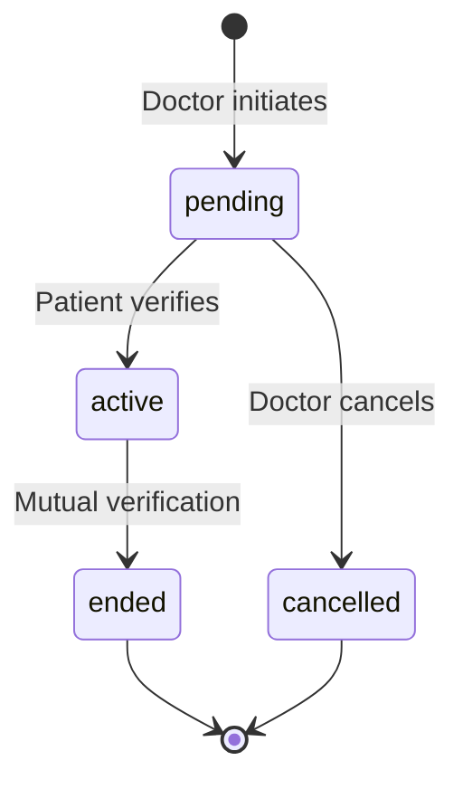
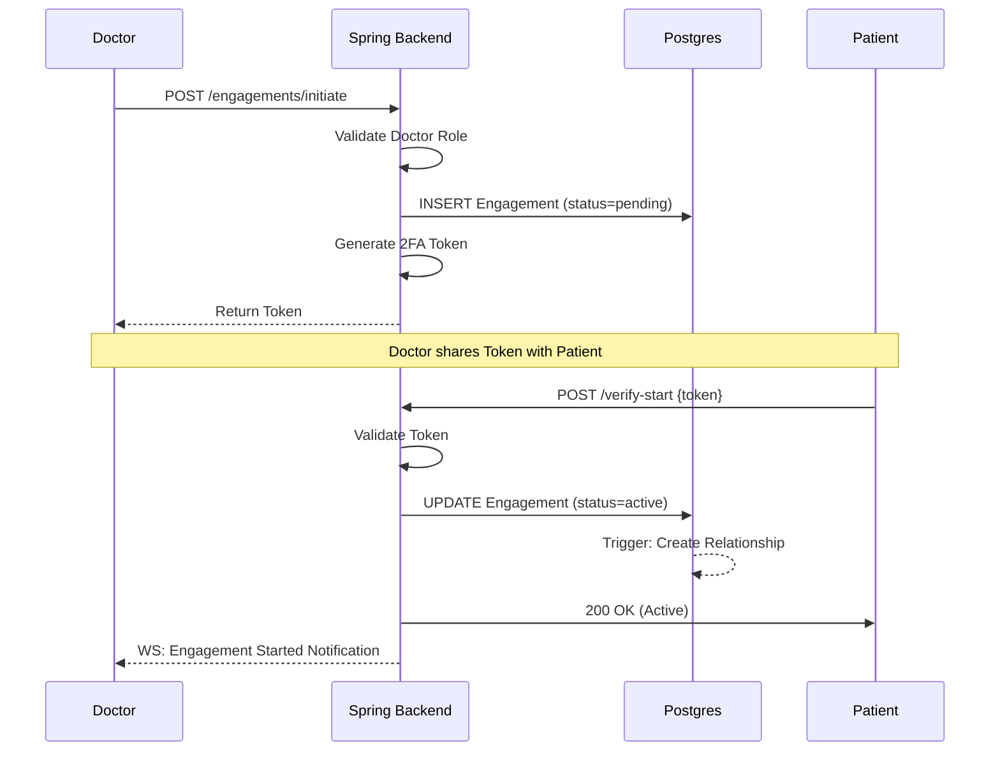
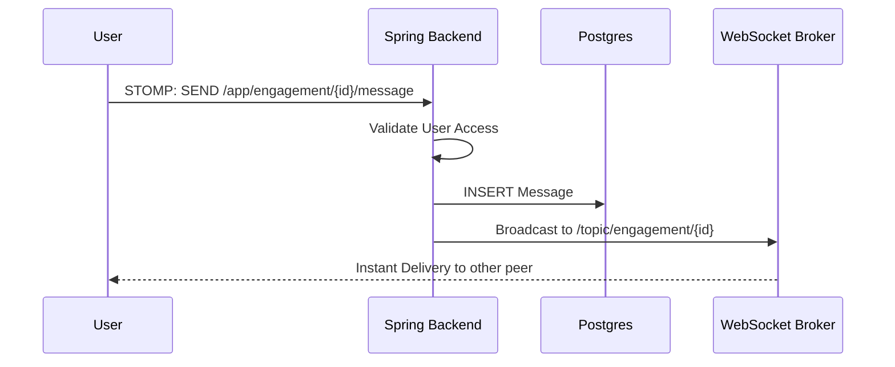

# Architecture Guide - NeuralHealer
**Version:** 0.5.0

This document details the technical design of the NeuralHealer backend, focusing on the 3-Plane Architecture and the Engagement Lifecycle.

---

## 🏗️ 1. Three-Plane Architecture

NeuralHealer separates concerns into three logical planes to optimize for correctness, persistence, and real-time performance.

### 1.1 Control Plane (Critical & Regulated)
**Purpose:** Business rule enforcement and ACID transactions.  
**Goal:** 100% correctness.
- **Components:**
  - `com.neuralhealer.backend.config.SecurityConfig` (AuthZ/CORS)
  - `com.neuralhealer.backend.service.EngagementService` (State Transitions)
  - Database Triggers (Data Integrity)
- **Characteristics:**
  - Synchronous operations.
  - High consistency requirements.
  - Transaction-heavy.

### 1.2 Data Plane (Persistent & Traceable)
**Purpose:** Historical data storage and retrieval.  
**Goal:** Consistency + Audit trails.
- **Components:**
  - `com.neuralhealer.backend.repository.MessageRepository`
  - `com.neuralhealer.backend.service.NotificationService`
- **Characteristics:**
  - Optimized for read/write throughput.
  - Indexed for fast history retrieval.

### 1.3 Real-Time Plane (Fast & Volatile)
**Purpose:** Low-latency live updates.  
**Goal:** < 50ms message delivery.
- **Components:**
  - `com.neuralhealer.backend.config.WebSocketConfig`
  - `com.neuralhealer.backend.model.dto.WebSocketMessage`
- **Characteristics:**
  - Asynchronous broadcasting.
  - In-memory message routing (current implementation).

---

## 🔄 2. Engagement Lifecycle

### 2.1 State Machine

### 2.2 States Explained

| State | Entry Condition | Action Allowed |
| :--- | :--- | :--- |
| **pending** | Doctor calls `/initiate` | Patient: Verify start, Doctor: Cancel |
| **active** | Patient calls `/verify-start` | Both: Message, Request end |
| **ended** | One calls `/verify-end` | Both: History only |
| **cancelled** | Doctor calls `DELETE /{id}` | None |

> [!NOTE]
> **Implementation Detail**: Currently, `requestEnd()` generates a verification token but keeps the status as `active` until the other party verifies. 
> For a detailed breakdown of the engagement state machine and API flows, see [ENGAGEMENT_LOGIC.md](ENGAGEMENT_LOGIC.md).

---

## 📊 3. Key Workflows

### 3.1 Engagement Initiation & 2FA

### 3.2 Real-Time Messaging (Simplified)

---

## 📈 4. Performance & Scalability

### 1,000 Active Chats Scenario
- **Security Context**: JWT validation is O(1) in time - no impact.
- **Memory**: 1,000 WebSocket sessions consume ~100MB RAM in the JVM.
- **I/O**: 1,000 concurrent writes/sec is the primary bottleneck for PostgreSQL without partitioning.
- **Scaling Path**: Vertical -> Horizontal (Load Balancer) -> Microservices (Go/Redis).

---

🔍 **Code Reference**:
- [EngagementService.java](file:///f:/documents/Nuralhealer-main/Nuralhealer/backend/backend/src/main/java/com/neuralhealer/backend/service/EngagementService.java)
- [EngagementStatus.java](file:///f:/documents/Nuralhealer-main/Nuralhealer/backend/backend/src/main/java/com/neuralhealer/backend/model/enums/EngagementStatus.java)
