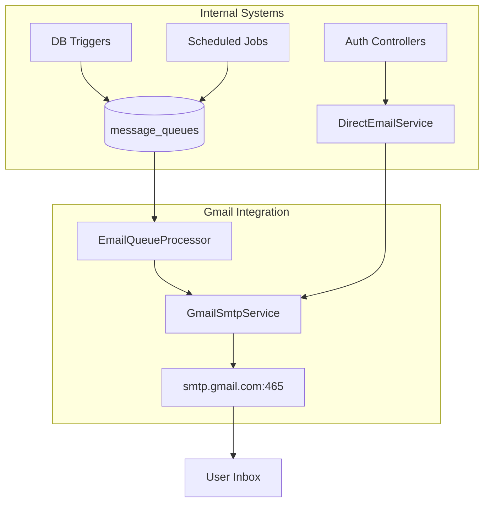

# Gmail SMTP Integration - Implementation Guide
**NeuralHealer Platform Email System**

---

## 1. System Overview

### 1.1 Purpose
Integrate Gmail SMTP to handle **two distinct email flows**:
1.  **Notification-driven emails**: Automated from the `message_queues` table (engagement alerts, activity reminders).
2.  **Direct system emails**: High-priority account lifecycle events (Password reset, verification codes, special acknowledgments).

### 1.2 Key Principle
- **Notification-driven**: Database triggers or scheduled jobs queue emails into `message_queues` → `EmailQueueProcessor` sends them in batches.
- **Direct-driven**: Controllers call `DirectEmailService` for immediate delivery (e.g., while a user is waiting for a PIN).

---

## 2. Architecture

### 2.1 Folder Structure
```
backend/
└── src/main/java/com/neuralhealer/backend/
    └── integration/
        └── gmail/
            ├── GmailSmtpService.java          # Core SMTP sender
            ├── EmailQueueProcessor.java        # Processes background queues
            ├── DirectEmailService.java         # Lifecycle emails (Reset/PIN)
            ├── EmailTestController.java        # Developer test endpoints
            └── config/
                └── GmailConfig.java            # SMTP & SSL Configuration
```

### 2.2 Integration Flow


---

## 3. Configuration & Security

### 3.1 Network Configuration
To ensure maximum reliability across different networks, the system uses **SMTPS (Port 465)**.
- **Automatic SSL**: The configuration detects port 465 and automatically enables `SSLSocketFactory`.
- **Failover**: Port 587 (STARTTLS) is supported if reconfigured in `application.yml`.

### 3.2 Resilience & Credentials
- **Credential Sanitization**: The code automatically removes spaces from `GMAIL_APP_PASSWORD`. It safely handles both `xxxx xxxx xxxx xxxx` and `xxxxxxxxxxxxxxxx` formats.
- **Environment Loading**: Uses `dotenv-java` to inject variables from the `.env` file into the Spring `PropertySource` at startup.

---

## 4. Component Details

### 4.1 GmailSmtpService
The core engine using Spring's `JavaMailSender`.
- **Dual Support**: Provides `sendEmail` (HTML) and `sendTextEmail` (Plain text).
- **Error Hinting**: Granular detection of `MailAuthenticationException` provides setup hints specifically for Google's security settings.

### 4.2 EmailQueueProcessor
- **Algorithm**: Pure Event-Driven (PostgreSQL NOTIFY). Polling is **disabled**.
- **Trigger**: Listens for 'email_queue' signal from database.
- **Reliability**:
    - **Startup Catch-up**: Processes any backlog immediately upon connection to ensure no jobs are missed during app downtime.
    - **Event-Scheduled Retries**: Failed jobs managed via internal `ScheduledExecutorService` with exponential backoff.
- **Concurrency**:
    - **Atomic Locking**: Uses native SQL to lock jobs (`status='processing'`) preventing race conditions.
    - **Isolation**: Each job is wrapped in a `TransactionTemplate` to ensure atomic status updates and bypass proxy self-invocation limitations.
- **Logic**: Reads jobs generated by the `trg_auto_queue_email` database trigger.
- **Personalization**: Automatically extracts `{USER_NAME}` and `{DOCTOR_NAME}` from the notification payload.
- **Delivery Tracking**: Updates `notifications.delivery_status->>'email'` to `true` after successful delivery.

### 4.3 DirectEmailService
- **Email Types**:
    - `sendPasswordResetEmail`: Password recovery with customizable base URLs.
    - `sendVerificationEmail`: 6-digit confirmation codes.
    - `sendSpecialThanksEmail`: Personalized gratitude letters with dedicated templates.
- **Safety Net**: Includes **Embedded Fallback Templates**—if the HTML files in `resources/` are missing, the system will still send a cleanly formatted default email.

---

## 5. Notification System Integration (✅ EVENT-DRIVEN)

### 5.1 Deep Integration Strategy
The email system is **directly connected** to the notification engine via PostgreSQL primitives (`LISTEN`/`NOTIFY`).
- **No latency**: Emails are triggered the millisecond the notification is created.
- **No polling**: Zero database load when idle.

> [!IMPORTANT]
> **No manual job creation**: Developers should only call `create_system_notification()`. If the notification type requires an email (controlled by the `send_email` flag), the database trigger `trg_auto_queue_email` will automatically handle the rest.

### 5.2 The Unified Flow
1. **Trigger**: Event happens (Registration/Engagement).
2. **Flag**: `create_system_notification()` sets `send_email = true`.
3. **Queue**: Database trigger inserts job AND fires `pg_notify('email_queue')`.
4. **Wake**: Java Listener receives signal instantly.
5. **Process**: `EmailQueueProcessor` locks job and sends email via Gmail SMTP.
6. **Track**: `notifications.delivery_status` is updated to show `email: true`.

### 5.2 Template System
- **Location**: `src/main/resources/templates/emails/`
- **Supported Templates**: `welcome.html`, `password-reset.html`, `email-verification.html`, `special-thanks.html`
- **Placeholders**: Use `{VARIABLE_NAME}` format (e.g., `{USER_NAME}`, `{RESET_LINK}`)
- **Fallback**: Hardcoded HTML templates in Java code if files are missing

### 5.3 Multi-Channel Delivery Status
The `notifications` table tracks delivery across channels:
```json
{
  "sse": true,   // Pushed via Server-Sent Events
  "email": true  // Sent via Gmail SMTP
}
```

---

## 6. Testing & Verification

### 6.1 Developer Test API
A public test endpoint is available (permitted in `SecurityConfig`).

**Endpoint**: `POST /api/test/email/verification`
**Payload**:
```json
{
  "email": "test@example.com",
  "code": "123456"
}
```

### 6.2 Registration Test
1. Register a new patient via `/api/auth/register`
2. Check `notifications` table for `send_email = true`
3. Check `message_queues` table for `EMAIL_NOTIFICATION` job
4. **Verify**: Email should arrive INSTANTLY (no 15s wait)
5. Check `notifications.delivery_status->>'email'` = `true`

### 6.3 Manual Queue Test
```sql
INSERT INTO message_queues (job_type, status, payload, created_at)
VALUES (
    'EMAIL_NOTIFICATION', 
    'pending', 
    '{"userId": "YOUR-USER-UUID", "templateKey": "USER_WELCOME", "userName": "John", "title": "Welcome!", "body": "Test"}', 
    NOW()
);
-- Trigger NOTE: Manually inserting into message_queues does NOT fire the notification trigger.
-- You must also run: PERFORM pg_notify('email_queue', 'manual_test');
```

---

## 7. Limits & Monitoring
- **Gmail Quotas**: Batching is used to manage the ~500/day limit of personal Gmail accounts.
- **Timeout Monitoring**: A mandatory 5-second timeout ensures that slow SMTP connections never hang the application server.
- **Delivery Metrics**: Track success/failure via `message_queues.status` and `notifications.delivery_status`.

---

## 8. Next Steps & Roadmap

### Phase 1: Expansion of Lifecycle Emails (✅ DONE)
1. **Re-engagement Templates**: Created `re-engage.html` and `inactivity-warning.html`.
2. **Rendering Logic**: Updated `EmailQueueProcessor` to handle these keys.

### Phase 2: Engagement Alerts (✅ DONE)
1. **Database Update**: Implemented `send_email` flag and automated trigger.
2. **Templates**: Created `engagement-started.html` and `engagement-cancelled.html`.

### Phase 3: Operations & UX (🚀 NEXT)
1. **Unsubscribe Mechanism**: Add a footer to all templates with a secure unsubscribe link.
2. **Analytics**: Implement a lightweight logging of email open rates using a transparent pixel.