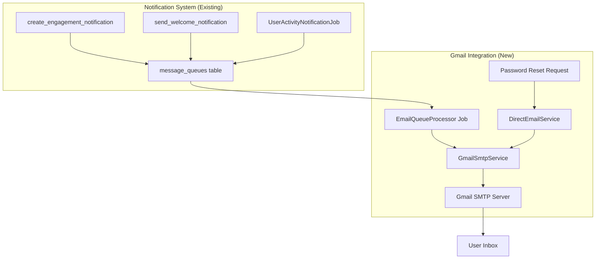

# Gmail SMTP Integration - Implementation Guide
**NeuralHealer Platform Email System**

---

## 1. System Overview

### 1.1 Purpose
Integrate Gmail SMTP to handle **two distinct email flows**:
1. **Notification-driven emails**: Automated from `message_queues` table
2. **Direct system emails**: Password reset, verification codes, etc.

### 1.2 Key Principle
- Notifications system **already queues** emails → We just need a **processor**
- Direct emails bypass notifications → Simple service call

---

## 2. Architecture

### 2.1 Folder Structure
```
backend/
└── src/main/java/com/neuralhealer/backend/
    └── integration/
        └── gmail/
            ├── GmailSmtpService.java          # Core SMTP sender
            ├── EmailQueueProcessor.java        # Processes message_queues
            ├── DirectEmailService.java         # Password reset, etc.
            └── config/
                └── GmailConfig.java            # SMTP configuration
```

### 2.2 Flow Diagram


---

## 3. Component Specifications

### 3.1 GmailSmtpService
**Purpose**: Low-level SMTP sender using JavaMailSender

**Configuration** (`application.yml`):
```yaml
spring:
  mail:
    host: smtp.gmail.com
    port: 587
    username: ${GMAIL_USERNAME}  # your-app@gmail.com
    password: ${GMAIL_APP_PASSWORD}  # 16-char app password
    properties:
      mail.smtp.auth: true
      mail.smtp.starttls.enable: true
```

**Key Method**:
```
sendEmail(recipientEmail, subject, htmlBody)
  → Uses MimeMessage with HTML content
  → Catches exceptions and logs failures
  → Returns success/failure boolean
```

---

### 3.2 EmailQueueProcessor
**Purpose**: Scheduled job that processes `message_queues` table

**Schedule**: Every 1 minute (configurable)

**Logic**:
```
1. Query message_queues WHERE job_type = 'EMAIL_NOTIFICATION' 
   AND status = 'PENDING' LIMIT 50

2. For each message:
   - Extract payload: {recipientEmail, title, body}
   - Call GmailSmtpService.sendEmail()
   - Update status:
     • SUCCESS → status = 'COMPLETED'
     • FAILURE → status = 'FAILED', retry_count++
   
3. Retry logic:
   - Max 3 retries
   - After 3 failures → status = 'DEAD_LETTER'
```

**Database Fields Used**:
| Column | Usage |
|--------|-------|
| `job_type` | Filter for `'EMAIL_NOTIFICATION'` |
| `payload` | JSONB: `{recipientEmail, title, body}` |
| `status` | `PENDING` → `COMPLETED`/`FAILED` |
| `retry_count` | Increment on failure |
| `created_at` | Order by oldest first |

---

### 3.3 DirectEmailService
**Purpose**: Send emails NOT tied to notifications

**Use Cases**:
1. Password reset
2. Email verification
3. Account activation
4. Security alerts (outside notification flow)

**Methods**:
```
sendPasswordResetEmail(userEmail, resetToken)
  → Build HTML template with reset link
  → Call GmailSmtpService.sendEmail()

sendVerificationEmail(userEmail, verificationCode)
  → Build HTML with 6-digit code
  → Call GmailSmtpService.sendEmail()
```

---

## 4. Email Templates

### 4.1 Template Storage
**Option 1 (Simple)**: Hardcoded HTML in Java
**Option 2 (Flexible)**: Store in `resources/templates/emails/`

### 4.2 Notification Email Template
Already handled by `get_notification_message()` SQL function.

**Example rendered body** (from `message_queues.payload`):
```
{
  "recipientEmail": "patient@example.com",
  "title": "Engagement Started",
  "body": "Dr. Ahmed has started your engagement. Login to view details."
}
```

### 4.3 Password Reset Template
```html
<!DOCTYPE html>
<html>
<body style="font-family: Arial; padding: 20px;">
  <h2>Reset Your Password</h2>
  <p>Click the link below to reset your password:</p>
  <a href="{RESET_LINK}">Reset Password</a>
  <p>This link expires in 1 hour.</p>
</body>
</html>
```

---

## 5. Integration with Existing System

### 5.1 No Changes Needed in Notification System
✅ Database triggers already insert into `message_queues`  
✅ `get_notification_message()` already renders content  
✅ Priority mapping already determines email eligibility  

**We just add the processor!**

### 5.2 Priority → Email Mapping (Already Defined)
| Type | Email? | How It's Queued |
|------|--------|-----------------|
| `ENGAGEMENT_STARTED` | ✅ | `create_engagement_notification()` trigger |
| `ENGAGEMENT_CANCELLED` | ✅ | Same trigger |
| `USER_REENGAGE` | ✅ | `UserActivityNotificationJob` |
| `USER_INACTIVE_WARNING` | ✅ | Same job |
| `SECURITY_ALERT` | ✅ | Future: `create_system_notification()` |
| `MESSAGE_RECEIVED` | ❌ | SSE only |
| `ACCOUNT_UPDATE` | ❌ | SSE only |

---

## 6. Implementation Steps

### Phase 1: Core SMTP (1 day)
1. Add Spring Mail dependency
2. Create `GmailConfig.java` with credentials
3. Implement `GmailSmtpService.sendEmail()`
4. Test with hardcoded recipient

### Phase 2: Queue Processor (1 day)
1. Create `EmailQueueProcessor` scheduled job
2. Implement query + send + status update logic
3. Add retry mechanism
4. Test with manual `message_queues` insert

### Phase 3: Direct Emails (1 day)
1. Create `DirectEmailService`
2. Implement password reset email
3. Integrate with password reset controller
4. Test full flow

### Phase 4: Templates & Polish (1 day)
1. Create HTML templates for each email type
2. Add email footer (unsubscribe, company info)
3. Test rendering with real data

---

## 7. Configuration

### 7.1 Environment Variables
```
GMAIL_USERNAME=notifications@neuralhealer.com
GMAIL_APP_PASSWORD=xxxx xxxx xxxx xxxx
```

### 7.2 Gmail App Password Setup
1. Go to Google Account → Security
2. Enable 2-Factor Authentication
3. Generate App Password for "Mail"
4. Copy 16-character password → Environment variable

---

## 8. Error Handling

### 8.1 Queue Processor Failures
| Error | Action |
|-------|--------|
| SMTP timeout | Retry after 1 minute (3x max) |
| Invalid email | Mark as `FAILED`, no retry |
| Gmail rate limit | Pause job for 10 minutes |

### 8.2 Direct Email Failures
Return error to caller:
```java
if (!emailSent) {
    throw new EmailSendException("Failed to send password reset email");
}
```

---

## 9. Monitoring

### 9.1 Metrics to Track
- Total emails sent (counter)
- Failed emails (counter)
- Queue processing time (histogram)
- Dead letter queue size (gauge)

### 9.2 Logging
```
[EmailQueueProcessor] Processing 12 emails...
[GmailSmtpService] Sent email to patient@example.com: "Engagement Started"
[EmailQueueProcessor] Completed 12/12 emails in 3.2s
```

---

## 10. Security

### 10.1 Best Practices
✅ Use app-specific password (not account password)  
✅ Store credentials in environment variables  
✅ Never log email content (HIPAA compliance)  
✅ Validate email addresses before sending  

### 10.2 Rate Limiting
Gmail SMTP limits:
- **500 emails/day** (free Gmail)
- **2000 emails/day** (Google Workspace)

**Recommendation**: Batch emails, implement circuit breaker if limit hit.

---

## 11. Testing Strategy

### 11.1 Unit Tests (Minimal)
- Test email template rendering
- Test retry logic calculation

### 11.2 Integration Tests
1. Insert test record into `message_queues`
2. Trigger job manually
3. Verify email received
4. Verify status updated to `COMPLETED`

### 11.3 Manual Testing
Send test emails for:
- Welcome notification
- Engagement started
- Password reset
- Verification code

---

## 12. Future Enhancements (Not Now)

- ❌ Email analytics (open rates, click tracking)
- ❌ Unsubscribe management
- ❌ A/B testing templates
- ❌ Switch to SendGrid/AWS SES for scale

---

## 13. Summary

### What We're Building
1. **SMTP Service**: Sends emails via Gmail
2. **Queue Processor**: Reads `message_queues` every minute
3. **Direct Service**: Handles password reset, etc.

### What We're NOT Building
- Custom email template engine (use simple HTML)
- Advanced retry strategies (3 retries is enough)
- Email tracking/analytics
- High-volume optimizations

### Integration Points
✅ Notification system already populates `message_queues`  
✅ Just process the queue and send via SMTP  
✅ Add direct email calls for non-notification flows  

---

**Estimated Effort**: 4 days (1 developer)  
**Dependencies**: Gmail account, app password  
**Risk**: Low (standard Spring Mail integration)