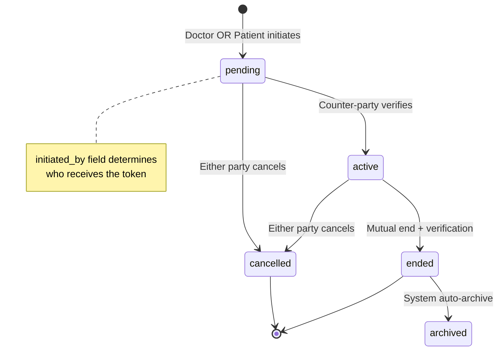
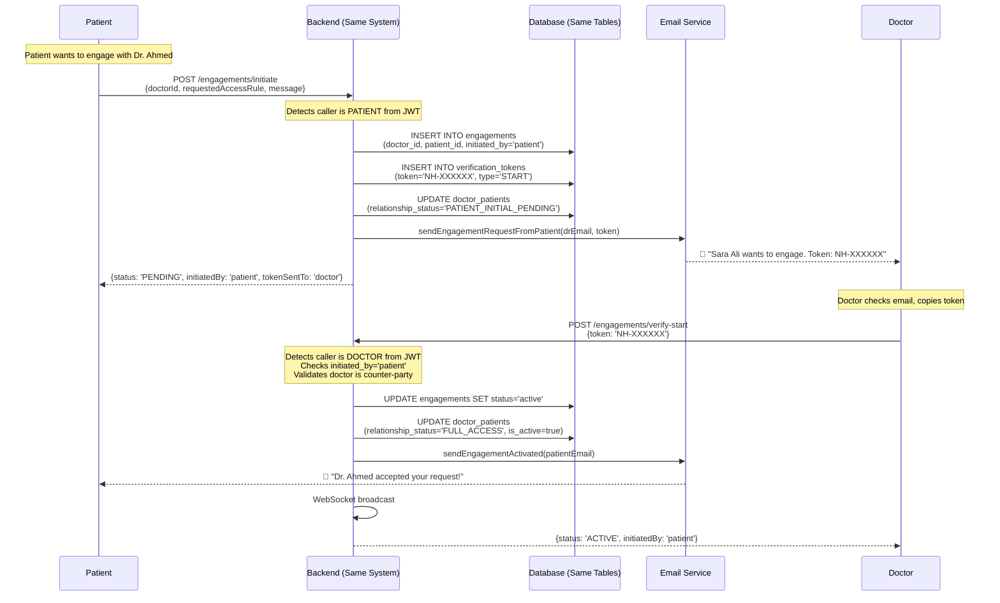
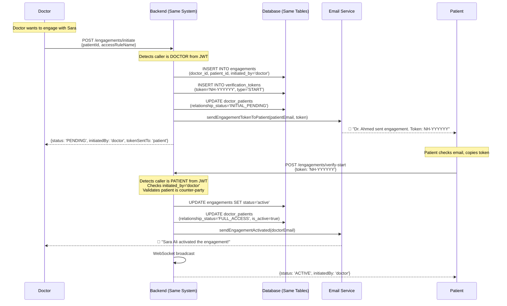

# 🔄 Unified Bidirectional Engagement System
**NeuralHealer Platform**  
**Version:** 3.1.0 (Refined with Refreshed Token Notifications)  
**Date:** February 14, 2026  
**Status:** ✅ FULLY IMPLEMENTED

---

This document details the **unified Bidirectional Engagement System** which has been successfully implemented. This system allows both Doctors and Patients to initiate secure, time-bound interactions using a symmetric verification process.

**Current Status**: Live and Operational.

---

## 🎯 Core Philosophy: ONE System, TWO Directions

### What's NOT Changing
- ✅ **Same database tables** (`engagements`, `doctor_patients`, `verification_tokens`)
- ✅ **Same status enums** (`engagement_status`, `relationship_status`, `token_status`)
- ✅ **Same endpoints** (mostly - we'll make them intelligent)
- ✅ **Same security model** (24h token expiry, 2FA verification)
- ✅ **Same lifecycle** (cancel, end, delete work identically)
- ✅ **Same WebSocket events** (just parameterized)
- ✅ **Same email infrastructure** (different templates, same service)

### What IS Changing
- ✨ **Add one field**: `initiated_by` VARCHAR(10) to `engagements` table
- ✨ **Smart endpoint logic**: Endpoints detect who's calling and adjust behavior
- ✨ **Role-based email routing**: System sends token to counter-party automatically
- ✨ **Optional relationship status**: `PATIENT_INITIAL_PENDING` (for clarity, not required)

---

## 🏗️ Database Changes (Minimal)

### Single Field Addition

```sql
-- Migration: Add initiated_by to existing table
ALTER TABLE engagements 
ADD COLUMN initiated_by VARCHAR(10) NOT NULL DEFAULT 'doctor';

-- Constraint
ALTER TABLE engagements 
ADD CONSTRAINT check_initiated_by 
CHECK (initiated_by IN ('doctor', 'patient'));

-- Index for queries
CREATE INDEX idx_engagements_initiated_by 
ON engagements(initiated_by);

-- Update existing records (all current engagements are doctor-initiated)
UPDATE engagements SET initiated_by = 'doctor' WHERE initiated_by IS NULL;
```

**That's it for the database!** No new tables, no schema restructuring.

---

## 🔄 Unified State Machine

The state machine doesn't change - it just has two entry points now:



---

## 📡 API Design: Intelligent Unified Endpoints

### Strategy: Make Existing Endpoints Bidirectional

Instead of creating separate `/patient-initiate` and `/doctor-initiate` endpoints, we make the **existing** `/initiate` endpoint smart enough to handle both.

---

### 1. Unified Initiation Endpoint

**Endpoint**: `POST /api/engagements/initiate` *(existing, enhanced)*  
**Role**: Doctor OR Patient  
**Auto-detects**: Role from JWT token

#### Request Format (Context-Sensitive)

**When Doctor Calls (Current Behavior)**:
```json
{
  "patientId": "550e8400-e29b-41d4-a716-446655440000",
  "accessRuleName": "FULL_ACCESS"
}
```

**When Patient Calls (New Behavior)**:
```json
{
  "doctorId": "550e8400-e29b-41d4-a716-446655440000",
  "requestedAccessRule": "FULL_ACCESS",
  "message": "I need help with anxiety management"
}
```

#### Unified Response
```json
{
  "engagementId": "a1b2c3d4-e5f6-g7h8-i9j0-k1l2m3n4o5p6",
  "engagementCode": "ENG-2026-000124",
  "status": "PENDING",
  "initiatedBy": "patient",  // or "doctor"
  "verification": {
    "tokenSentTo": "doctor",  // or "patient"
    "tokenDeliveryMethod": "email",
    "emailSentTo": "dr.ahmed@example.com",
    "expiresAt": "2026-02-14T10:00:00Z"
  }
}
```

#### Backend Implementation (ONE Method for Both)

```java
@PostMapping("/engagements/initiate")
public ResponseEntity<EngagementResponse> initiateEngagement(
    @RequestBody Map<String, Object> request,
    @AuthenticationPrincipal UserDetails userDetails
) {
    // 1. Auto-detect who's calling
    User currentUser = userService.findByEmail(userDetails.getUsername());
    String currentRole = currentUser.getRole(); // "DOCTOR" or "PATIENT"
    
    UUID doctorId, patientId;
    String initiatedBy;
    String accessRule;
    String message = null;
    
    // 2. Set variables based on caller
    if (currentRole.equals("DOCTOR")) {
        // Doctor-initiated flow (existing)
        doctorId = currentUser.getId();
        patientId = UUID.fromString((String) request.get("patientId"));
        initiatedBy = "doctor";
        accessRule = (String) request.get("accessRuleName");
        
    } else { // PATIENT
        // Patient-initiated flow (new)
        patientId = currentUser.getId();
        doctorId = UUID.fromString((String) request.get("doctorId"));
        initiatedBy = "patient";
        accessRule = (String) request.get("requestedAccessRule");
        message = (String) request.get("message");
    }
    
    // 3. Create engagement (SAME CODE for both)
    Engagement engagement = new Engagement();
    engagement.setDoctorId(doctorId);
    engagement.setPatientId(patientId);
    engagement.setAccessRuleName(accessRule);
    engagement.setStatus(EngagementStatus.PENDING);
    engagement.setInitiatedBy(initiatedBy); // ← Only difference
    engagement.setCreatedAt(LocalDateTime.now());
    engagement = engagementRepository.save(engagement);
    
    // 4. Generate token (SAME CODE)
    String token = tokenGenerator.generate(); // "NH-123456"
    VerificationToken verificationToken = createToken(
        token, 
        VerificationType.START, 
        engagement.getId()
    );
    
    // 5. Update relationship (SAME CODE, different initial status)
    DoctorPatient relationship = doctorPatientService.findOrCreate(doctorId, patientId);
    if (relationship.getRelationshipStartedAt() == null) {
        // First-time engagement
        RelationshipStatus initialStatus = initiatedBy.equals("doctor")
            ? RelationshipStatus.INITIAL_PENDING
            : RelationshipStatus.PATIENT_INITIAL_PENDING;
        relationship.setRelationshipStatus(initialStatus);
    }
    relationship.setCurrentEngagementId(engagement.getId());
    doctorPatientRepository.save(relationship);
    
    // 6. Send email (ROUTING based on initiated_by)
    if (initiatedBy.equals("doctor")) {
        // Send to patient (existing flow)
        Patient patient = patientService.findById(patientId);
        emailService.sendEngagementTokenToPatient(
            patient.getEmail(),
            currentUser.getFullName(),
            token,
            engagement.getEngagementCode()
        );
        
    } else {
        // Send to doctor (new flow)
        Doctor doctor = doctorService.findById(doctorId);
        emailService.sendEngagementRequestFromPatient(
            doctor.getEmail(),
            currentUser.getFullName(),
            token,
            accessRule,
            message,
            engagement.getEngagementCode()
        );
    }
    
    // 7. Build unified response
    return ResponseEntity.ok(buildResponse(engagement, verificationToken, initiatedBy));
}
```

**Key Insight**: One method, one endpoint, role-detection determines behavior.

---

### 2. Unified Verification Endpoint

**Endpoint**: `POST /api/engagements/verify-start` *(existing, enhanced)*  
**Role**: Doctor OR Patient (auto-detected)  
**Validates**: Caller is the counter-party to the initiator

#### Request (Same for Both)
```json
{
  "token": "NH-847293"
}
```

#### Response (Same for Both)
```json
{
  "id": "a1b2c3d4-e5f6-g7h8-i9j0-k1l2m3n4o5p6",
  "status": "ACTIVE",
  "doctor": { "id": "...", "firstName": "Ahmed" },
  "patient": { "id": "...", "firstName": "Sara" },
  "accessRule": "FULL_ACCESS",
  "startAt": "2026-02-13T10:15:00Z",
  "initiatedBy": "patient"  // Shows who initiated
}
```

#### Backend Implementation (ONE Method, Role-Agnostic)

```java
@PostMapping("/engagements/verify-start")
public ResponseEntity<EngagementResponse> verifyStart(
    @RequestBody TokenVerifyRequest request,
    @AuthenticationPrincipal UserDetails userDetails
) {
    // 1. Validate token
    VerificationToken token = tokenService.findValidToken(
        request.getToken(), 
        VerificationType.START
    );
    
    Engagement engagement = token.getEngagement();
    User currentUser = userService.findByEmail(userDetails.getUsername());
    
    // 2. Determine expected verifier based on initiated_by
    UUID expectedVerifierId;
    String expectedVerifierRole;
    
    if (engagement.getInitiatedBy().equals("doctor")) {
        // Doctor initiated → Patient must verify
        expectedVerifierId = engagement.getPatientId();
        expectedVerifierRole = "patient";
    } else {
        // Patient initiated → Doctor must verify
        expectedVerifierId = engagement.getDoctorId();
        expectedVerifierRole = "doctor";
    }
    
    // 3. Validate current user is the expected verifier
    if (!currentUser.getId().equals(expectedVerifierId)) {
        throw new UnauthorizedException(
            "Only the " + expectedVerifierRole + " can verify this engagement"
        );
    }
    
    // 4. Activate engagement (SAME CODE regardless of direction)
    engagement.setStatus(EngagementStatus.ACTIVE);
    engagement.setStartAt(LocalDateTime.now());
    engagementRepository.save(engagement);
    
    token.setStatus(TokenStatus.VERIFIED);
    token.setVerifiedAt(LocalDateTime.now());
    tokenRepository.save(token);
    
    // 5. Update relationship (SAME CODE)
    DoctorPatient relationship = doctorPatientService.find(
        engagement.getDoctorId(),
        engagement.getPatientId()
    );
    relationship.setRelationshipStatus(engagement.getAccessRuleName());
    relationship.setIsActive(true);
    
    if (relationship.getRelationshipStartedAt() == null) {
        relationship.setRelationshipStartedAt(LocalDateTime.now());
    }
    doctorPatientRepository.save(relationship);
    
    // 6. Send confirmation email to initiator
    if (engagement.getInitiatedBy().equals("doctor")) {
        // Doctor initiated → notify doctor
        Doctor doctor = doctorService.findById(engagement.getDoctorId());
        emailService.sendEngagementActivatedNotification(
            doctor.getEmail(),
            "patient",
            currentUser.getFullName(),
            engagement.getEngagementCode()
        );
    } else {
        // Patient initiated → notify patient
        Patient patient = patientService.findById(engagement.getPatientId());
        emailService.sendEngagementActivatedNotification(
            patient.getEmail(),
            "doctor",
            currentUser.getFullName(),
            engagement.getEngagementCode()
        );
    }
    
    // 7. WebSocket broadcast (SAME CODE)
    webSocketService.broadcast(
        "/topic/engagement/" + engagement.getId(),
        EngagementStatusEvent.builder()
            .type("ENGAGEMENT_STATUS")
            .status("active")
            .activatedBy(currentUser.getRole().toLowerCase())
            .build()
    );
    
    return ResponseEntity.ok(buildEngagementResponse(engagement));
}
```

**Key Insight**: The code doesn't care who initiated - it just checks `initiated_by` and validates the counter-party is verifying.

---

### 3. Unified Token Refresh

**Endpoint**: `POST /api/engagements/{id}/refresh-token` *(existing, enhanced)*  
**Role**: Initiator only (Doctor OR Patient)  
**Validates**: Caller is the one who created the engagement

#### Request
*(Empty body)*

#### Response
```json
{
  "token": "NH-789012",
  "expiresAt": "2026-02-14T11:00:00Z",
  "status": "pending",
  "isNew": true,
  "emailSentTo": "dr.ahmed@example.com",  // or patient email
  "recipientRole": "doctor"  // or "patient"
}
```

#### Backend Implementation

```java
@PostMapping("/engagements/{id}/refresh-token")
public ResponseEntity<TokenResponse> refreshToken(
    @PathVariable UUID id,
    @AuthenticationPrincipal UserDetails userDetails
) {
    Engagement engagement = engagementService.findById(id);
    User currentUser = userService.findByEmail(userDetails.getUsername());
    
    // 1. Validate caller is the initiator
    UUID initiatorId;
    if (engagement.getInitiatedBy().equals("doctor")) {
        initiatorId = engagement.getDoctorId();
    } else {
        initiatorId = engagement.getPatientId();
    }
    
    if (!currentUser.getId().equals(initiatorId)) {
        throw new UnauthorizedException(
            "Only the " + engagement.getInitiatedBy() + 
            " who created this engagement can refresh the token"
        );
    }
    
    // 2. Validate engagement is still pending
    if (!engagement.getStatus().equals(EngagementStatus.PENDING)) {
        throw new BadRequestException("Can only refresh pending engagements");
    }
    
    // 3. Check existing token
    VerificationToken existingToken = tokenService.findLatest(
        id, 
        VerificationType.START
    );
    
    if (existingToken != null && !existingToken.isExpired()) {
        // Return existing valid token
        return ResponseEntity.ok(TokenResponse.builder()
            .token(existingToken.getToken())
            .expiresAt(existingToken.getExpiresAt())
            .status("pending")
            .isNew(false)
            .build());
    }
    
    // 4. Generate new token
    String newToken = tokenGenerator.generate();
    VerificationToken verificationToken = createToken(
        newToken,
        VerificationType.START,
        id
    );
    
    // Mark old token as expired
    if (existingToken != null) {
        existingToken.setStatus(TokenStatus.EXPIRED);
        tokenRepository.save(existingToken);
    }
    
    // 5. Re-send email to RECIPIENT (not initiator)
    String recipientEmail;
    String recipientRole;
    
    if (engagement.getInitiatedBy().equals("doctor")) {
        // Send to patient
        Patient patient = patientService.findById(engagement.getPatientId());
        recipientEmail = patient.getEmail();
        recipientRole = "patient";
        
        emailService.sendEngagementTokenToPatient(
            recipientEmail,
            currentUser.getFullName(),
            newToken,
            engagement.getEngagementCode()
        );
        
    } else {
        // Send to doctor
        Doctor doctor = doctorService.findById(engagement.getDoctorId());
        recipientEmail = doctor.getEmail();
        recipientRole = "doctor";
        
        emailService.sendEngagementRequestFromPatient(
            recipientEmail,
            currentUser.getFullName(),
            newToken,
            engagement.getAccessRuleName(),
            "Token refreshed - previous token expired",
            engagement.getEngagementCode()
        );
    }
    
    return ResponseEntity.ok(TokenResponse.builder()
        .token(newToken)
        .expiresAt(verificationToken.getExpiresAt())
        .status("pending")
        .isNew(true)
        .emailSentTo(recipientEmail)
        .recipientRole(recipientRole)
        .build());
}
```

---

## 📧 Email Templates (Two New Templates)

### Template 1: Engagement Request from Patient to Doctor

**File**: `engagement-request-from-patient.html`  
**Subject**: `New Engagement Request from {PATIENT_NAME}`

```html
<!DOCTYPE html>
<html>
<head>
    <meta charset="UTF-8">
    <style>
        body { font-family: 'Segoe UI', Arial, sans-serif; background: #f5f7fa; margin: 0; padding: 0; }
        .container { max-width: 600px; margin: 40px auto; background: white; border-radius: 12px; overflow: hidden; box-shadow: 0 4px 6px rgba(0,0,0,0.1); }
        .header { background: linear-gradient(135deg, #667eea 0%, #764ba2 100%); color: white; padding: 30px; text-align: center; }
        .content { padding: 30px; }
        .token-box { background: #f8f9fa; border-left: 4px solid #667eea; padding: 20px; margin: 25px 0; text-align: center; }
        .token { font-size: 32px; font-weight: bold; letter-spacing: 4px; color: #667eea; font-family: 'Courier New', monospace; }
        .info-section { background: #e7f3ff; border: 1px solid #b3d9ff; padding: 20px; border-radius: 8px; margin: 20px 0; }
        .message-box { background: #fff3cd; border-left: 4px solid #ffc107; padding: 15px; margin: 20px 0; font-style: italic; }
        .button { display: inline-block; background: #667eea; color: white; padding: 14px 32px; text-decoration: none; border-radius: 6px; margin: 20px 0; font-weight: 600; }
        .footer { background: #f8f9fa; padding: 20px; text-align: center; font-size: 12px; color: #6c757d; }
        .warning { background: #ffe0e0; border-left: 4px solid #ff4444; padding: 15px; margin: 20px 0; }
    </style>
</head>
<body>
    <div class="container">
        <div class="header">
            <h1 style="margin: 0;">🩺 New Engagement Request</h1>
            <p style="margin: 10px 0 0 0; opacity: 0.9;">Action Required</p>
        </div>
        
        <div class="content">
            <p style="font-size: 16px; color: #2c3e50;">Dear Dr. {DOCTOR_NAME},</p>
            
            <p style="font-size: 15px; line-height: 1.6;">
                <strong>{PATIENT_NAME}</strong> has requested to start an engagement with you on the NeuralHealer platform.
            </p>
            
            <div class="info-section">
                <h3 style="margin-top: 0; color: #667eea;">📋 Request Details</h3>
                <table style="width: 100%; border-collapse: collapse;">
                    <tr>
                        <td style="padding: 8px 0; font-weight: 600;">Patient:</td>
                        <td style="padding: 8px 0;">{PATIENT_NAME}</td>
                    </tr>
                    <tr>
                        <td style="padding: 8px 0; font-weight: 600;">Requested Access:</td>
                        <td style="padding: 8px 0;">{ACCESS_RULE}</td>
                    </tr>
                    <tr>
                        <td style="padding: 8px 0; font-weight: 600;">Engagement Code:</td>
                        <td style="padding: 8px 0;">{ENGAGEMENT_CODE}</td>
                    </tr>
                    <tr>
                        <td style="padding: 8px 0; font-weight: 600;">Request Date:</td>
                        <td style="padding: 8px 0;">{REQUEST_DATE}</td>
                    </tr>
                </table>
            </div>
            
            <div class="message-box">
                <strong>💬 Patient's Message:</strong><br>
                <span style="color: #666; margin-top: 8px; display: block;">{PATIENT_MESSAGE}</span>
            </div>
            
            <p style="font-size: 15px; font-weight: 600; margin-top: 30px;">
                To accept this engagement request, use this verification code:
            </p>
            
            <div class="token-box">
                <div style="font-size: 12px; color: #6c757d; margin-bottom: 8px;">VERIFICATION TOKEN</div>
                <div class="token">{TOKEN}</div>
                <div style="font-size: 12px; color: #6c757d; margin-top: 8px;">Enter this code in the NeuralHealer app</div>
            </div>
            
            <div style="text-align: center;">
                <a href="{VERIFICATION_LINK}" class="button">Verify Engagement Now →</a>
            </div>
            
            <div class="warning">
                <strong>⏰ Important Information:</strong>
                <ul style="margin: 10px 0; padding-left: 20px;">
                    <li>This verification code expires in <strong>24 hours</strong></li>
                    <li>If it expires, the patient can request a new code</li>
                    <li>You can cancel this request at any time before verifying</li>
                </ul>
            </div>
        </div>
        
        <div class="footer">
            <p style="margin: 5px 0;"><strong>Need help?</strong> Contact support@neuralhealer.com</p>
            <p style="margin: 5px 0;">This is an automated message from NeuralHealer. Please do not reply to this email.</p>
            <p style="margin: 15px 0 5px 0;">&copy; 2026 NeuralHealer. All rights reserved.</p>
        </div>
    </div>
</body>
</html>
```

---

### Template 2: Engagement Activated (Doctor Accepted Patient Request)

**File**: `engagement-activated-by-doctor.html`  
**Subject**: `✅ Dr. {DOCTOR_NAME} Accepted Your Engagement Request`

```html
<!DOCTYPE html>
<html>
<head>
    <meta charset="UTF-8">
    <style>
        body { font-family: 'Segoe UI', Arial, sans-serif; background: #f5f7fa; margin: 0; padding: 0; }
        .container { max-width: 600px; margin: 40px auto; background: white; border-radius: 12px; overflow: hidden; box-shadow: 0 4px 6px rgba(0,0,0,0.1); }
        .header { background: linear-gradient(135deg, #11998e 0%, #38ef7d 100%); color: white; padding: 30px; text-align: center; }
        .content { padding: 30px; }
        .success-icon { text-align: center; font-size: 64px; margin: 20px 0; }
        .info-box { background: #d4edda; border: 1px solid #28a745; border-radius: 8px; padding: 20px; margin: 20px 0; }
        .button { display: inline-block; background: #11998e; color: white; padding: 14px 32px; text-decoration: none; border-radius: 6px; margin: 20px 0; font-weight: 600; }
        .next-steps { background: #e7f3ff; border-left: 4px solid #007bff; padding: 20px; margin: 20px 0; }
        .footer { background: #f8f9fa; padding: 20px; text-align: center; font-size: 12px; color: #6c757d; }
    </style>
</head>
<body>
    <div class="container">
        <div class="header">
            <h1 style="margin: 0;">✅ Engagement Activated!</h1>
            <p style="margin: 10px 0 0 0; opacity: 0.9;">Your request has been accepted</p>
        </div>
        
        <div class="content">
            <div class="success-icon">🎉</div>
            
            <p style="font-size: 16px; color: #2c3e50;">Dear {PATIENT_NAME},</p>
            
            <p style="font-size: 15px; line-height: 1.6;">
                Great news! <strong>Dr. {DOCTOR_NAME}</strong> has accepted your engagement request and is now available to support your healthcare journey.
            </p>
            
            <div class="info-box">
                <h3 style="margin-top: 0; color: #28a745;">📋 Engagement Details</h3>
                <table style="width: 100%; border-collapse: collapse;">
                    <tr>
                        <td style="padding: 8px 0; font-weight: 600;">Doctor:</td>
                        <td style="padding: 8px 0;">Dr. {DOCTOR_NAME}</td>
                    </tr>
                    <tr>
                        <td style="padding: 8px 0; font-weight: 600;">Engagement Code:</td>
                        <td style="padding: 8px 0;">{ENGAGEMENT_CODE}</td>
                    </tr>
                    <tr>
                        <td style="padding: 8px 0; font-weight: 600;">Access Level:</td>
                        <td style="padding: 8px 0;">{ACCESS_RULE}</td>
                    </tr>
                    <tr>
                        <td style="padding: 8px 0; font-weight: 600;">Activated On:</td>
                        <td style="padding: 8px 0;">{ACTIVATION_DATE}</td>
                    </tr>
                </table>
            </div>
            
            <div style="text-align: center;">
                <a href="{DASHBOARD_LINK}" class="button">Go to Dashboard →</a>
            </div>
            
            <div class="next-steps">
                <h3 style="margin-top: 0; color: #007bff;">🩺 Next Steps</h3>
                <ul style="margin: 10px 0; padding-left: 20px; line-height: 1.8;">
                    <li>You can now message Dr. {DOCTOR_NAME} securely through the platform</li>
                    <li>Share your health data and medical history as needed</li>
                    <li>Schedule appointments and track your treatment progress</li>
                    <li>Both you and Dr. {DOCTOR_NAME} can end or modify this engagement at any time</li>
                </ul>
            </div>
            
            <p style="font-size: 14px; color: #6c757d; margin-top: 30px;">
                We're here to support your health journey. If you have any questions about your engagement, don't hesitate to reach out.
            </p>
        </div>
        
        <div class="footer">
            <p style="margin: 5px 0;"><strong>Questions?</strong> Contact support@neuralhealer.com</p>
            <p style="margin: 5px 0;">This is an automated message from NeuralHealer. Please do not reply to this email.</p>
            <p style="margin: 15px 0 5px 0;">&copy; 2026 NeuralHealer. All rights reserved.</p>
        </div>
    </div>
</body>
</html>
```

---

## 🔄 Complete Flow Diagrams

### Flow 1: Patient Initiates (New)



### Flow 2: Doctor Initiates (Existing, Now Shows `initiated_by`)



**Key Observation**: Both flows use the **exact same endpoints, same database tables, same logic** - only `initiated_by` changes behavior.

---

## 🔐 Authorization Matrix (Unified)

| Action | Allowed Role(s) | Validation Logic |
|--------|----------------|------------------|
| **Initiate engagement** | Doctor OR Patient | JWT role detection → sets `initiated_by` |
| **Verify START token** | Counter-party only | `if (initiated_by == 'doctor') require patient; else require doctor` |
| **Refresh START token** | Initiator only | `if (initiated_by == 'doctor') require doctor; else require patient` |
| **Cancel engagement** | Either party | No change from current system |
| **Request end** | Either party | No change from current system |
| **Verify END token** | Counter-party | No change from current system |

---

## 📦 Implementation Checklist

### Phase 1: Database (1 day)
- [ ] Add `initiated_by` column to `engagements` table
- [ ] Create migration script
- [ ] Update existing records to `'doctor'`
- [ ] Deploy to dev/staging

### Phase 2: Backend Core (3 days)
- [ ] Update `Engagement` entity with `initiatedBy` field
- [ ] Modify `/engagements/initiate` to detect caller role
- [ ] Modify `/engagements/verify-start` to validate based on `initiated_by`
- [ ] Modify `/engagements/{id}/refresh-token` to check initiator
- [ ] Add unit tests for both directions

### Phase 3: Email Service (2 days)
- [ ] Create `engagement-request-from-patient.html` template
- [ ] Create `engagement-activated-by-doctor.html` template
- [ ] Implement `sendEngagementRequestFromPatient()` method
- [ ] Implement `sendEngagementActivatedToPatient()` method
- [ ] Add placeholder replacement logic
- [ ] Test email delivery

### Phase 4: Integration Testing (2 days)
- [ ] Test doctor-initiated flow (ensure backward compatibility)
- [ ] Test patient-initiated flow (new feature)
- [ ] Test token refresh for both directions
- [ ] Test unauthorized access attempts
- [ ] Test WebSocket broadcasts

### Phase 5: Documentation & Deployment (1 day)
- [ ] Update API documentation
- [ ] Update user guides
- [ ] Deploy to staging
- [ ] QA approval
- [ ] Deploy to production

**Total Estimated Time**: 9 working days (< 2 weeks)

---

## ✅ Success Criteria

### Backward Compatibility
- ✅ All existing doctor-initiated engagements work unchanged
- ✅ No breaking changes to existing API responses
- ✅ Existing frontend continues to work

### New Functionality
- ✅ Patients can initiate engagement requests
- ✅ Doctors receive email notifications with tokens
- ✅ Doctors can verify tokens to activate engagements
- ✅ Token refresh works for both directions

### Quality Metrics
- ✅ Email delivery < 30 seconds
- ✅ API response time < 500ms
- ✅ 100% test coverage for new code paths
- ✅ Zero data migration issues

---

## 🎯 Key Takeaways

### What Makes This "One System"

1. **Single Database Schema**: No new tables, just one field addition
2. **Unified Endpoints**: Same `/initiate`, same `/verify-start`, same `/refresh-token`
3. **Role-Agnostic Logic**: Code checks `initiated_by` field, not hardcoded roles
4. **Same Security Model**: 24h tokens, 2FA, same expiration rules
5. **Same Lifecycle**: Cancel, end, delete work identically
6. **Shared Infrastructure**: Same email service, same WebSocket events

### Why This Design is Superior

- ✅ **Minimal code changes** (< 500 lines of new code)
- ✅ **No duplication** (don't copy-paste doctor logic for patients)
- ✅ **Easy to maintain** (one codebase, one truth source)
- ✅ **Scalable** (can add more initiator types in future)
- ✅ **Testable** (parameterized tests cover both directions)

---

**END OF UNIFIED PLAN**

This is truly **one system** with bidirectional capability, not two separate systems cobbled together.