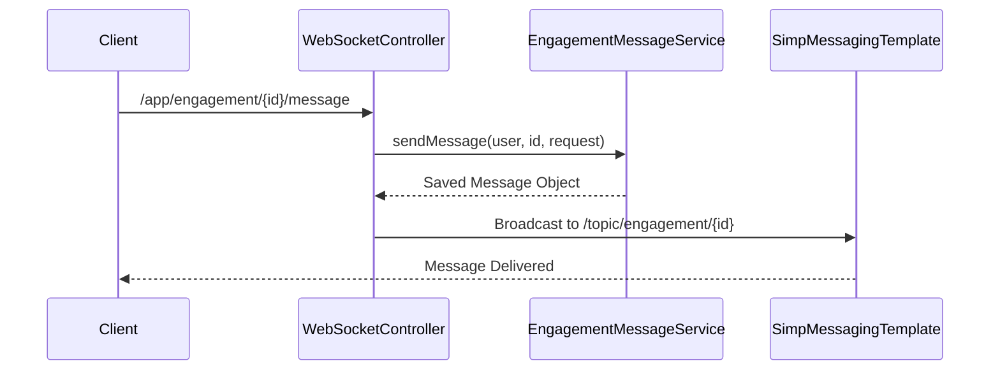
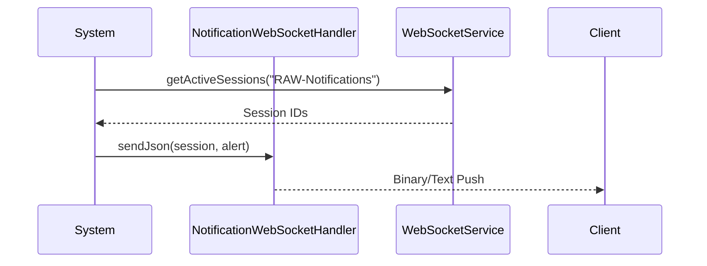

# WebSocket Architecture Guide - NeuralHealer

NeuralHealer utilizes a **Hybrid WebSocket Architecture** to balance the richness of messaging features (STOMP) with the lightweight efficiency of push notifications (Raw WebSockets). Both protocols are unified via a central management service.

---

## 🏗️ 1. The Centralized Hub: `WebSocketService`

The `WebSocketService` is the single source of truth for all real-time connections in the application. It acts as a bridge between different protocols and handles:

- **Unified Session Registry**: Maintains a `ConcurrentHashMap` of all active sessions across both STOMP and Raw WebSockets.
- **Security Normalization**: Provides consistent JWT validation and guest session creation for all handlers.
- **Lifecycle Tracking**: Monitors connects and disconnects to maintain an accurate real-time user state.

### Key Logic
- `registerSession(sessionId, protocol, userIdentifier)`: Maps a low-level ID to a high-level user context.
- `validateToken(token)`: Centralized JWT logic using `JwtService`.

---

## 🎭 2. Dual-Protocol Strategy

### 2.1 STOMP (Messaging & State)
Designed for complex interactions like chat, typing indicators, and state machine transitions.
- **Endpoint**: `/ws`
- **Application Path**: `/app` (Send)
- **Broker Path**: `/topic` (Subscribe)
- **User Path**: `/user` (Private messages)
- **Controller**: `WebSocketController`

**Flow Example:**
1. Client connects to `/ws` with a JWT.
2. `WebSocketAuthInterceptor` validates the token via `WebSocketService`.
3. `WebSocketEventListener` registers the session in the central registry.
4. Client sends a message to `/app/engagement/{id}/message`.

### 2.2 Raw WebSockets (Notifications & Alerts)
Designed for high-frequency or lightweight server-to-client updates where STOMP overhead is unnecessary.
- **Endpoint**: `/notifications`
- **Handler**: `NotificationWebSocketHandler` (extends `BaseWebSocketHandler`)
- **Security**: Handled by `BaseWebSocketHandler` during the handshake.

---

## 🔐 3. Security & Authentication

NeuralHealer supports two tiers of connection security:

| Tier | Method | Implementation |
| :--- | :--- | :--- |
| **Authenticated** | JWT (Bearer) | Validated against `User` repository. |
| **Anonymous** | Guest ID | Created as `guest_<sessionId>` if the handler allows guest access. |

### Auth Extraction
The system looks for tokens in:
1. `Authorization: Bearer <token>` header (Native or Handshake).
2. `neuralhealer_token` Cookie (Priority fallback for browser clients).

---

## 📡 4. Communication Patterns

### Messaging Flow

### Notification Flow

---

## 🛠️ 5. Technical Summary

- **Heartbeat**: Configured at 10s intervals for STOMP to ensure connection stability.
- **CORS**: Origin patterns are set to `*` to accommodate diverse client environments while relying on JWT for security.
- **Scalability**: All session tracking uses `ConcurrentHashMap` for thread-safety, preparing the system for high concurrency.

🔍 **Key Files**:
- [WebSocketConfig.java](file:///f:/documents/Nuralhealer-main/Nuralhealer/backend/backend/src/main/java/com/neuralhealer/backend/config/WebSocketConfig.java) (STOMP Configuration)
- [RawWebSocketConfig.java](file:///f:/documents/Nuralhealer-main/Nuralhealer/backend/backend/src/main/java/com/neuralhealer/backend/config/RawWebSocketConfig.java) (Raw Configuration)
- [WebSocketService.java](file:///f:/documents/Nuralhealer-main/Nuralhealer/backend/backend/src/main/java/com/neuralhealer/backend/service/WebSocketService.java) (Central Hub)
