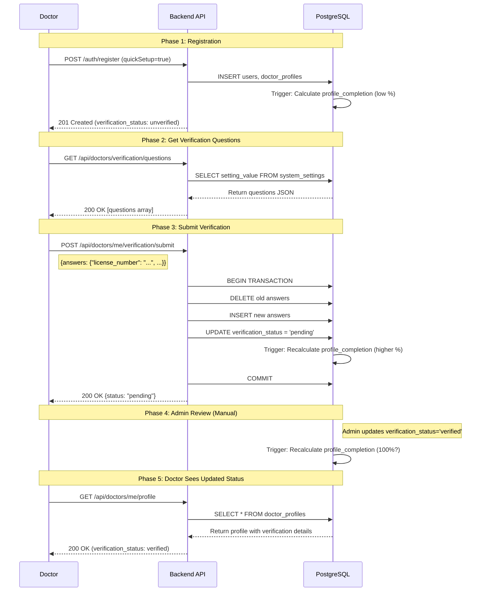

Doctor Profile & Lobby System - Implementation Plan
Complete backend implementation for doctor profile management, public lobby browsing, and verification system.

User Review Required
IMPORTANT

File Storage Path Configuration Using ${user.dir}/storage to resolve to the backend application root dynamically. This ensures files are stored relative to where the Spring Boot app launches, avoiding path issues.

IMPORTANT

Profile Picture Strategy Increased to **10MB** limit. Store the original image (square cropped, optimized). Simplified to generate thumbnails on-the-fly with caching to ensure performance without over-engineering disk usage.

IMPORTANT

Geolocation Distance Calculation Using **Haversine formula** in SQL for simpler, accurate distance calculations without requiring PostGIS.

IMPORTANT

Thumbnail Generation Simplified to generate thumbnails on-the-fly with caching. Lobby will serve thumbnails, profile page serves full-size images.

Proposed Changes
Phase 1: File Storage Infrastructure
Foundation for handling doctor profile picture uploads with validation, processing, and serving.

[NEW] 
FileStorageService.java
Purpose: Central service for all file storage operations

Key Methods:

java
@PostConstruct
void initDirectories() // Create storage/doctors/profiles on startup
String saveProfilePicture(MultipartFile file, UUID doctorId)
// 1. Validate file (size, format, dimensions)
// 2. Delete old profile picture if exists
// 3. Process image (crop to square, compress, generate thumbnail)
// 4. Save both full-size and thumbnail
// 5. Return relative path: "doctors/profiles/{doctorId}/profile.jpg"
void deleteProfilePicture(UUID doctorId)
// Delete both profile.jpg and profile_thumb.jpg
void validateImage(MultipartFile file)
// Check: size ≤ 10MB, format (jpg/png/webp), not corrupted
BufferedImage ensureSquareRatio(BufferedImage image)
// Crop to center square (1:1 ratio)
BufferedImage compressImage(BufferedImage image, int quality)
// JPEG compression at 85% quality
BufferedImage createThumbnail(BufferedImage image, int size)
// Generate 256x256 thumbnail for lobby
String getPublicUrl(String relativePath, boolean thumbnail)
// Return: http://localhost:8080/files/doctors/profiles/{id}/profile.jpg
// Or: http://localhost:8080/files/doctors/profiles/{id}/profile_thumb.jpg
Dependencies:

java.awt.image.BufferedImage for image processing
javax.imageio.ImageIO for read/write
@Value("${file.storage.base-path}") for path resolution
[NEW] 
ImageValidator.java
Purpose: Reusable validation logic for image uploads

Validations:

File size: ≤ 10MB
MIME type: image/jpeg, image/png, image/webp
Dimensions: Min 512x512, Max 2048x2048
Aspect ratio: 1:1 ±5% tolerance
File integrity (not corrupted)
Custom Exceptions:

java
FileSizeExceededException extends RuntimeException
InvalidImageFormatException extends RuntimeException
InvalidAspectRatioException extends RuntimeException
InvalidImageDimensionsException extends RuntimeException
CorruptedImageException extends RuntimeException
[NEW] 
StaticResourceConfig.java
Purpose: Configure Spring to serve uploaded files

java
@Configuration
public class StaticResourceConfig implements WebMvcConfigurer {
    @Value("${file.storage.base-path}")
    private String storageBasePath;
    @Override
    public void addResourceHandlers(ResourceHandlerRegistry registry) {
        registry.addResourceHandler("/files/**")
                .addResourceLocations("file:" + storageBasePath + "/")
                .setCachePeriod(3600); // 1 hour cache
    }
}
[MODIFY] 
.env
Add file storage configuration:

properties
# File Storage
BACKEND_ROOT_URL=http://localhost:8080
FILE_STORAGE_BASE_PATH=${user.dir}/storage
PROFILE_PICTURES_PATH=doctors/profiles
MAX_FILE_SIZE_MB=10
ALLOWED_IMAGE_FORMATS=jpg,jpeg,png,webp
PROFILE_IMAGE_MIN_DIMENSION=512
PROFILE_IMAGE_MAX_DIMENSION=2048
THUMBNAIL_SIZE=256
IMAGE_COMPRESSION_QUALITY=85
[MODIFY] 
application.properties
Add multipart configuration:

properties
# File Upload
spring.servlet.multipart.max-file-size=10MB
spring.servlet.multipart.max-request-size=10MB
spring.servlet.multipart.enabled=true
# File Storage
file.storage.base-path=${FILE_STORAGE_BASE_PATH}
file.storage.profile-pictures=${PROFILE_PICTURES_PATH}
file.max-size-mb=${MAX_FILE_SIZE_MB}
file.allowed-formats=${ALLOWED_IMAGE_FORMATS}
file.image.min-dimension=${PROFILE_IMAGE_MIN_DIMENSION}
file.image.max-dimension=${PROFILE_IMAGE_MAX_DIMENSION}
file.thumbnail.size=${THUMBNAIL_SIZE}
file.image.compression-quality=${IMAGE_COMPRESSION_QUALITY}
Phase 2: DTOs & Mappers
Data transfer objects for clean API contracts and separation of concerns.

[NEW] 
DoctorProfileFullDTO.java
Complete profile information for individual doctor view.

Fields:

java
// User info
UUID id;
UUID userId;
String email;
String firstName;
String lastName;
// Professional info
String title;
String bio;
String specialization; // Psychiatrist | Therapist
Integer yearsOfExperience;
List<Certificate> certificates;
// Location
LocationDTO location;
// Visual
String profilePictureUrl; // Full URL to uploaded image
String profilePictureThumbnailUrl; // URL to 256x256 thumbnail
// Status
String verificationStatus; // unverified | pending | verified
String availabilityStatus; // online | offline | busy
// Metrics
Double rating;
Integer totalReviews;
Integer profileCompletion; // 0-100
// Contact
SocialMediaDTO socialMedia;
// Verification details
VerificationDetailsDTO verificationDetails;
// Pricing
Double consultationFee;
[NEW] 
DoctorLobbyCardDTO.java
Lightweight DTO for lobby list view (optimized for performance).

Fields:

java
UUID id;
String fullName; // firstName + " " + lastName
String title;
String specialization;
Integer yearsOfExperience;
Double rating;
Integer totalReviews;
String profilePictureThumbnailUrl; // 256x256 for performance
String location; // "Cairo, Egypt" (formatted string)
String availabilityStatus;
String verificationStatus;
Boolean isVerified; // Quick check (platform_approved)
Double consultationFee;
Double distance; // Only present if geolocation used
[NEW] 
UpdateDoctorProfileRequest.java
Request DTO for updating profile information.

Validation:

java
@NotBlank(message = "Title is required")
@Size(max = 100)
String title;
@Size(max = 2000)
String bio;
@NotNull
@Pattern(regexp = "Psychiatrist|Therapist")
String specialization;
@Min(0) @Max(70)
Integer yearsOfExperience;
List<Certificate> certificates;
@Valid
SocialMediaDTO socialMedia;
@Valid
LocationDTO location;
@DecimalMin("0.0")
Double consultationFee;
[NEW] 
DoctorLobbyFilterRequest.java
Filter criteria for lobby search.

java
String specialization; // null = all
String verificationStatus; // null = all
String availabilityStatus; // null = all
Double minRating; // e.g., 4.0
String location; // city name
String sortBy; // rating | reviews | experience | fee
String sortDirection; // asc | desc
Integer page; // default 0
Integer size; // default 20, max 50
[NEW] 
VerificationSubmissionRequest.java
java
@NotNull
Map<String, String> answers; // {"license_number": "EG123456", ...}
[NEW] 
SocialMediaDTO.java
java
@Pattern(regexp = "^https?://.*", message = "Must be valid URL")
String linkedin;
@Pattern(regexp = "^https?://.*")
String twitter;
@Pattern(regexp = "^https?://.*")
String facebook;
@Pattern(regexp = "^https?://.*")
String instagram;
@Pattern(regexp = "^https?://.*")
String website;
@Pattern(regexp = "^\\+?[1-9]\\d{1,14}$") // E.164 format
String whatsapp;
@Pattern(regexp = "^\\+?[1-9]\\d{1,14}$")
String phone;
[NEW] 
DoctorMapper.java
Methods:

java
DoctorProfileFullDTO toFullDTO(DoctorProfile profile, User user, String profilePictureUrl)
DoctorLobbyCardDTO toLobbyCardDTO(DoctorProfile profile, User user, String thumbnailUrl)
List<DoctorLobbyCardDTO> toLobbyCardDTOs(List<DoctorProfile> profiles)
Mapping Notes:

fullName = user.firstName + " " + user.lastName
location = profile.city + ", " + profile.country
isVerified = (profile.verification_status == 'verified')
profilePictureUrl comes from FileStorageService.getPublicUrl()

---

## 🔄 Implementation Flow

---

## 🧠 Database Inteligence (Triggers & Functions)

### Profile Completion Calculation
A PostgreSQL trigger `trg_update_profile_completion` calls `calculate_profile_completion(UUID)` automatically whenever relevant fields are updated. This ensures the 0-100% progress is always accurate without manual recalculation in Java.

### Rating Synchronization
The `trg_update_doctor_rating` trigger recalculates the `rating` and `total_reviews` in `doctor_profiles` whenever a new entry is added to `doctor_reviews`.

---
Phase 3: Service Layer
Business logic for profile management, lobby browsing, and verification.

[NEW] 
DoctorProfileService.java
Responsibilities: CRUD operations for doctor profiles

Methods:

java
@Transactional(readOnly = true)
DoctorProfileFullDTO getDoctorProfile(UUID doctorId)
// 1. Fetch DoctorProfile by ID (throw DoctorNotFoundException if not found)
// 2. Fetch associated User
// 3. Build profile picture URL from FileStorageService
// 4. Map to DoctorProfileFullDTO
@Transactional(readOnly = true)
DoctorProfileFullDTO getMyProfile(UUID userId)
// Same as above but find by userId
@Transactional
DoctorProfileFullDTO updateProfile(UUID userId, UpdateDoctorProfileRequest request)
// 1. Find DoctorProfile by userId
// 2. Update fields from request
// 3. Save to database (triggers will recalculate profile_completion)
// 4. Return updated DTO
@Transactional
String uploadProfilePicture(UUID userId, MultipartFile file)
// 1. Validate image via ImageValidator
// 2. Get doctorId from userId
// 3. Call FileStorageService.saveProfilePicture()
// 4. Update doctor_profile.profile_picture_path in DB
// 5. Return public URL
@Transactional
void deleteProfilePicture(UUID userId)
// 1. Get doctorId
// 2. Call FileStorageService.deleteProfilePicture()
// 3. Set profile_picture_path = NULL in DB
@Transactional
void updateAvailabilityStatus(UUID userId, String status)
// Validate: online | offline | busy
// Update doctor_profile.availability_status
@Transactional
void updateSocialMedia(UUID userId, SocialMediaDTO socialMedia)
// Update social_media JSONB column
@Transactional(readOnly = true)
int calculateProfileCompletion(UUID doctorId)
// Call DB function: SELECT calculate_doctor_profile_completion(doctorId)
Dependencies:

DoctorProfileRepository
UserRepository
FileStorageService
DoctorMapper
[NEW] 
DoctorLobbyService.java
Responsibilities: Public doctor browsing and search

Methods:

java
@Transactional(readOnly = true)
Page<DoctorLobbyCardDTO> getDoctorLobby(DoctorLobbyFilterRequest filters)
// 1. Build JPA Specification from filters
// 2. Create Pageable with sort (default: rating DESC, totalReviews DESC)
// 3. Query doctorProfileRepository.findAll(spec, pageable)
// 4. Map to DoctorLobbyCardDTO with thumbnail URLs
// 5. Return Page
@Transactional(readOnly = true)
Page<DoctorLobbyCardDTO> searchDoctors(String query, Pageable pageable)
// Search by: firstName, lastName, title, bio, specialization
// Use ILIKE for case-insensitive search
@Transactional(readOnly = true)
List<DoctorLobbyCardDTO> getNearbyDoctors(double lat, double lng, int radiusKm)
// Requires PostGIS extension
// SQL: SELECT * FROM doctor_profiles 
//      WHERE ST_Distance_Sphere(
//        ST_MakePoint(longitude, latitude), 
//        ST_MakePoint(lng, lat)
//      ) <= radiusKm * 1000
//      ORDER BY distance ASC
Specification<DoctorProfile> buildFilterSpecification(DoctorLobbyFilterRequest filters)
// Dynamic filters for:
// - specialization (exact match)
// - verificationStatus (exact match)
// - availabilityStatus (exact match)
// - minRating (>=)
// - location (city ILIKE '%{location}%')
Performance Notes:

Max page size: 50 (enforce validation)
Default sort: rating DESC, total_reviews DESC
Use @EntityGraph to fetch social_media JSONB efficiently
Cache lobby results for 5 minutes
[NEW] 
DoctorVerificationService.java
Responsibilities: Handle verification questions and submissions

Methods:

java
@Transactional(readOnly = true)
List<VerificationQuestion> getVerificationQuestions()
// Fetch from system_settings table
// Key: "doctor_verification_questions"
// Parse JSON array to List<VerificationQuestion>
@Transactional
void submitVerificationAnswers(UUID userId, Map<String, String> answers)
// 1. Get doctorId from userId
// 2. Delete existing entries in doctor_verification_questions
// 3. Insert new answers for each question
// 4. Update doctor_profile.verification_status = 'pending'
@Transactional(readOnly = true)
List<DoctorVerificationQuestion> getMyVerificationAnswers(UUID userId)
// Fetch all answers submitted by this doctor
Phase 4: REST Controllers
Expose HTTP endpoints with proper security and validation.

[NEW] 
DoctorProfileController.java
java
@RestController
@RequestMapping("/api/doctors")
@Validated
public class DoctorProfileController {
    @GetMapping("/{doctorId}/profile")
    public ResponseEntity<DoctorProfileFullDTO> getDoctorProfile(@PathVariable UUID doctorId)
    
    @GetMapping("/me/profile")
    @PreAuthorize("hasRole('DOCTOR')")
    public ResponseEntity<DoctorProfileFullDTO> getMyProfile()
    
    @PutMapping("/me/profile")
    @PreAuthorize("hasRole('DOCTOR')")
    public ResponseEntity<DoctorProfileFullDTO> updateProfile(@Valid @RequestBody UpdateDoctorProfileRequest request)
    
    @PostMapping("/me/profile-picture")
    @PreAuthorize("hasRole('DOCTOR')")
    public ResponseEntity<Map<String, String>> uploadProfilePicture(@RequestParam("file") MultipartFile file)
    // Returns: {"profilePictureUrl": "http://...", "thumbnailUrl": "http://..."}
    
    @DeleteMapping("/me/profile-picture")
    @PreAuthorize("hasRole('DOCTOR')")
    public ResponseEntity<Void> deleteProfilePicture()
    
    @PatchMapping("/me/availability")
    @PreAuthorize("hasRole('DOCTOR')")
    public ResponseEntity<Void> updateAvailability(@RequestParam String status)
    // Validate: online | offline | busy
    
    @PutMapping("/me/social-media")
    @PreAuthorize("hasRole('DOCTOR')")
    public ResponseEntity<Void> updateSocialMedia(@Valid @RequestBody SocialMediaDTO socialMedia)
}
[NEW] 
DoctorLobbyController.java
java
@RestController
@RequestMapping("/api/doctors")
public class DoctorLobbyController {
    @GetMapping("/lobby")
    public ResponseEntity<Page<DoctorLobbyCardDTO>> getDoctorLobby(
        @RequestParam(required = false) String specialization,
        @RequestParam(required = false) String verificationStatus,
        @RequestParam(required = false) String availabilityStatus,
        @RequestParam(required = false) Double minRating,
        @RequestParam(required = false) String location,
        @RequestParam(defaultValue = "rating") String sortBy,
        @RequestParam(defaultValue = "desc") String sortDirection,
        @RequestParam(defaultValue = "0") int page,
        @RequestParam(defaultValue = "20") @Max(50) int size
    )
    
    @GetMapping("/search")
    public ResponseEntity<Page<DoctorLobbyCardDTO>> searchDoctors(
        @RequestParam String q,
        @RequestParam(defaultValue = "0") int page,
        @RequestParam(defaultValue = "20") @Max(50) int size
    )
    
    @GetMapping("/nearby")
    public ResponseEntity<List<DoctorLobbyCardDTO>> getNearbyDoctors(
        @RequestParam double lat,
        @RequestParam double lng,
        @RequestParam(defaultValue = "10") @Max(100) int radius
    )
}
[NEW] 
DoctorVerificationController.java
java
@RestController
@RequestMapping("/api/doctors/verification")
public class DoctorVerificationController {
    @GetMapping("/questions")
    public ResponseEntity<List<VerificationQuestion>> getVerificationQuestions()
    
    @PostMapping("/me/submit")
    @PreAuthorize("hasRole('DOCTOR')")
    public ResponseEntity<Map<String, String>> submitVerification(@Valid @RequestBody VerificationSubmissionRequest request)
    // Returns: {"status": "pending", "message": "Verification submitted successfully"}
    
    @GetMapping("/me/answers")
    @PreAuthorize("hasRole('DOCTOR')")
    public ResponseEntity<List<DoctorVerificationQuestion>> getMyVerificationAnswers()
}
Phase 5: Validation & Error Handling
Ensure data integrity and provide clear error messages.

[NEW] 
GlobalExceptionHandler.java
java
@ControllerAdvice
public class GlobalExceptionHandler {
    @ExceptionHandler(FileSizeExceededException.class)
    public ResponseEntity<ErrorResponse> handleFileSizeExceeded(FileSizeExceededException e)
    // 413 Payload Too Large
    
    @ExceptionHandler(InvalidImageFormatException.class)
    public ResponseEntity<ErrorResponse> handleInvalidFormat(InvalidImageFormatException e)
    // 400 Bad Request
    
    @ExceptionHandler(DoctorNotFoundException.class)
    public ResponseEntity<ErrorResponse> handleDoctorNotFound(DoctorNotFoundException e)
    // 404 Not Found
    
    @ExceptionHandler(MethodArgumentNotValidException.class)
    public ResponseEntity<ErrorResponse> handleValidationErrors(MethodArgumentNotValidException e)
    // 400 Bad Request with field-specific errors
    
    @ExceptionHandler(MaxUploadSizeExceededException.class)
    public ResponseEntity<ErrorResponse> handleMaxSizeException(MaxUploadSizeExceededException e)
    // 413 Payload Too Large
}
[NEW] Rate Limiting Configuration
Add to application.properties:

properties
# Rate Limiting
rate.limit.upload.max-requests=5
rate.limit.upload.duration-seconds=3600
Implement using Bucket4j or Spring Security rate limiting.

Phase 6: Enhanced Registration
Allow doctors to complete basic profile during signup.

[MODIFY] 
AuthController.java
Update POST /api/auth/register to accept optional doctor details:

java
@PostMapping("/register")
public ResponseEntity<AuthResponse> register(@Valid @RequestBody RegisterRequest request) {
    // Existing: Create User account
    
    // NEW: If role == DOCTOR and quickSetup == true
    if (request.getRole().equals("DOCTOR") && request.isQuickSetup()) {
        DoctorProfile profile = new DoctorProfile();
        profile.setUserId(user.getId());
        profile.setSpecialization(request.getDoctorDetails().getSpecialization());
        profile.setTitle(request.getDoctorDetails().getTitle());
        profile.setYearsOfExperience(request.getDoctorDetails().getYearsOfExperience());
        profile.setBio(request.getDoctorDetails().getBio());
        // ... set location
        doctorProfileRepository.save(profile);
    }
    
    // Return with profile completion info
}
Phase 7: Testing & Documentation
Ensure quality and maintainability.

[NEW] Unit Tests
FileStorageServiceTest: Test upload, delete, validation logic
DoctorProfileServiceTest: Test CRUD operations
DoctorLobbyServiceTest: Test filtering and search
ImageValidatorTest: Test all validation rules
[NEW] Integration Tests
Doctor registration with quick setup
Upload profile picture → old picture deleted → thumbnail generated
Update profile → profile completion recalculated
Lobby filtering returns correct results
Geolocation distance calculation accuracy
[MODIFY] Postman Collection
Update 
Postman.json
 with:

Doctor Profile Management folder (7 endpoints)
Doctor Lobby folder (3 endpoints)
Verification folder (3 endpoints)
Phase 8: Performance Optimization
Ensure scalability and fast response times.

[NEW] 
CacheConfig.java
java
@Configuration
@EnableCaching
public class CacheConfig {
    @Bean
    public CacheManager cacheManager() {
        // Configure Caffeine cache
        // doctorProfiles: TTL 10min
        // doctorLobby: TTL 5min
    }
}
Add caching annotations to services:

java
@Cacheable(value = "doctorProfiles", key = "#doctorId")
DoctorProfileFullDTO getDoctorProfile(UUID doctorId)
@CacheEvict(value = "doctorProfiles", key = "#userId")
void updateProfile(UUID userId, ...)
Database Optimizations
Verify indexes exist (from DB.sql):

sql
CREATE INDEX idx_doctor_profiles_specialization ON doctor_profiles(specialization);
CREATE INDEX idx_doctor_profiles_verification_status ON doctor_profiles(verification_status);
CREATE INDEX idx_doctor_profiles_rating ON doctor_profiles(rating DESC);
CREATE INDEX idx_doctor_profiles_location ON doctor_profiles(city, country);
Add PostGIS index for geolocation:

sql
CREATE INDEX idx_doctor_profiles_location_gist 
ON doctor_profiles USING GIST (ST_MakePoint(longitude, latitude));
Logging Strategy
Add logging for:

File uploads (doctorId, fileSize, format, timestamp)
Verification submissions (doctorId, timestamp, status)
Profile updates (doctorId, fields changed, timestamp)
Failed validations (reason, doctorId, timestamp)
Verification Plan
Automated Tests
bash
# Run unit tests
mvn test
# Run integration tests
mvn verify
# Run with coverage
mvn test jacoco:report
# Target: ≥80% coverage
Manual Verification
File Upload Flow:

Upload valid image (JPG, 512x512) → Success
Upload oversized image (>5MB) → 413 error
Upload non-square image → Cropped to square
Upload second image → Old image deleted
Access via /files/** → Image served correctly
Thumbnail generated and accessible
Lobby Filtering:

Filter by specialization → Only matching doctors
Filter by minRating=4.0 → Only doctors with rating ≥4.0
Sort by rating DESC → Highest rated first
Pagination works (page 0, page 1)
Max 50 results per page enforced
Verification Flow:

Get questions → Returns list from system_settings
Submit answers → Status changes to 'pending'
Get my answers → Returns submitted answers
Profile Completion:

New doctor → completion = low%
Add bio, upload picture, add social media → completion increases
Verify calculation matches DB function
Performance Testing
Lobby load time: <200ms for 20 results
Profile picture upload: <1s for 2MB image
Thumbnail generation: <500ms
Cache hit rate: >80% for lobby queries
Browser Testing
Access profile pictures via browser
Verify CORS headers if frontend is separate domain
Test caching headers (should cache for 1 hour)