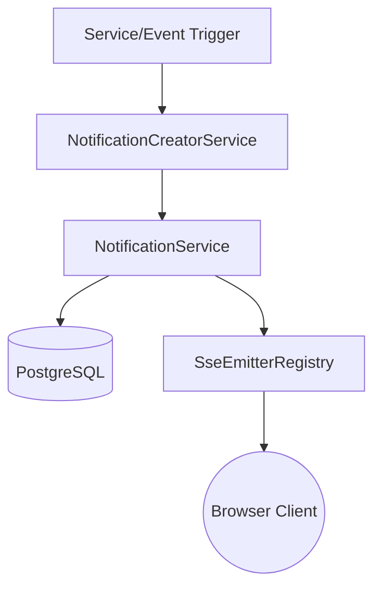
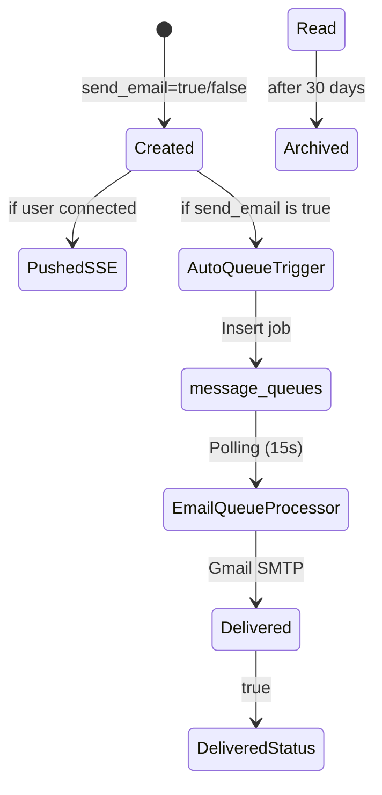
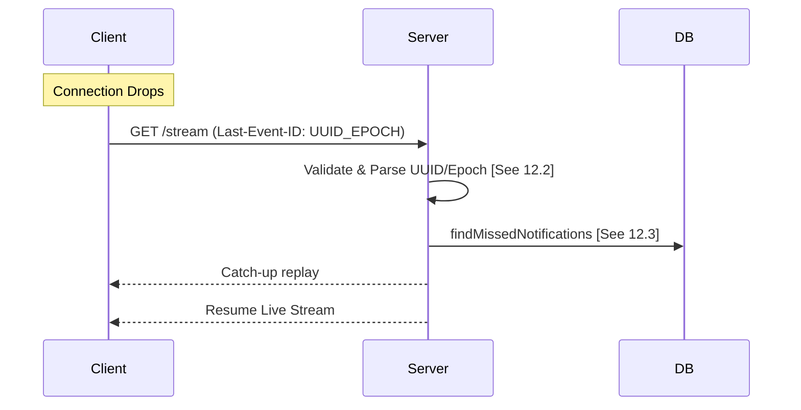
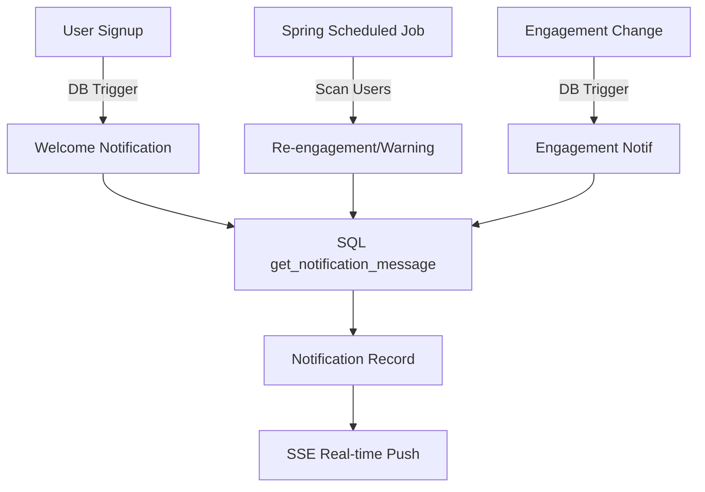

# Notification System - Master Specification
## NeuralHealer Platform

---
**Document Type:** Master Implementation & Design Specification  
**Version:** 3.0.0  
**Last Updated:** 2026-01-27  
**Status:** ✅ FULLY IMPLEMENTED CORE / 🎯 EXPANDABLE  

---

## 📋 Table of Contents

01. [System Overview](#01-system-overview)
02. [Notification Types & Categorization](#02-notification-types--categorization)
03. [Delivery Channels](#03-delivery-channels)
04. [Data Model](#04-data-model)
05. [Service Architecture](#05-service-architecture)
06. [Real-time Protocol (SSE)](#06-real-time-protocol-sse)
07. [API Reference (REST & SSE)](#07-api-reference-rest--sse)
08. [Notification Lifecycle](#08-notification-lifecycle)
09. [Automated Maintenance](#09-automated-maintenance)
10. [Implementation Phases](#10-implementation-phases)
11. [Performance & Scalability](#11-performance--scalability)
12. [Core Implementation Specifications](#12-core-implementation-specifications)
13. [Security Hardening & Compliance](#13-security-hardening--compliance)
14. [Monitoring & Operations](#14-monitoring--operations)
15. [Service Integration](#15-service-integration)
16. [Troubleshooting Guide](#16-troubleshooting-guide)
17. [Testing Strategy](#17-testing-strategy)
18. [Evolution & Roadmap](#18-evolution--roadmap)
19. [Database Performance & Operations](#19-database-performance--operations)
20. [Production Deployment Guide](#20-production-deployment-guide)
21. [Integration & API Contracts](#21-integration--api-contracts)
22. [Disaster Recovery & Business Continuity](#22-disaster-recovery--business-continuity)
23. [Client Implementation & Libraries](#23-client-implementation--libraries)
24. [Deployment & Infrastructure](#24-deployment--infrastructure)
25. [Cost Optimization & Scaling](#25-cost-optimization--scaling)
26. [Migration & Versioning](#26-migration--versioning)
27. [Team & Collaboration](#27-team--collaboration)
28. [Appendices](#appendices)

---

## 01. System Overview

### 01.1 Purpose
The Notification System provides real-time alerts and persistent history for NeuralHealer. It ensures that critical medical events and patient communications are delivered instantly via Server-Sent Events (SSE).

### 01.2 Core Principles
✅ **Reactive Push**: Instant delivery via SSE. [See Section 06]  
✅ **Resilient Logic**: Replay mechanism using `Last-Event-ID`. [See Section 12.2]  
✅ **Stateless Scale**: Standardized event-driven architecture.

---

## 02. Notification Types & Categorization

| Source | Type | Priority | Trigger |
|--------|------|----------|---------|
| `engagement` | `ENGAGEMENT_STARTED` | HIGH | Patient verifies start token |
| `engagement` | `ENGAGEMENT_CANCELLED` | HIGH | Either party cancels |
| `message` | `MESSAGE_RECEIVED` | NORMAL | New chat message |
| `system` | `SECURITY_ALERT` | HIGH | Login from new location/MFA |
| `ai` | `AI_RESPONSE_READY` | NORMAL | Analysis finished |

---

## 03. Delivery Channels

1. **SSE (Real-time)**: [IMPLEMENTED] Primary channel for live UI updates.
2. **Email**: [PLANNED] Asynchronous fallback for high-priority alerts.
3. **Mobile Push**: [PLANNED] Native OS alerts via FCM.

---

## 04. Data Model

### 04.1 Notifications Entity
Reflected in `src/main/java/com/neuralhealer/backend/notification/entity/Notification.java`:
```java
public class Notification {
    private UUID id;
    private User user;
    private NotificationType type;
    private String title;
    private String message;
    private Map<String, Object> payload; // JSONB
    private NotificationPriority priority;
    private NotificationSource source;
    private Map<String, Object> deliveryStatus; // JSONB {"sse": boolean, "email": boolean}
    private Boolean isRead;
    private Boolean sendEmail; // Controls if an email job should be queued
    private LocalDateTime sentAt;
}
```

---

## 05. Service Architecture



---

## 06. Real-time Protocol (SSE)

### 06.1 Event ID Format Specification
**Format**: `{NOTIFICATION_UUID}_{EPOCH_TIMESTAMP}`
*Example*: `550e8400-e29b-41d4-a716-446655440000_1737981600`
This deterministic format allows the client to resume from a specific point in time without database overhead.

### 06.2 Last-Event-ID Parsing & Replay
When a client reconnects with `Last-Event-ID`, the server:
1. Validates the header format.
2. Extracts the timestamp from the suffix.
3. Performs a catch-up query: `sent_at > :timestamp`.
4. Pushes missed notifications before resuming the live stream.

### 06.3 Reliability Parameters
- **Replay Window**: 30 Minutes (Default). [Not Configurable yet]
- **Heartbeat Interval**: 30 Seconds.
- **Client Retry Strategy**: Recommended exponential backoff (1s, 2s, 4s, 8s, 16s, 30s max).

---

## 07. API Reference (REST & SSE)

### 07.1 SSE Stream
`GET /api/notifications/stream`
- **Headers**: `Last-Event-ID` (Optional).
- **Responses**:
  - `200 OK`: Stream established.
  - `401 Unauthorized`: Session expired.

### 07.2 Notification History
`GET /api/notifications?page=0&size=20&sort=sentAt,desc`
**Response Example**:
```json
{
  "content": [{
    "id": "...",
    "type": "MESSAGE_RECEIVED",
    "title": "New Message",
    "isRead": false
  }],
  "totalElements": 150
}
```

### 07.3 Management Endpoints
- `PUT /api/notifications/{id}/read`: Mark as read.
- `GET /api/notifications/unread-count`: Returns `{"count": X}`.

---

## 08. Notification Lifecycle



---

## 09. Automated Maintenance

### 09.1 `NotificationCleanupJob`
Runs at 2 AM Daily:
- **Rule A**: Delete READ > 30 days.
- **Rule B**: Delete UNREAD > 90 days.
- **Rule C**: Delete EXPIRED immediately.

---

## 10. Implementation Phases

| Phase | Description | Status |
|-------|-------------|--------|
| **01-04** | Foundation, REST API, & Initial SSE Stream | ✅ Complete |
| **05** | Priority Alignment & deterministic Event IDs | ✅ Complete |
| **06** | `Last-Event-ID` Parser & Missed Replay Logic | ✅ Complete |
| **07** | DB Indexing & Query Optimization | ✅ Complete |
| **08-10** | Controller Consolidation & Master Documentation | ✅ Complete |
| **11** | Simplified Trigger-Driven Email System | ✅ Complete |

---

## 11. Performance & Scalability

### 11.1 Latency Targets
- **Creation to Push**: < 100ms.
- **SSE Connection Overhead**: < 50ms (Internal).

### 11.2 Scaling Benchmarks
- **Concurrent Connections**: Target 10,000 per instance.
- **Memory Footprint**: ~15KB per active SSE emitter.

---

## 12. Core Implementation Specifications

### 12.1 Database Index Creation (Implemented)
```sql
CREATE INDEX idx_notifications_user_sentat 
ON notifications (user_id, sent_at);

-- Partial index for high-performance undelivered scans
CREATE INDEX idx_notifications_undelivered 
ON notifications (user_id) 
WHERE (delivery_status->>'sse')::boolean = false;
```

### 12.2 Priority Source Mapping
| Notification Type | Default Priority | Source |
|-------------------|------------------|--------|
| `ENGAGEMENT_*` | **HIGH** | `engagement` |
| `SECURITY_*` | **HIGH** | `system` |
| `MESSAGE_*` | NORMAL | `message` |

---

## 13. Security Hardening & Compliance

### 13.1 Rate Limiting (Not Implemented)
- ❌ **Stream Limits**: No per-user connection cap.
- ❌ **Request Limits**: No explicit `X-RateLimit` headers configured. [Refer to Appendix C]

### 13.2 Data Encryption
- ✅ **In Transit**: TLS 1.2+ (Handled by Infrastructure).
- ❌ **At Rest**: No column-level encryption for `message` content.

---

## 14. Monitoring & Operations

### 14.1 Key Performance Baselines
- **Nominal SSE Latency**: 10-30ms.
- **High Load SSE Latency**: > 200ms (Triggers alert).

### 14.2 Dashboards (Not Implemented)
- ❌ **Prometheus/Grafana**: No pre-configured JSON dashboards included in codebase.
- ✅ **Basic Metrics**: Active connections available via `/api/notifications/stats` (Admin only).

---

## 15. Service Integration

### 15.1 Creator Facade
Developers must use `NotificationCreatorService` instead of raw repository calls to ensure consistent SSE pushing. [See Appendix B]

---

## 16. Troubleshooting Guide

### 16.1 Common Issues
- **Issue**: Client doesn't receive events after reconnection.
  - **Check**: Verify `Last-Event-ID` header format (`uuid_epoch`); check if `sent_at` in DB is after the timestamp. [See Section 12.2]
- **Issue**: 405 Method Not Supported on `/stream`.
  - **Check**: Ensure `NotificationRestController` is handling the GET request.

---

## 17. Testing Strategy

### 17.1 Test Suites
- ✅ **Unit Tests**: `NotificationServiceTest` - Verifies priority logic.
- ✅ **Integration Tests**: `test-notifications.ps1` - Validates full SSE lifecycle.
- ❌ **Load Tests**: No JMeter/K6 scripts currently implemented.

---

## 18. Evolution & Roadmap

- **Phase 11**: Real-time Persistent Notification Center (UI).
- **Phase 12**: Multi-platform Push (Firebase/APNS).
- **Phase 13**: Notification Throttling/Batching for high-frequency users.## 19. Database Performance & Operations

### 19.1 Optimized Index Creation (Implemented)
```sql
-- Mandatory for Real-time Replay performance
CREATE INDEX idx_notifications_catchup 
ON notifications (user_id, sent_at);

-- Partial index for background delivery scans
CREATE INDEX idx_notifications_undelivered 
ON notifications (user_id) 
WHERE (delivery_status->>'sse')::boolean = false;
```

### 19.2 Maintenance (Not Implemented)
- ❌ **Partitioning**: Monthly partitioning by `created_at` suggested for datasets > 10M.
- ✅ **Vacuum**: Relying on PostgreSQL autovacuum.

---

## 20. Production Deployment Guide

### 20.1 Deployment Specs (Partial)
- ✅ **Docker**: `Dockerfile` uses multi-stage JRE 17 builds.
- ✅ **Compose**: `docker-compose.yml` links App to Postgres.
- ❌ **Kubernetes**: No standard Helm charts or manifests implemented.

### 20.2 Connectivity (Not Implemented)
- ❌ **Nginx/Load Balancer**: Config not provided. Required: `proxy_buffering off` for SSE.
- ✅ **Health Checks**: Actuator enabled at `/api/management/health`.

---

## 21. Integration & API Contracts

### 21.1 Documentation (Implemented)
- **OpenAPI**: Available via `/api/swagger-ui/index.html`.

### 21.2 Service Discovery (Not Implemented)
- ❌ **Webhooks**: No outbound webhook notification system implemented.
- ❌ **Contracts**: No Pact/Consumer-Driven Contract tests implemented.

---

## 22. Disaster Recovery & Business Continuity

### 22.1 RTO/RPO Objects (Not Implemented)
- ❌ **Recovery Targets**: No explicit RTO (15m) or RPO (5m) automation.
- ❌ **Failover**: No automated multi-zonal failover logic.

---

## 23. Client Implementation & Libraries

### 23.1 Web Integration (Implemented)
Provided via [sse_client_guide.md](file:///f:/documents/Nuralhealer-main/Nuralhealer/backend/backend/docs/implementation/sse_client_guide.md).

### 23.2 Native SDKs (Not Implemented)
- ❌ **Mobile**: No Swift/Kotlin libraries implemented.

---

## 24. Deployment & Infrastructure

### 24.1 Container Configuration (Implemented)
- ✅ **Dockerfile**: Multi-stage JRE 17 build.
- ✅ **Compose**: Standard developer-ready environment.

### 24.2 Kubernetes (Not Implemented)
- ❌ **Manifests**: No Deployment/Service/Ingress YAMLs implemented.

---

## 25. Cost Optimization & Scaling

### 25.1 Scaling Strategy (Not Implemented)
- ❌ **Horizontal Scaling**: No HPA or multi-replica sticky session configs.
- ❌ **Caching Layer**: Redis mapping for active emitters not implemented.

---

## 26. Migration & Versioning

### 26.1 Versioning
- **API**: URI-based versioning implicitly supported via `/api/` prefix.

### 26.2 Schema Evolution (Not Implemented)
- ❌ **Automated Migration**: Flyway/Liquibase not currently implemented in `backend/`.

---

## 27. Team & Collaboration

### 27.1 Operational Support
- ✅ **Logging**: Structured SLF4J logging with engagement context.
- ❌ **On-call**: No PagerDuty/OpsGenie integration.

---

## 28. Appendices

### Appendix A: Database Tuning
- **Max Connections**: HikariCP set to 10 (Default).
- **SSL**: Supported via JDBC parameters.

### Appendix B: API Error Codes
[Refer to Section 07.1 for context]
- `401 Unauthorized`: Session token expired.
- `403 Forbidden`: Cross-user stream access attempt.
- `429 Too Many Requests`: [Target] Rate limiting not implemented.
- `500 Server Error`: Registry capacity limit (10k).

---

## Visual Documentation Gaps

### Sequence: SSE Reconnection (Internal Logic)


---

## 29. Notification Content Architecture (The Main Brain)

### 29.1 Architecture Concept: DB vs. Backend Logic
The system uses a hybridized approach to content generation:

| Logic Layer | Responsibility | Component |
|-------------|----------------|-----------|
| **Main Brain (DB)** | Engagement State & Lifecycle | `create_engagement_notification()` (Trigger) |
| **Lifecycle Logic (DB)** | Welcome Messages | `send_welcome_notification()` (Trigger) |
| **Time-Based Logic (App)** | Inactivity (3d, 14d) | `UserActivityNotificationJob` (Spring) |
| **Logic Layer (API)** | Real-time Operations & AI | `NotificationCreatorService` (Spring) |
| **I18n Engine** | Centralized Templates & Rendering | `get_notification_message()` (SQL Helper) |

### 29.2 Content Flow Diagram


## 30. Notification Optimizations & Throttling

### 30.1 Throttling Logic (Anti-Spam)
To prevent overwhelming users with re-engagement alerts, a **7-day throttling window** is applied.
- **Implementation**: The `UserRepository` native queries use a `NOT EXISTS` clause checking for similar notifications sent in the last 7 days.
- **SQL Source**: 
  ```sql
  AND NOT EXISTS (
    SELECT 1 FROM notifications n 
    WHERE n.user_id = u.id AND n.type = 'USER_REENGAGE_ACTIVE' 
    AND n.sent_at > NOW() - INTERVAL '7 days'
  )
  ```

### 30.2 Email Fallback Protocol (✅ TEMPLATE-DRIVEN)
The system uses the `notifications` table as the single source of truth for delivery, but **configures** that delivery via the template system.
- **Template Channels**: The `notification_message_templates` table now includes a `channels` JSONB column (e.g., `{"email": true, "sse": true}`).
- **Dynamic Flagging**: `create_system_notification()` reads these channels from the resolved template and sets the `send_email` flag accordingly.
- **The Trigger**: `trg_auto_queue_email` automatically inserts jobs into `message_queues` when `send_email` is `TRUE`.
- **Latency**: `EmailQueueProcessor` runs every **15 seconds** for near real-time email fallback.
- **Tracking**: `delivery_status->>'email'` is updated to `true` upon success by the Java processor.

### 30.3 SQL Helper: create_system_notification()
A centralized helper function in `DB.sql` ensures consistent notification creation across all database triggers.
- **Responsibilities**: Localized rendering, placeholder replacement, multi-channel queuing (SSE + Email), and priority resolution.


---

## 31. Next Steps: Email Expansion
To further integrate the email system:
1.  **Lifecycle Templates**: Complete the `re-engage.html` and `inactivity-warning.html` templates.
2.  **Trigger Expansion**: Add `ENGAGEMENT_*` types to the `create_system_notification` email filter in `DB.sql`.

---
**END OF MASTER SPECIFICATION - REVISION 8.0.0 (SIMPLIFIED EMAIL SYSTEM)**
